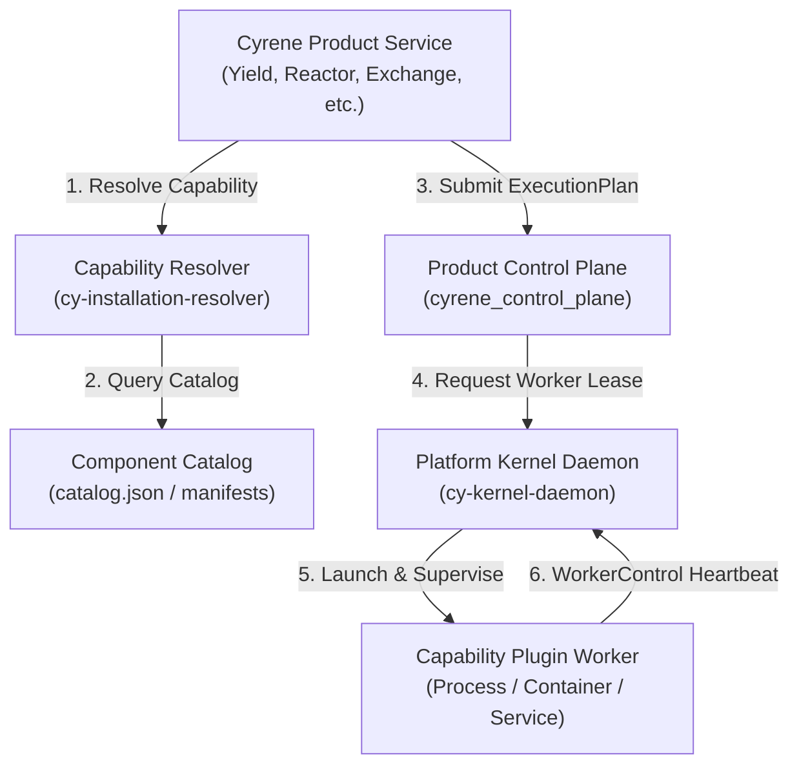

# Cyrene-Platform Canonical API & Substrate Contract Specification

This document provides the authoritative specification for **Cyrene-Platform**, classified as **`ACTIVE_PLATFORM`**, the shared substrate foundation for all Cyrene Products and Plugins.

---

## 1. Repository Role & Audience

- **Role**: `ACTIVE_PLATFORM` / Foundational Kernel, Control Plane & Substrate Runtime.
- **Audience**: Product engine developers, plugin authors, and infrastructure operators.
- **Implementation Status**: `IMPLEMENTED_STABLE` (Kernel, Control Plane, Artifact Plane, Preflight).

---

## 2. What the Platform Substrate Owns

Cyrene-Platform is **NOT a Product**. It owns generic execution mechanisms, process supervision, isolation, and capability resolution primitives:

- **Kernel Runtime & Isolation**: Process supervision, cgroup sandbox boundaries, resource accounting (CPU/GPU/VRAM), hardware facts authority via Node Agent.
- **Product Control Plane Primitives**: Generic execution primitives (`ProductRun`, `Attempt`, `PlanStep`, `ExecutionPlan`), reconciliation state machines, idempotency management.
- **WorkerControl**: Execution lifecycle channel (`INIT`, `READY`, `HEARTBEAT`, `CANCEL`, `DRAIN`, `LOST`, `EXIT`).
- **Capability Registry & Installation Resolver**: Discovery, resolution, and binding of replaceable plugins implementing versioned capability interfaces.
- **Artifact Plane**: Content-Addressable Storage (CAS), artifact digests (SHA-256), immutable reference transport.
- **Environment & Preflight**: Deterministic environment locks, dependency resolution, hardware compatibility evaluation, and static model inspection.

### What Cyrene-Platform Must NOT Contain
- **Product-Specific Semantics**: No dataset ingestion/cleaning (Catalyst), training loops or epochs (Yield), deployment admission logic (Reactor), gateway routing rules (Exchange), desktop workspace UI (Navigator), or evaluation/benchmark logic (Echo).

---

## 3. Public Platform Objects & Schemas

| Object / Type | Schema / Contract | Implementation Status | Definition & Responsibility |
|---|---|---|---|
| `ProductRun` | `execution-plan-v1.schema.json` | `IMPLEMENTED_STABLE` | Top-level durable execution instance initiated by a Product. |
| `Attempt` | `execution-plan-v1.schema.json` | `IMPLEMENTED_STABLE` | Concrete execution attempt of a step. Mapped 1:1 with worker/process execution. |
| `PlanStep` | `execution-plan-v1.schema.json` | `IMPLEMENTED_STABLE` | Discrete executable task within an `ExecutionPlan`. |
| `WorkerControl` | `kernel_authority.proto` | `IMPLEMENTED_STABLE` | Lifecycle protocol between Platform Kernel and capability worker processes. |
| `HardwareFacts` | `kernel_runtime.proto` | `IMPLEMENTED_STABLE` | Authoritative hardware observation from Node Agent (GPU compute, VRAM, NUMA, driver). |
| `ArtifactRef` | `cy_artifacts.contracts` | `IMPLEMENTED_STABLE` | Immutable reference with digest (`sha256`), uri, kind, and size. |
| `EnvironmentLock` | `cy_environment.contracts` | `IMPLEMENTED_STABLE` | Fully pinned and reproducible execution environment specification. |
| `CapabilityRequirement` | `plugin.manifest.schema.json` | `IMPLEMENTED_STABLE` | Typed capability interface identifier with version constraint and required execution mode. |

---

## 4. Core Platform Subsystems & APIs



### A. Capability Registry & Resolver API (`IMPLEMENTED_STABLE`)
Products query the resolver using structured requirements:
```python
from cy_installation_resolver import CapabilityRequirement, CapabilityResolver

requirement = CapabilityRequirement(
    capability="model.analyzer.v1",
    interface_version="1",
    execution_modes=("IN_PROCESS", "WORKER")
)
plugin_target = resolver.resolve(requirement)
```

The `cyrene-capability-resolver` executable used by the current cross-language
Product integration is a **REFERENCE / EXPERIMENTAL BRIDGE**. It proves the
registry and resolver boundary for a Python Product, but it is not a
prescription that production deployments must start a subprocess per
resolution. The production transport and lifecycle remain open to the
Platform runtime design.

### B. WorkerControl Lifecycle Channel (`IMPLEMENTED_STABLE`)
Kernel supervises worker execution using standard transitions:
- `INIT` $\rightarrow$ Worker process spawned, assigned cgroup/sandbox.
- `READY` $\rightarrow$ Worker signals socket availability (`WORKER_READY` or ready file).
- `HEALTH_PROBE` $\rightarrow$ Periodic ping/metrics collection.
- `CANCEL` $\rightarrow$ Kernel sends SIGTERM $\rightarrow$ graceful drain $\rightarrow$ SIGKILL on deadline.
- `LOST` $\rightarrow$ Process exited unexpectedly; maps directly to `AttemptStatus.FAILED` (Lost) to allow Product controller reconciliation.

### C. Artifact Plane API (`IMPLEMENTED_STABLE`)
```python
from cy_artifacts import LocalArtifactProvider, ArtifactKind

provider = LocalArtifactProvider(storage_root="/var/cyrene/cas")
artifact_ref = provider.put(
    source_path="/path/to/checkpoint",
    kind=ArtifactKind.MODEL_CHECKPOINT,
    metadata={"format": "safetensors", "model_id": "org/model-v1"}
)
```

---

## 5. Implementation Status Matrix

| Subsystem / Component | Implementation Status | Notes |
|---|---|---|
| Rust Kernel Supervisor & UDS | `IMPLEMENTED_STABLE` | `kernel/crates/` core isolation daemon. |
| Node Agent Hardware Observation | `IMPLEMENTED_STABLE` | Authoritative GPU/VRAM hardware discovery. |
| Control Plane Primitives | `IMPLEMENTED_STABLE` | `cyrene_control_plane` (Python / Kotlin). |
| Artifact Plane CAS | `IMPLEMENTED_STABLE` | `cyrene_artifacts` Content-Addressable Storage. |
| Preflight & Compat Analyzers | `IMPLEMENTED_STABLE` | `cyrene_preflight` verification library. |
| Environment Resolver & Lock | `IMPLEMENTED_STABLE` | `cyrene_environment` pinning and execution locks. |
| Central Capability Registry | `IMPLEMENTED_STABLE` | `docs/api/CAPABILITY_INDEX.md`. |
| Shared Model Registry Capability | `CONTRACT_CANDIDATE` | `model.registry.v1` formal interface candidate. |
