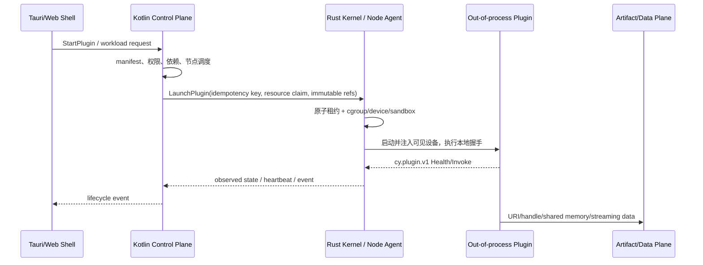

# CYRENE Engine 初始架构与协议蓝图

- 状态：Draft / Architecture Discussion
- 日期：2026-08-10
- 范围：目录规划、内核与框架边界、分布式控制契约
- 本轮变更：仅新增本文档，不修改源码、构建配置或现有协议

## 1. 结论先行

CYRENE Engine 应被定义为一个面向 AI 应用的分布式运行平台，而不是新的
Linux 内核。这里的 “Kernel” 是运行在 Linux 用户态、部署于每个计算节点的
最小可信节点运行时。它借鉴微内核的机制与策略分离，但不进入内核态，也不
负责训练、推理、数据处理等业务。

最重要的边界可以概括为：

> Kotlin 决定“应该发生什么”，Rust 保证“在这台机器上安全地发生”，插件
> 实现“具体业务如何计算”，Shell 只负责“如何呈现和控制”。

具体决策如下：

1. **Rust Kernel / Node Runtime**
   是每个 Linux 节点上资源、租约、沙盒、进程和本地运行状态的唯一事实源。
2. **Kotlin Framework / Control Plane**
   是插件目录、安装、期望状态、集群调度、权限和工作流的唯一控制面。
3. **生态插件默认全部进程外运行。**
   Python、JVM 和第三方 Rust 插件都不能进入 Kernel 或 Kotlin 进程。
4. **Kernel 进程内只允许受信任的编译期平台适配器。**
   例如 Linux cgroup、procfs、GPU 发现、bwrap、OCI 和传输适配器；它们不是
   可安装的业务插件。
5. **当前阶段不需要 C 核心。**
   Rust 足以承担节点运行时；确实需要厂商 C API 时，只能放在隔离适配器中。
6. **控制流、事件流和数据流分离。**
   模型、数据集、checkpoint 和张量不经过普通 Kernel RPC 或 Kotlin 控制面。
7. **跨语言只有一个线协议权威。**
   Protobuf 是 Rust、Kotlin、Python 和 TypeScript SDK 的唯一生成源。
8. **Shell 不直接连接 Kernel。**
   Tauri/Web 客户端只访问 Kotlin 的公开 API，节点管理凭证不下发到客户端。

## 2. RustRover 对当前仓库的只读检查结果

本蓝图不是针对空目录生成的通用模板。RustRover MCP 已检查当前项目树、
模块、依赖、关键符号、现有 Proto 和 IDE 诊断，得到以下事实：

- 根 Cargo workspace 已包含 8 个 Rust crate。
- `kernel/` 已有 `cy-local-transport`、`cy-node-agent` 和
  `cy-plugin-supervisor`。
- `framework/` 已有 Rust 的 `cy-extension-registry` 与 `cy-platform-api`，
  但 `framework/jvm/` 只有占位 README，没有 Kotlin/Gradle 工程。
- `contracts/` 已有 manifest/schema、Rust bindings、旧的 `cy.llm`
  协议，以及较完整的 `cy.plugin.v1` 本地插件协议。
- `apps/`、`shell/`、`sdk/`、`infra/`、`tools/` 和顶层 `tests/` 尚不存在。
- RustRover 当前只识别到一个 `EMPTY_MODULE`，说明多构建系统 Monorepo 尚未
  接入 IDE 项目模型。
- 关键 Rust/Proto 文件没有发现编译级 IDE 错误；Supervisor 的 Cargo 清单有
  少量未使用依赖和版本提示，这不是本次架构讨论的修改范围。

现有实现中值得保留的基础：

- `cy.plugin.v1.Envelope` 已有协议协商、request/trace id、deadline、
  Cancel、Health、Shutdown 和类型化错误。
- 本地插件已采用长度前缀 Protobuf over stdio，stdout 保留给协议，
  stderr 用于日志。
- Supervisor 已定义
  `Discovered -> Resolved -> Starting -> Handshaking -> Healthy` 等 13 个
  生命周期状态，并具备重启与崩溃隔离骨架。
- 当前 GPU 探测主要通过 `sysinfo`、`nvidia-smi`、procfs 和环境变量，
  没有链接 CUDA/C++ 计算运行时，方向符合本蓝图。

当前实现与目标边界之间的主要差距：

| 现状 | 风险 | 目标 |
| --- | --- | --- |
| `cy-extension-registry` 直接依赖 `cy-plugin-supervisor` | Kotlin 落地后形成两个控制面 | Kotlin 通过 `KernelService` 驱动 Rust，不链接 Kernel crate |
| `ai_service.proto` 包含 LoRA、训练、推理、量化和脚本执行 | Core 与 Yield/Reactor 业务耦合 | 业务 RPC 迁入各 App 的版本化协议 |
| `AgentService` 使用自由字符串 `command_type/payload/env` | 可能演化成远程命令注入面 | 只保留类型化资源和生命周期命令 |
| `HardwareProbe` 直接实现 NVIDIA/procfs 逻辑 | 没有 OS/GPU provider 抽象 | 原始事实经 provider/adapter 暴露 |
| `BuiltinSystemProbe` 又硬编码另一份硬件事实 | 双重库存权威 | 可分配资源只由 Kernel 报告 |
| `StdioTransport::spawn(executable, args)` 裸启动进程 | 没有 cgroup、沙盒、设备映射或资源环境注入 | 所有进程经 `ProcessRuntime` 与 `SandboxBackend` |
| 当前 ADR 允许 `in-proc-rust` 业务插件和 PyO3 | 业务崩溃可能影响可信核心 | 进程内仅限平台适配器；PyO3 只能存在于外部 worker |
| GPU 按型号聚合 | 无法对单卡、MIG/分区做租约 | 使用稳定设备 ID、PCI 地址、分区和健康状态 |
| 现有仓库边界文档把六大 App 放在另一私有仓库 | 与本次 Monorepo `apps/` 要求冲突 | 先以 ADR 明确仓库治理，再迁移源码 |

## 3. 内核、框架、插件与 Shell 的边界

| 层 | 必须负责 | 明确禁止 |
| --- | --- | --- |
| Rust Kernel / Node Runtime | 主机资源发现；设备清单；资源租约；cgroup/namespace/device 映射；native/bwrap/OCI 后端；进程启停、watchdog、OOM/退出码、日志；本地 IPC；节点观察状态 | 训练策略、模型选择、数据处理、推理路由、插件市场策略、用户工作流、Python 解释器、CUDA kernel 或 AI 计算库 |
| Kotlin Framework / Control Plane | 插件目录与安装；依赖解析；期望状态；集群拓扑；节点选择；权限、租户与配额策略；工作流；配置；分布式状态协调；面向 Shell 的 API | 直接调用 CUDA/NVML；直接操作 cgroup/device node；用 `ProcessBuilder` 启动计算插件；加载 Python 到 JVM |
| App / Plugin | Catalyst、Yield、Reactor 等全部 AI 和产品能力；PyTorch、vLLM、uv；数据、训练、推理、网关、评估和微前端 | 依赖 Kernel 私有 crate；绕过租约；自行选择未授权 GPU；修改控制面全局状态 |
| Tauri/Web Shell | UI、窗口/托盘、安全存储、认证会话、公开 API 客户端、远程控制体验 | 直接调用 KernelService；启动节点进程；扫描 GPU；加载服务端业务插件；持有节点管理凭证 |
| SDK / Contracts | 唯一跨语言协议；版本策略；代码生成；manifest/schema；兼容性测试与 TCK | 业务实现；某一种语言独有但未进入协议的隐藏语义 |

Kernel 不能被称为完全“无状态”。进程、租约、重启计数和健康信息都是节点
本地运行态。更准确的定义是：

> Kernel 只维护可重建的节点运行态，不持有全局业务期望状态；Kotlin 保存
> 期望状态，Rust 上报观察状态，双方通过 generation、fence token 和
> idempotency key 收敛。

### 3.1 资源分配的双层权威

- Kotlin 决定工作负载放到哪个节点、请求多少 GPU/CPU/内存以及优先级。
  这是调度策略。
- Rust 在目标节点上原子检查库存、创建租约、选择具体设备、建立沙盒并启动
  进程。这是事实与执行。
- Rust 不决定哪个训练任务更重要；Kotlin 也不能指定一个未经节点确认的
  `CUDA_VISIBLE_DEVICES` 值。
- 启动失败时，内联申请的租约必须原子回滚；已有租约由 TTL 或显式释放控制。

### 3.2 标准控制流程



控制 RPC 只传标识符、digest、URI/handle、配额、状态、deadline、revision、
幂等键和能力引用。模型权重、数据集、checkpoint、日志正文和张量不作为
普通 KernelService 消息经过 Kotlin。

### 3.3 通信平面

| 平面 | 用途 | 推荐传输 |
| --- | --- | --- |
| 控制面 | 资源租约、插件期望状态、进程启停、查询 | 远程 mTLS gRPC；本地可用 UDS |
| 事件面 | 节点、租约、进程、插件状态变化 | 可恢复的 gRPC stream；后续可接事件总线 |
| 本地插件面 | Supervisor 与 Python/JVM/native worker | 现有 length-prefixed Protobuf over stdio；后续 UDS/Named Pipe |
| 数据面 | 模型、数据集、checkpoint、token/tensor 流 | 对象存储 URI、共享内存、mmap、UDS 或独立流服务 |
| 客户端面 | Shell 到控制面 | HTTPS、WebSocket、gRPC-Web/Connect 等公开 API |

分布式部署时，推荐 Rust Agent 主动建立到 Kotlin 控制面的 mTLS 长连接，以
适应 NAT 和防火墙。无论采用主动流还是控制面直连，协议中的 generation、
node epoch、fence token 和 idempotency key 都必须保持一致。

## 4. Rust、Kotlin 与 C 的范围

### 4.1 Rust 的范围

Rust 负责最小可信执行基座：

- Linux 主机与设备抽象；
- 节点 Agent；
- 资源租约与本地强制执行；
- 进程、沙盒与 watchdog；
- 本地 IPC 和 KernelService；
- 审计友好的运行事件。

Kernel 默认应使用 `forbid(unsafe_code)`。确需 unsafe/FFI 的 crate 必须被
依赖边界隔离，并且不能把 unsafe 扩散到资源管理、Supervisor 或协议层。

### 4.2 Kotlin 的范围

Kotlin 负责长期运行的分布式控制面。建议核心领域层采用 Kotlin 协程和
生成的 gRPC client/server，不把 Spring 类型渗透进领域模型。Spring Boot、
Ktor 或其他 Web 框架可以作为公开 API、企业集成和部署适配器，不能成为
插件契约本身。

Kotlin 模块应遵循 `domain <- application <- adapters` 的依赖方向，并通过
架构测试阻止 `framework` 导入 `apps`。

### 4.3 是否需要 C

当前阶段不需要 C 核心，优先级应为：

1. Linux 标准接口：procfs、sysfs、cgroup v2、pidfd、device node；
2. 厂商 CLI：`nvidia-smi`、`rocm-smi` 等只读/管理适配器；
3. 厂商管理 API：仅在 CLI/标准接口不足时采用；
4. Linux 内核模块：只作为独立、可选、平台限定的未来项目。

如果未来必须使用 NVML、ROCm SMI、Ascend 管理 API 等 C ABI，优先放入
独立 adapter 进程。若必须进程内 FFI，则只允许存在于明确命名的 vendor
adapter crate，通过稳定 Rust trait 暴露能力。厂商适配器崩溃只能使能力
变为 `DEGRADED/UNAVAILABLE`，不能带崩主 Kernel。

Kernel 依赖树中不得出现 CUDA、cuDNN、PyTorch、vLLM、PyO3 等计算运行时。
PyO3 如有必要，只能用于一个独立 worker 进程内部。

## 5. Kernel 应提前定义的抽象

即使第一版实现仍依赖系统命令与环境变量，也应先稳定内部端口：

```rust
trait HostInventoryProvider {}
trait AcceleratorProvider {}
trait ResourceLeaseManager {}
trait ProcessRuntime {}
trait SandboxBackend {}
trait DeviceMapper {}
trait TelemetryProvider {}
trait NodeIdentityProvider {}
```

建议适配器：

- `linux-procfs`
- `linux-sysfs`
- `linux-cgroup-v2`
- `nvidia-cli`
- `amd-sysfs`
- `ascend-cli`
- `native-process`
- `bwrap`
- `oci-container`

GPU 清单至少要包含稳定设备 ID、PCI 地址、厂商、型号、显存、可分配显存、
分区/MIG、健康状态和拓扑。插件兼容性可以补充证据，但不能成为可分配库存
的第二事实源。

资源执行强度必须显式返回：

- `HARD`：由 cgroup、设备映射或等价机制强制；
- `SOFT`：受控但不是安全边界；
- `VISIBILITY_ONLY`：只设置 `CUDA_VISIBLE_DEVICES`、
  `HIP_VISIBLE_DEVICES` 等协作式变量；
- `OBSERVE_ONLY`：只能观察，不能限制；
- `UNENFORCED`：无法执行，默认应 fail closed。

## 6. 目标 Monorepo 目录结构

以下目标树假设 CYRENE-Platform 在孵化阶段成为完整私有 Monorepo，并通过
依赖规则保持 Core 可独立发布。当前仓库文档仍规定六大 App 位于另一个私有
仓库，因此在仓库边界 ADR 获批前，不应直接搬迁这些源码。

```text
Cyrene-Platform/
├── Cargo.toml
├── Cargo.lock
├── settings.gradle.kts
├── build.gradle.kts
├── pnpm-workspace.yaml
├── buf.work.yaml
│
├── kernel/                               # Rust 用户态微内核 / Node Runtime
│   ├── README.md
│   ├── crates/
│   │   ├── cy-kernel-api/                # OS/GPU/process/sandbox 抽象 traits
│   │   ├── cy-kernel-daemon/             # KernelService 服务入口
│   │   ├── cy-resource-manager/          # 原子配额、租约、fencing
│   │   ├── cy-hardware-discovery/        # 只读硬件事实和遥测
│   │   ├── cy-sandbox/                   # runtime/backend 编排
│   │   ├── cy-local-transport/           # 已存在
│   │   ├── cy-plugin-supervisor/         # 已存在
│   │   └── cy-node-agent/                # 已存在
│   ├── adapters/
│   │   ├── os/linux/
│   │   ├── gpu/generic/
│   │   ├── gpu/nvidia-cli/
│   │   ├── gpu/amd-cli/
│   │   ├── gpu/ascend-cli/
│   │   └── sandbox/
│   │       ├── native/
│   │       ├── bwrap/
│   │       └── oci/
│   └── tests/
│
├── framework/                            # Kotlin/JVM 控制面
│   ├── README.md
│   ├── jvm/
│   │   ├── settings.gradle.kts
│   │   ├── build.gradle.kts
│   │   ├── gradle/libs.versions.toml
│   │   ├── control-plane/
│   │   ├── modules/
│   │   │   ├── kernel-client/
│   │   │   ├── plugin-catalog/
│   │   │   ├── plugin-lifecycle/
│   │   │   ├── scheduler/
│   │   │   ├── cluster/
│   │   │   ├── policy/
│   │   │   ├── eventing/
│   │   │   └── public-api/
│   │   └── test-support/
│   └── crates/                           # 迁移期 Rust 兼容层
│       ├── cy-extension-registry/
│       └── cy-platform-api/
│
├── sdk/                                  # 唯一跨语言契约与 SDK 边界
│   ├── proto/
│   │   ├── buf.yaml
│   │   ├── cyrene/core/v1/
│   │   │   └── cyrene_core.proto
│   │   ├── cy/plugin/v1/                 # 现有本地插件协议
│   │   ├── cy/llm/v0/                    # 现有兼容命名空间
│   │   └── third_party/
│   ├── schemas/
│   ├── codegen/
│   │   ├── buf.gen.yaml
│   │   └── scripts/
│   ├── rust/
│   │   ├── cy-proto/
│   │   ├── cy-plugin-protocol/
│   │   ├── cy-manifest/
│   │   └── cy-platform-api/
│   ├── kotlin/
│   │   ├── cyrene-proto/
│   │   ├── cyrene-kernel-client/
│   │   └── cyrene-plugin-sdk/
│   ├── python/
│   │   ├── pyproject.toml
│   │   └── src/cyrene_sdk/
│   ├── typescript/
│   └── conformance/
│
├── apps/                                 # 六大官方插件/插件束
│   ├── README.md
│   ├── _template/
│   │   ├── service.json
│   │   ├── plugins/
│   │   ├── workers/
│   │   ├── ui/
│   │   ├── deploy/
│   │   └── tests/
│   ├── catalyst/                         # 数据与知识提取
│   ├── yield/                            # 训练与微调
│   ├── reactor/                          # 量化、部署与推理
│   ├── exchange/                         # 工作流、网关与企业协调
│   ├── navigator/                        # 官方用户体验与跨设备执行
│   └── echo/                             # 评估、评分与反馈增强
│
├── shell/                                # 无业务的客户端壳
│   ├── desktop-tauri/
│   │   ├── src/
│   │   └── src-tauri/
│   ├── web/                              # 浏览器/PWA 远程控制入口
│   ├── packages/
│   │   ├── ui-kit/
│   │   └── framework-client/
│   └── tests/
│
├── infra/
│   ├── images/
│   │   ├── python-base/                  # 固定基础镜像 + uv
│   │   ├── kernel/
│   │   └── framework/
│   ├── compose/
│   ├── kubernetes/helm/cyrene/
│   ├── systemd/
│   ├── sandbox/bwrap/
│   └── observability/
│
├── tools/
│   ├── codegen/
│   ├── cyrene-cli/
│   ├── dev/
│   ├── release/
│   └── ci/
│
├── tests/
│   ├── contract/
│   ├── conformance/
│   ├── integration/
│   │   ├── kernel-framework/
│   │   ├── plugin-runtime/
│   │   └── multinode/
│   ├── e2e/
│   ├── performance/
│   ├── security/
│   └── fixtures/
│
├── examples/
├── docs/
│   ├── architecture/
│   ├── adr/
│   ├── api/
│   ├── plugins/
│   ├── operations/
│   └── security/
└── .github/workflows/
```

`shell/desktop-tauri` 是通用渲染容器，`apps/navigator` 是官方产品体验插件。
二者不能互相硬编码。对于 HarmonyOS 等尚未验证的原生目标，应首先保证
`shell/web` 可作为远程控制入口，原生包装作为独立客户端适配器评估。

### 6.1 当前路径到目标路径

| 当前路径 | 目标路径 | 迁移规则 |
| --- | --- | --- |
| 根 `Cargo.toml` / `Cargo.lock` | 原路径 | 保持 Rust workspace 根入口 |
| `kernel/crates/cy-*` | 原路径 | 先增量扩展，不先拆现有 crate |
| `framework/jvm/README.md` | `framework/jvm/*` | 在既有边界内创建 Gradle 工程 |
| `framework/crates/cy-extension-registry` | 迁移期保留；长期由 Kotlin plugin-catalog/lifecycle 接管 | Kotlin shadow/conformance 通过前不得删除 |
| `framework/crates/cy-platform-api` | `sdk/rust/cy-platform-api` | 重新定位为 Rust SDK/受信任静态接口 |
| `contracts/proto/plugin/v1/*` | `sdk/proto/cy/plugin/v1/*` | 原子迁移，保持 `cy.plugin.v1` wire package |
| `contracts/proto/ai_service.proto` | `sdk/proto/cy/llm/v0/*` 后逐 App 替代 | 冻结兼容，不直接改 package |
| `contracts/proto/agent_service.proto` | `sdk/proto/cy/llm/v0/*` | 弃用任意命令接口，保留兼容期 |
| 无 | `sdk/proto/cyrene/core/v1/cyrene_core.proto` | 新的正式分布式 Core v1 |
| `contracts/schemas/*` | `sdk/schemas/*` | 与 codegen/build 路径一次迁移 |
| `contracts/rust/cy-*` | `sdk/rust/cy-*` | 保持 crate 名称与兼容性 |
| 六大服务私有仓库 | `apps/*` | 先批准仓库边界 ADR，再保留历史导入 |
| 无 | `shell/`、`infra/`、`tools/`、`tests/` | 纯新增建立 |

`contracts/` 与 `sdk/` 不能长期双写。先建立可复现 codegen 和兼容门禁，再在
一个受控变更中更新 Cargo、Gradle、build.rs、CI 和外部消费者，最后原子
迁移路径。

## 7. `cyrene_core.proto` 讨论稿

建议最终路径：
`sdk/proto/cyrene/core/v1/cyrene_core.proto`。

当前阶段本文只给出契约草案，不创建或替换 `.proto` 文件。正式落地前可以
把单文件拆为 `common.proto`、`resource.proto`、`kernel_service.proto` 和
`plugin_lifecycle.proto`，但都保持 `cyrene.core.v1` package。

职责方向：

- `KernelService` 由每台 Linux 节点上的 Rust Agent 实现，只有认证后的
  Kotlin 控制面可以调用变更类 RPC。
- `PluginLifecycleService` 由 Kotlin 控制面实现，Shell、管理员、Rust Agent
  和经过授权的远程 service 插件按角色调用。
- 本地 Python/JVM/native 子进程继续使用现有 `cy.plugin.v1`，不直接连接
  Kotlin。

```proto
syntax = "proto3";

package cyrene.core.v1;

import "google/protobuf/duration.proto";
import "google/protobuf/timestamp.proto";
import "google/rpc/status.proto";

option java_multiple_files = true;
option java_package = "io.cyrene.proto.core.v1";
option java_outer_classname = "CyreneCoreProto";

// Implemented by the Rust Node Agent.
service KernelService {
  rpc GetKernelCapabilities(GetKernelCapabilitiesRequest)
      returns (KernelCapabilities);

  rpc ReserveResources(ReserveResourcesRequest)
      returns (ResourceLease);

  rpc ReleaseResources(ReleaseResourcesRequest)
      returns (ResourceLease);

  // With resource_claim this is an atomic allocate-and-launch transaction.
  // The executable, argv and environment are resolved from a verified local
  // installation and are never accepted from this remote request.
  rpc LaunchPlugin(LaunchPluginRequest)
      returns (Operation);

  rpc TerminatePlugin(TerminatePluginRequest)
      returns (Operation);

  rpc GetOperation(GetOperationRequest)
      returns (Operation);

  rpc CancelOperation(CancelOperationRequest)
      returns (Operation);

  rpc WatchOperations(WatchOperationsRequest)
      returns (stream OperationEvent);
}

// Implemented by the Kotlin control plane.
service PluginLifecycleService {
  rpc InstallPlugin(InstallPluginRequest)
      returns (Operation);

  rpc UninstallPlugin(UninstallPluginRequest)
      returns (Operation);

  rpc SetPluginEnabled(SetPluginEnabledRequest)
      returns (PluginInstallation);

  // Start/Stop change desired state. They do not directly spawn/kill an OS
  // process; the Kotlin reconciler calls the selected node's KernelService.
  rpc StartPlugin(StartPluginRequest)
      returns (Operation);

  rpc StopPlugin(StopPluginRequest)
      returns (Operation);

  rpc GetPluginInstance(GetPluginInstanceRequest)
      returns (PluginInstance);

  rpc ListPluginInstances(ListPluginInstancesRequest)
      returns (ListPluginInstancesResponse);

  rpc ReportHeartbeat(ReportHeartbeatRequest)
      returns (ReportHeartbeatResponse);

  rpc WatchPluginEvents(WatchPluginEventsRequest)
      returns (stream PluginLifecycleEvent);
}

message RequestContext {
  // Unique per transport attempt.
  string request_id = 1;
  string tenant_id = 2;
  string project_id = 3;
  string traceparent = 4;

  // Persisted admission expiry for asynchronous operations.
  // This does not replace the gRPC deadline.
  google.protobuf.Timestamp expire_at = 5;
}

message MutationContext {
  RequestContext request = 1;

  // Required for every mutating RPC.
  string idempotency_key = 2;

  // Optimistic concurrency and stale-controller fencing.
  optional uint64 expected_generation = 3;
}

message NodeRef {
  string node_id = 1;

  // Changes when the Node Agent is reinstalled or loses durable state.
  uint64 node_epoch = 2;
}

message CatalogPluginRef {
  // A policy-approved catalog record, never an arbitrary download command.
  string catalog_name = 1;
  string plugin_id = 2;
  string version = 3;
  string component_id = 4;
  string package_digest = 5;
}

message InstalledPluginRef {
  // Server-issued identifier for an already verified installation.
  string installation_name = 1;
  string plugin_id = 2;
  string version = 3;
  string component_id = 4;
  string manifest_digest = 5;
}

message SnapshotRef {
  string name = 1;
  uint64 generation = 2;
  string digest = 3;
}

enum AcceleratorKind {
  ACCELERATOR_KIND_UNSPECIFIED = 0;
  ACCELERATOR_KIND_GPU = 1;
  ACCELERATOR_KIND_NPU = 2;
  ACCELERATOR_KIND_TPU = 3;
  ACCELERATOR_KIND_OTHER = 100;
}

enum AcceleratorVendor {
  ACCELERATOR_VENDOR_UNSPECIFIED = 0;
  ACCELERATOR_VENDOR_NVIDIA = 1;
  ACCELERATOR_VENDOR_AMD = 2;
  ACCELERATOR_VENDOR_HUAWEI_ASCEND = 3;
  ACCELERATOR_VENDOR_INTEL = 4;
  ACCELERATOR_VENDOR_OTHER = 100;
}

enum AcceleratorIsolation {
  ACCELERATOR_ISOLATION_UNSPECIFIED = 0;
  ACCELERATOR_ISOLATION_EXCLUSIVE_DEVICE = 1;
  ACCELERATOR_ISOLATION_PARTITION = 2;
  ACCELERATOR_ISOLATION_SHARED_VISIBLE = 3;
}

enum ResourceKind {
  RESOURCE_KIND_UNSPECIFIED = 0;
  RESOURCE_KIND_CPU = 1;
  RESOURCE_KIND_MEMORY = 2;
  RESOURCE_KIND_EPHEMERAL_STORAGE = 3;
  RESOURCE_KIND_ACCELERATOR = 4;
}

enum EnforcementMode {
  ENFORCEMENT_MODE_UNSPECIFIED = 0;
  ENFORCEMENT_MODE_HARD = 1;
  ENFORCEMENT_MODE_SOFT = 2;
  ENFORCEMENT_MODE_VISIBILITY_ONLY = 3;
  ENFORCEMENT_MODE_OBSERVE_ONLY = 4;
  ENFORCEMENT_MODE_UNENFORCED = 5;
}

message CpuRequirements {
  uint32 request_millicores = 1;
  uint32 limit_millicores = 2;
}

message MemoryRequirements {
  uint64 request_bytes = 1;
  uint64 limit_bytes = 2;
}

message AcceleratorRequirements {
  AcceleratorKind kind = 1;
  AcceleratorVendor vendor = 2;

  // Reverse-DNS vendor id, used only with OTHER.
  string other_vendor_id = 3;

  uint32 count = 4;
  uint64 min_memory_bytes_per_device = 5;
  AcceleratorIsolation isolation = 6;

  // Values come from a versioned controlled vocabulary.
  repeated string required_features = 7;
}

message ResourceRequirements {
  CpuRequirements cpu = 1;
  MemoryRequirements memory = 2;
  uint64 ephemeral_storage_limit_bytes = 3;
  repeated AcceleratorRequirements accelerators = 4;
}

message NodeCapacity {
  uint32 total_cpu_millicores = 1;
  uint32 allocatable_cpu_millicores = 2;
  uint64 total_memory_bytes = 3;
  uint64 allocatable_memory_bytes = 4;
  uint64 total_ephemeral_storage_bytes = 5;
  uint64 allocatable_ephemeral_storage_bytes = 6;
}

enum HealthStatus {
  HEALTH_STATUS_UNSPECIFIED = 0;
  HEALTH_STATUS_HEALTHY = 1;
  HEALTH_STATUS_DEGRADED = 2;
  HEALTH_STATUS_UNHEALTHY = 3;
  HEALTH_STATUS_UNKNOWN = 4;
}

message HealthReport {
  HealthStatus status = 1;
  string reason_code = 2;

  // Bounded sanitized summary, never logs or exception dumps.
  string summary = 3;
}

message AcceleratorPartition {
  string partition_id = 1;
  uint64 total_memory_bytes = 2;
  uint64 allocatable_memory_bytes = 3;
  HealthReport health = 4;
}

message AcceleratorDevice {
  // Opaque stable node-local id; never a shell fragment.
  string device_id = 1;
  AcceleratorKind kind = 2;
  AcceleratorVendor vendor = 3;
  string other_vendor_id = 4;
  string model = 5;
  string pci_address = 6;
  uint64 total_memory_bytes = 7;
  uint64 allocatable_memory_bytes = 8;
  repeated string features = 9;
  repeated AcceleratorPartition partitions = 10;
  HealthReport health = 11;
}

message EnforcementReport {
  ResourceKind resource_kind = 1;
  EnforcementMode mode = 2;
  string adapter_id = 3;
  string reason_code = 4;
}

message KernelCapabilities {
  NodeRef node = 1;
  string kernel_version = 2;
  uint64 inventory_generation = 3;
  google.protobuf.Timestamp observed_at = 4;
  NodeCapacity capacity = 5;
  repeated AcceleratorDevice accelerators = 6;
  repeated string sandbox_backends = 7;
  repeated EnforcementReport enforcement = 8;
  repeated string feature_flags = 9;
}

message GetKernelCapabilitiesRequest {
  RequestContext context = 1;
  NodeRef node = 2;
}

enum LeaseState {
  LEASE_STATE_UNSPECIFIED = 0;
  LEASE_STATE_ACTIVE = 1;
  LEASE_STATE_ATTACHED = 2;
  LEASE_STATE_RELEASING = 3;
  LEASE_STATE_RELEASED = 4;
  LEASE_STATE_EXPIRED = 5;
  LEASE_STATE_FAILED = 6;
}

message ResourceLeaseRef {
  string lease_name = 1;
  uint64 fence_token = 2;
}

message AcceleratorAllocation {
  string allocation_id = 1;
  string device_id = 2;
  string partition_id = 3;
  uint64 granted_memory_bytes = 4;
  EnforcementMode enforcement = 5;
}

message ResourceLease {
  string name = 1;
  NodeRef node = 2;
  LeaseState state = 3;
  ResourceRequirements granted = 4;
  repeated AcceleratorAllocation accelerators = 5;
  repeated EnforcementReport enforcement = 6;
  google.protobuf.Timestamp expires_at = 7;
  uint64 fence_token = 8;
}

message ReserveResourcesRequest {
  MutationContext mutation = 1;
  NodeRef node = 2;
  ResourceRequirements requirements = 3;
  google.protobuf.Duration ttl = 4;
}

message ReleaseResourcesRequest {
  MutationContext mutation = 1;
  ResourceLeaseRef lease = 2;
}

message LaunchPluginRequest {
  MutationContext mutation = 1;
  NodeRef node = 2;
  InstalledPluginRef plugin = 3;

  oneof allocation {
    // Kernel performs atomic allocate + launch.
    ResourceRequirements resource_claim = 4;

    // Used only after an explicit reservation.
    ResourceLeaseRef existing_lease = 5;
  }

  // Opaque immutable references. No inline secrets or environment.
  SnapshotRef configuration = 6;
  SnapshotRef runtime_profile = 7;
  SnapshotRef sandbox_profile = 8;
}

enum StopMode {
  STOP_MODE_UNSPECIFIED = 0;
  STOP_MODE_GRACEFUL = 1;
  STOP_MODE_IMMEDIATE = 2;
}

message TerminatePluginRequest {
  MutationContext mutation = 1;
  string process_name = 2;
  StopMode mode = 3;
  google.protobuf.Duration grace_period = 4;
}

enum PluginRuntimeState {
  PLUGIN_RUNTIME_STATE_UNSPECIFIED = 0;
  PLUGIN_RUNTIME_STATE_DISCOVERED = 1;
  PLUGIN_RUNTIME_STATE_RESOLVED = 2;
  PLUGIN_RUNTIME_STATE_STARTING = 3;
  PLUGIN_RUNTIME_STATE_HANDSHAKING = 4;
  PLUGIN_RUNTIME_STATE_HEALTHY = 5;
  PLUGIN_RUNTIME_STATE_DEGRADED = 6;
  PLUGIN_RUNTIME_STATE_STOPPING = 7;
  PLUGIN_RUNTIME_STATE_STOPPED = 8;
  PLUGIN_RUNTIME_STATE_UNAVAILABLE = 9;
  PLUGIN_RUNTIME_STATE_INCOMPATIBLE = 10;
  PLUGIN_RUNTIME_STATE_CRASHED = 11;
  PLUGIN_RUNTIME_STATE_QUARANTINED = 12;
  PLUGIN_RUNTIME_STATE_DISABLED = 13;
}

message ExitStatus {
  optional int32 exit_code = 1;
  bool oom_killed = 2;
  string reason_code = 3;
  google.protobuf.Timestamp exited_at = 4;
}

message PluginProcess {
  string name = 1;
  InstalledPluginRef plugin = 2;
  NodeRef node = 3;
  ResourceLeaseRef lease = 4;
  PluginRuntimeState state = 5;
  uint64 generation = 6;
  uint32 restart_count = 7;
  google.protobuf.Timestamp created_at = 8;
  google.protobuf.Timestamp updated_at = 9;
  ExitStatus last_exit = 10;
}

enum PluginInstallationState {
  PLUGIN_INSTALLATION_STATE_UNSPECIFIED = 0;
  PLUGIN_INSTALLATION_STATE_INSTALLING = 1;
  PLUGIN_INSTALLATION_STATE_INSTALLED = 2;
  PLUGIN_INSTALLATION_STATE_FAILED = 3;
  PLUGIN_INSTALLATION_STATE_UNINSTALLING = 4;
  PLUGIN_INSTALLATION_STATE_UNINSTALLED = 5;
}

message PluginInstallation {
  InstalledPluginRef plugin = 1;
  PluginInstallationState state = 2;
  bool enabled = 3;
  uint64 generation = 4;
  repeated string declared_capabilities = 5;
  google.protobuf.Timestamp created_at = 6;
  google.protobuf.Timestamp updated_at = 7;
  google.rpc.Status error = 8;
}

message InstallPluginRequest {
  MutationContext mutation = 1;
  CatalogPluginRef catalog_plugin = 2;
}

message UninstallPluginRequest {
  MutationContext mutation = 1;
  string installation_name = 2;
}

message SetPluginEnabledRequest {
  MutationContext mutation = 1;
  string installation_name = 2;
  bool enabled = 3;
}

enum OperationState {
  OPERATION_STATE_UNSPECIFIED = 0;
  OPERATION_STATE_PENDING = 1;
  OPERATION_STATE_RUNNING = 2;
  OPERATION_STATE_SUCCEEDED = 3;
  OPERATION_STATE_FAILED = 4;
  OPERATION_STATE_CANCELLING = 5;
  OPERATION_STATE_CANCELLED = 6;
}

message OperationResult {
  oneof value {
    ResourceLease resource_lease = 1;
    PluginProcess plugin_process = 2;
    PluginInstance plugin_instance = 3;
    PluginInstallation plugin_installation = 4;
  }
}

message Operation {
  string name = 1;
  OperationState state = 2;
  string target_resource_name = 3;
  bool cancellable = 4;
  google.protobuf.Timestamp created_at = 5;
  google.protobuf.Timestamp updated_at = 6;

  oneof outcome {
    OperationResult result = 10;
    google.rpc.Status error = 11;
  }
}

message GetOperationRequest {
  RequestContext context = 1;
  string name = 2;
}

message CancelOperationRequest {
  MutationContext mutation = 1;
  string name = 2;
}

message WatchOperationsRequest {
  RequestContext context = 1;
  repeated string operation_names = 2;
  string resume_token = 3;
}

message OperationEvent {
  string event_id = 1;
  string resume_token = 2;
  uint64 sequence_number = 3;
  Operation operation = 4;
}

enum DesiredPluginState {
  DESIRED_PLUGIN_STATE_UNSPECIFIED = 0;
  DESIRED_PLUGIN_STATE_RUNNING = 1;
  DESIRED_PLUGIN_STATE_STOPPED = 2;
  DESIRED_PLUGIN_STATE_DISABLED = 3;
}

message PluginInstance {
  string name = 1;
  InstalledPluginRef plugin = 2;
  NodeRef node = 3;
  uint64 generation = 4;
  uint64 observed_generation = 5;
  DesiredPluginState desired_state = 6;
  PluginRuntimeState runtime_state = 7;
  HealthReport health = 8;
  ResourceLeaseRef lease = 9;
  uint32 restart_count = 10;
  google.protobuf.Timestamp created_at = 11;
  google.protobuf.Timestamp updated_at = 12;
  google.protobuf.Timestamp last_heartbeat_at = 13;
}

message StartPluginRequest {
  MutationContext mutation = 1;
  InstalledPluginRef plugin = 2;

  // Unset means the scheduler selects a node.
  NodeRef preferred_node = 3;

  ResourceRequirements resources = 4;
  SnapshotRef configuration = 5;
  SnapshotRef deployment_policy = 6;
}

message StopPluginRequest {
  MutationContext mutation = 1;
  string plugin_instance_name = 2;
  StopMode mode = 3;
  google.protobuf.Duration grace_period = 4;
}

message GetPluginInstanceRequest {
  RequestContext context = 1;
  string name = 2;
}

message ListPluginInstancesRequest {
  RequestContext context = 1;
  repeated PluginRuntimeState state_filter = 2;
  uint32 page_size = 3;
  string page_token = 4;
}

message ListPluginInstancesResponse {
  repeated PluginInstance plugins = 1;
  string next_page_token = 2;
}

message ReportHeartbeatRequest {
  RequestContext context = 1;
  string plugin_instance_name = 2;
  uint64 generation = 3;
  uint64 sequence_number = 4;
  google.protobuf.Timestamp observed_at = 5;
  PluginRuntimeState runtime_state = 6;
  HealthReport health = 7;
  uint32 restart_count = 8;
}

enum HeartbeatDisposition {
  HEARTBEAT_DISPOSITION_UNSPECIFIED = 0;
  HEARTBEAT_DISPOSITION_ACCEPTED = 1;
  HEARTBEAT_DISPOSITION_DUPLICATE = 2;
  HEARTBEAT_DISPOSITION_STALE_GENERATION = 3;
  HEARTBEAT_DISPOSITION_UNKNOWN_INSTANCE = 4;
}

message ReportHeartbeatResponse {
  HeartbeatDisposition disposition = 1;
  uint64 accepted_sequence_number = 2;
  google.protobuf.Timestamp server_time = 3;
  google.protobuf.Duration next_heartbeat_after = 4;
  DesiredPluginState desired_state = 5;
  uint64 desired_generation = 6;
}

enum PluginLifecycleEventType {
  PLUGIN_LIFECYCLE_EVENT_TYPE_UNSPECIFIED = 0;
  PLUGIN_LIFECYCLE_EVENT_TYPE_SNAPSHOT = 1;
  PLUGIN_LIFECYCLE_EVENT_TYPE_INSTALLED = 2;
  PLUGIN_LIFECYCLE_EVENT_TYPE_UNINSTALLED = 3;
  PLUGIN_LIFECYCLE_EVENT_TYPE_ENABLED = 4;
  PLUGIN_LIFECYCLE_EVENT_TYPE_DISABLED = 5;
  PLUGIN_LIFECYCLE_EVENT_TYPE_STATE_CHANGED = 6;
  PLUGIN_LIFECYCLE_EVENT_TYPE_HEALTH_CHANGED = 7;
  PLUGIN_LIFECYCLE_EVENT_TYPE_RESTARTED = 8;
  PLUGIN_LIFECYCLE_EVENT_TYPE_LEASE_CHANGED = 9;
}

message WatchPluginEventsRequest {
  RequestContext context = 1;
  repeated string plugin_instance_names = 2;
  string resume_token = 3;
  bool include_initial_snapshot = 4;
}

message PluginLifecycleEvent {
  string event_id = 1;
  string resume_token = 2;
  uint64 sequence_number = 3;
  google.protobuf.Timestamp observed_at = 4;
  PluginLifecycleEventType type = 5;
  PluginRuntimeState previous_state = 6;

  oneof snapshot {
    PluginInstance plugin_instance = 7;
    PluginInstallation plugin_installation = 8;
  }

  string reason_code = 9;
}
```

### 7.1 必须冻结的协议语义

- 相同作用域内，相同 `idempotency_key` 与相同规范化请求必须返回同一资源或
  Operation；同一 key 配不同请求返回 `ALREADY_EXISTS` 或
  `FAILED_PRECONDITION`。
- `ReportHeartbeat` 按
  `(plugin_instance_name, generation, sequence_number)` 去重；旧 generation
  不得复活已停止实例。
- gRPC deadline 约束当前网络调用，`expire_at` 约束进入队列后的持久操作。
- 取消等待 `LaunchPlugin` 的 RPC 不等于终止已启动进程。取消异步工作用
  `CancelOperation`；停止运行实例用 `StopPlugin/TerminatePlugin`。
- 内联 `resource_claim` 启动失败时自动回滚租约；`existing_lease` 保留到
  显式释放或 TTL 到期。
- 仅靠可见性环境变量时，GPU enforcement 必须返回
  `VISIBILITY_ONLY`，不能宣称硬隔离。
- `Watch*` 使用 opaque resume token；超出保留窗口返回 `OUT_OF_RANGE`，
  客户端重新获取快照。
- 认证来自 mTLS/JWT/SPIFFE 等传输身份，消息体中的 tenant/plugin id 只用于
  路由和审计，不能作为认证依据。
- 删除字段必须 `reserved`，禁止复用 field number；发布后不能重编号 enum。
- `buf lint`、`buf breaking`、Rust/Kotlin/Python/TypeScript 二进制 fixture
  必须进入 CI。

### 7.2 Core RPC 禁止出现的输入

- shell 命令字符串；
- `script_path`、任意工作目录；
- 远程传入的 executable、argv、任意环境变量；
- 任意 Docker 参数；
- 未经 catalog/digest 绑定的镜像或下载 URI；
- manifest JSON、内联 secret；
- 模型、数据集、checkpoint、大块 bytes、日志正文、stdout/stderr。

Rust 节点只能从已签名、已校验、按 digest 绑定的本地安装记录解析入口点，
使用 argv 数组启动进程，并拒绝插件覆盖 `CUDA_VISIBLE_DEVICES`、
`HIP_VISIBLE_DEVICES` 等 Kernel 保留变量。

### 7.3 与现有协议的关系

- 保留 `contracts/proto/plugin/v1/*` 作为 Supervisor 与本机 worker 的
  零端口协议，不把其业务 `Invoke` payload 合并进 Core gRPC。
- 新 `PluginRuntimeState` 与 Rust 当前状态一一映射。
- 旧 `cy.llm.AgentService.ExecuteCommandStream` 应弃用，不继续扩展；
  节点注册与 Journal 后续迁入独立的 `cyrene.node.v1`。
- `ai_service.proto` 冻结为 v0 兼容协议，训练、推理、量化分别由 Yield、
  Reactor 等 App 发布新契约。
- `google/rpc/status.proto` 必须通过锁定版本的 third-party Proto 或 Buf
  dependency 引入，不能依赖开发机的偶然环境。

## 8. 严格的插件标准

CYRENE 不应允许每个生态自行发明安装方式。平台只接受一种规范模型：

1. 一个规范化 `plugin.toml` / service manifest；
2. 一个版本化 `api_version` 和 `protocol_version`；
3. 受控的 `kind`、capability、permission 和 resource vocabulary；
4. 内容 digest、签名、SBOM、目标 OS/arch 和不可变依赖锁；
5. 统一的安装、升级、启停、健康、取消、日志和卸载语义；
6. Rust、Kotlin、Python SDK 全部由同一 Proto 生成；
7. 官方 TCK 验证所有语言实现。

Python 插件使用固定 digest 的基础镜像和 `uv`，在容器或独立沙盒中执行
冻结依赖安装。宿主机不能 `pip install`，插件也不能传任意 pip/uv 命令给
Kernel。缓存是实现细节，lockfile 与 package digest 才是可复现依据。

当前 `plugin_protocol.proto` 同时存在自由字符串 `extension_point/method`
和类型化 `oneof`，未来必须消除双重事实源：manifest 的 `kind` 决定允许的
类型化请求集合，运行时拒绝 kind、capability、身份或 digest 不匹配。

插件 TCK 至少覆盖：

- manifest 身份与握手身份不一致；
- protocol/api version 不兼容；
- 越权 capability 或 permission；
- deadline、真实 cancel 与流式背压；
- heartbeat、崩溃、OOM、空闲退出和 crash-loop quarantine；
- stdout 协议污染与 stderr 日志；
- 优雅停止超时后的升级终止、child reap 和租约回收；
- 重复幂等请求与断线重连；
- package digest、签名和升级回滚。

## 9. 分阶段落地建议

### P0：架构权威与仓库治理

- 用新 ADR 确认完整私有 Monorepo，或继续 core/apps 双仓。
- 用新 ADR 取代“可安装 in-proc Rust/PyO3 插件”的旧定义。
- 冻结 `cy.llm` 为 v0 compatibility namespace。

验收：不存在同时生效、互相矛盾的仓库边界或插件运行时规范。

### P1：契约与生成链

- 新增 `cyrene.core.v1`；
- 建立 Buf lint/breaking 和 Rust/Kotlin/Python/TypeScript codegen；
- 建立跨语言 golden fixture 与 TCK 骨架；
- 标记任意命令 RPC deprecated。

验收：干净环境一次命令可生成全部 SDK，生成结果无漂移。

### P2：Rust Kernel 抽象

- 增加 provider/adapter traits；
- 单卡身份、分区、资源租约和 fence token；
- cgroup v2、native、bwrap/OCI 后端；
- Supervisor 正确 wait/reap、主动 health、优雅停止和资源回收；
- `LaunchPlugin` 只能引用已验证安装。

验收：并发租约不重复分配；启动失败和节点断联可回收；Python 崩溃不影响
Kernel。

### P3：Kotlin 控制面

- Gradle/Kotlin 工程；
- catalog、installation、lifecycle、scheduler、cluster、policy；
- desired/observed reconciliation；
- Rust Kernel client 和公开 Shell API。

验收：Kotlin 不链接 Kernel crate/JNI，不直接拉起 worker；控制面重启后能
根据 generation 收敛。

### P4：插件包与生态

- 固定包格式、manifest、签名、SBOM、base-image/uv 规则；
- 迁移 Python/JVM SDK；
- 官方六 App 逐个通过 TCK；
- Rust 业务插件改为 native subprocess，平台适配器保持编译期链接。

验收：增加第七个 App 不修改 Kernel 或 Framework 源码。

### P5：分布式与数据面

- Agent mTLS 身份、长连接、重连和事件恢复；
- 对象存储/共享内存/UDS 数据面；
- 多节点故障转移、配额、审计和可观测性。

验收：网络重试不产生重复实例/租约，大 artifact 不经过 Core 控制 RPC。

### P6：Shell 与产品体验

- Tauri desktop shell；
- Web/PWA 远程入口；
- 微前端加载与权限；
- Navigator 作为官方体验插件而不是 Shell 私有逻辑。

验收：删除全部 `apps/` 后，Kernel、Framework 与空 Shell 仍能独立构建并
运行。

## 10. 架构门禁

实现阶段应把下列规则写成自动化检查：

- Kernel 不依赖 `framework/`、`apps/`、`shell/`。
- Framework 不链接 Kernel 私有 crate，不导入 `apps/`。
- Apps 只依赖公开 SDK、Proto 和 schema。
- Shell 只依赖面向客户端的 Control Plane SDK。
- Core Proto 不出现 LoRA、vLLM、训练超参数、模型格式等业务词汇。
- Core RPC 不接受任意 shell、executable、argv 或 env。
- Kernel 默认 `forbid(unsafe_code)`；FFI 仅在审计 adapter 中。
- Kernel 依赖树不包含 AI 计算运行时。
- 所有资源状态带 generation/revision；所有变更 RPC 可幂等重放。
- `VISIBILITY_ONLY` 与硬隔离在 API 上可区分。
- 未知硬件事实返回 `UNKNOWN/UNSUPPORTED`，禁止伪造默认值。
- 所有语言插件通过相同 TCK。
- Shell 不能持有节点凭证或绕过 Kotlin 访问 Kernel。

## 11. 仍需通过 ADR 决定的问题

1. **仓库治理：** 完整私有 Monorepo，还是公开 Core + 私有 Apps 双仓？
   本文目录树按前者展示，当前仓库文档仍按后者执行。
2. **Kotlin 部署框架：** 核心协程 + 轻量适配器，还是统一 Spring Boot？
   本文建议领域层保持纯 Kotlin，部署/API 层可选择 Spring。
3. **节点连接方向：** Agent 主动长连接，还是控制面直连 KernelService？
   本文推荐前者，但保留同一服务语义。
4. **第一版沙盒基线：** native + cgroup、bwrap，还是直接 OCI 容器？
   无论选择哪一种，都必须通过同一个 `SandboxBackend`。
5. **插件分发载体：** 签名 OCI artifact、专用 archive，或二者映射？
   对外只能有一套规范 manifest 和安装语义。

在这些 ADR 通过前，本蓝图用于评审和约束后续脚手架，不表示现有实现已完成
GPU 强隔离、Docker/uv 运行时、Kotlin 控制面或分布式生产验收。
