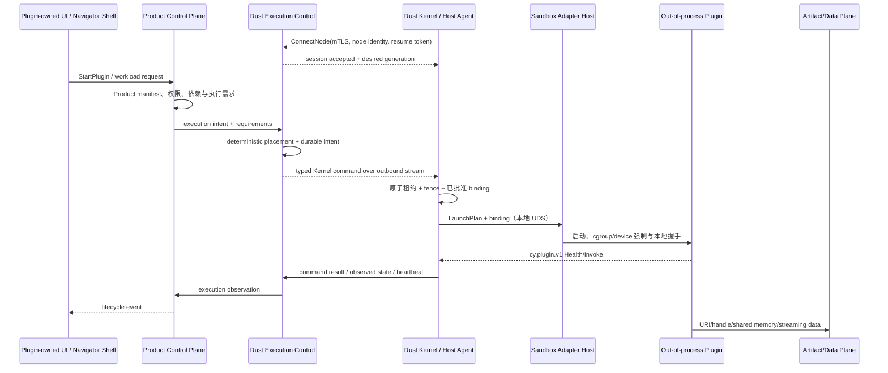

# CYRENE Engine 初始架构与协议蓝图

- 状态：Normative / P2 boundary implemented in Core
- 日期：2026-08-10
- 范围：多仓库规划、内核与框架边界、分布式控制契约
- 本轮变更：冻结 Kernel Semantic Contract v1；落实硬件适配器进程外化、版本化 UDS 协议和 Kernel 边界门禁；不将厂商 C ABI 放入 Kernel
- 文档权威：本文是合并后的唯一架构正文；原讨论稿中的冲突决策以本文已确认的方案 A 为准

## 1. 结论先行

CYRENE Engine 应被定义为一个面向 AI 应用的分布式运行平台，而不是新的
Linux 内核。这里的 “Kernel” 是运行在 Linux 用户态、部署于每个计算节点的
最小可信节点运行时。它借鉴微内核的机制与策略分离，但不进入内核态，也不
负责训练、推理、数据处理等业务。

最重要的边界可以概括为：

> Kotlin 决定“应该发生什么”，Rust 保证“在这台机器上安全地发生”，插件
> 实现“具体业务如何计算”，Shell 只负责“如何呈现和控制”。

具体决策如下：

1. **Rust Kernel / Node Runtime**
   是每个 Linux 节点上资源、租约、fence、生命周期决策和本地运行状态的唯一事实源；
   特权沙盒执行通过独立 sandboxd 完成。
2. **Kotlin Framework / Control Plane**
   是插件目录、安装、期望状态、集群调度、权限和工作流的唯一控制面。
3. **生态插件默认全部进程外运行。**
   Python、JVM 和第三方 Rust 插件都不能进入 Kernel 或 Kotlin 进程。
4. **Kernel 进程内只允许纯安全、无厂商和无宿主特权依赖的基础机制。**
   例如租约状态机、fence、协议校验和本地传输客户端。Linux cgroup、pidfd、进程
   回收、device BPF 与 namespace 由独立 sandboxd 执行；GPU 发现、厂商 CLI、驱动
   C ABI、厂商 sysfs/procfs 与设备节点枚举由独立 Hardware Adapter Host 执行；它们
   既不是可安装业务插件，也不在 Kernel 地址空间。
5. **当前阶段不需要 C 核心或进程内 Kernel C ABI。**
   Rust 足以承担节点运行时；确实需要厂商 C API 时，只能放在隔离 Adapter Host
   内部。未来可提供外部 native client C ABI，但它只能把 Kernel Semantic Contract
   投影到 UDS，不能把动态库加载进 Kernel 地址空间。
6. **控制流、事件流和数据流分离。**
   模型、数据集、checkpoint 和张量不经过普通 Kernel RPC 或 Kotlin 控制面。
7. **采用方案 A：Core 单独开源，官方服务插件各自独立建仓。**
   Core 不包含任何官方 App 源码；每个插件仓库独立发布、测试和签名。
8. **跨语言只有一个语义权威。**
   Kernel Semantic Contract 定义对象、状态机与不变量；Protobuf 是当前标准线协议
   投影，C ABI、Stable JVM SPI 与 Python SDK 必须表达同一语义，不能成为第二权威。
9. **UI 与 Shell 属于服务插件。**
   Core 只发布客户端协议与 SDK，不保存产品界面。普通服务提供 UI extension，
   Navigator 服务仓库可提供官方 Tauri/Web 组合壳；客户端仍不能直连 Kernel。
10. **Kotlin 固定为 Pure Kotlin Domain + Spring Boot Adapters。**
    Domain/Application 层没有 Spring 依赖，Spring Boot 只负责入站、出站和部署
    适配。
11. **插件以签名 OCI Artifact 分发。**
    tag 只用于发现，安装与运行必须绑定 digest、签名身份和策略。
12. **Node 默认主动拨号，直连模式可选。**
    默认由 Rust Agent 建立到 Rust `cy-execution-control` 的 mTLS 双向流；Product
    控制面通过 canonical Platform client seam 提交执行意图。网络可达且经策略允许时，
    控制编排也可独占式直连 Node 的 `KernelService`；两种模式复用同一命令消息，
    同一 Node 同一时刻只能有一个命令权威。
13. **Rust 与 Kotlin 分线开发，`develop` 负责集成。**
    Rust Kernel/Node Runtime 使用 `develop-kernel`，Kotlin Framework/Control
    Plane 使用 `develop-framework`；跨语言变更合并到 `develop` 后，才形成
    可发布候选。禁止在 `main` 直接开发；完整流水线和真实环境测试缺一不可。

## 2. RustRover 对当前仓库的只读检查结果

本蓝图不是针对空目录生成的通用模板。RustRover MCP 已检查当前项目树、
模块、依赖、关键符号、现有 Proto 和 IDE 诊断，得到以下事实：

- 根 Cargo workspace 已包含 8 个 Rust crate。
- 初始盘点时 `cy-local-transport` 与 `cy-plugin-supervisor` 位于 `kernel/`；
  现已迁为 `framework/` 的历史兼容层，Kernel 仅保留通用沙盒生命周期。
- `framework/` 已有 Rust 的 `cy-extension-registry` 与 `cy-platform-api`，
  但 `framework/jvm/` 只有占位 README，没有 Kotlin/Gradle 工程。
- `contracts/` 已有 manifest/schema、Rust bindings、旧的 `cy.llm`
  协议，以及较完整的 `cy.plugin.v1` 本地插件协议。
- `apps/`、`shell/`、`sdk/`、`infra/`、`tools/` 和顶层 `tests/` 尚不存在。
- RustRover 当前只识别到一个 `EMPTY_MODULE`，说明多构建系统 Monorepo 尚未
  接入 IDE 项目模型。
- 关键 Rust/Proto 文件没有发现编译级 IDE 错误；Supervisor 的 Cargo 清单有
  少量未使用依赖和版本提示，这不是本次架构讨论的修改范围。

现有实现中值得保留的基础：

- `cy.plugin.v1.Envelope` 已有协议协商、request/trace id、deadline、
  Cancel、Health、Shutdown 和类型化错误。
- 本地插件已采用长度前缀 Protobuf over stdio，stdout 保留给协议，
  stderr 用于日志。
- Supervisor 已定义
  `Discovered -> Resolved -> Starting -> Handshaking -> Healthy` 等 13 个
  生命周期状态，并具备重启与崩溃隔离骨架。
- 当前 NVIDIA 探测已迁入独立 Adapter Host，通过 CLI、sysfs 和设备节点事实
  上报版本化 UDS 快照；Kernel 不链接 CUDA/C++ 计算运行时。

当前实现与目标边界之间的主要差距：

| 现状                                                  | 风险                        | 目标                                                 |
| --------------------------------------------------- | ------------------------- | -------------------------------------------------- |
| `cy-extension-registry` 直接依赖 framework 的 `cy-plugin-supervisor` | Kotlin 落地后形成两个控制面         | Kotlin 通过 `KernelService` 驱动 Rust，不链接 Kernel crate |
| `ai_service.proto` 包含 LoRA、训练、推理、量化和脚本执行            | Core 与 Yield/Reactor 业务耦合 | 业务 RPC 迁入各 App 的版本化协议                              |
| `AgentService` 使用自由字符串 `command_type/payload/env`   | 可能演化成远程命令注入面              | 只保留类型化资源和生命周期命令                                    |
| `HardwareProbe` 直接实现 NVIDIA/procfs 逻辑               | 驱动故障可进入 Node Runtime    | 已迁出 Kernel；原始事实只经进程外 Adapter Host 暴露          |
| `BuiltinSystemProbe` 又硬编码另一份硬件事实                    | 双重库存权威                    | 已移除默认实现；可分配资源只由 Kernel 报告                    |
| framework 的 `StdioTransport::spawn(executable, args)` 裸启动进程     | 可绕过 cgroup、沙盒、设备映射或资源环境注入  | 生产 Worker 一律经 Kernel `ProcessRuntime` 与 `SandboxBackend`；该兼容层不得成为 Kernel 依赖          |
| 当前 ADR 允许 `in-proc-rust` 业务插件和 PyO3                 | 业务崩溃可能影响可信核心              | 进程内仅限平台适配器；PyO3 只能存在于外部 worker                     |
| GPU 按型号聚合                                           | 无法对单卡、MIG/分区做租约           | 使用稳定设备 ID、PCI 地址、分区和健康状态                           |
| 六大 App 尚未形成各自独立仓库                                   | 发布、权限和版本边界尚未落地            | 方案 A：Core 开源，六个服务一服务一仓                             |

### 2.1 当前实现的补充核查

以下事实用于区分“已有代码”与“目标架构”，不能把现有 scaffold 或单元测试
误报为分布式闭环已经完成：

- framework/crates/cy-extension-registry 当前直接持有 framework 的
  cy-plugin-supervisor::PluginSupervisor，调用链仍是 Rust 同进程调用；这
  不是 Kotlin 通过 KernelService 驱动 Rust 的进程边界。
- agents/node/cy-node-agent 已提供可部署的 node daemon binary、outbound mTLS、
  受 `session_id` 与严格序号约束的 session fencing、指数退避重连，以及到本机
  KernelService UDS 的 typed command bridge。它仍不承担控制面的 durable
  desired/observed reconcile、升级编排或业务日志；断线后的 Operation event 补发
  仍需随 Kotlin 控制面和事件存储共同验收。
- AgentCommandRequest 仍包含自由字符串 command_type/payload/env；该
  兼容接口不得演化为远程 shell，迁移期只能保留为 legacy v0，并由 typed
  resource/lifecycle command 替代。
- 已移除 Node Agent 的 `probe.rs` 与其默认版本/能力猜测。正式 inventory 由
  外部 Adapter Host 返回版本化快照；未知或失联必须返回
  `UNKNOWN/UNSUPPORTED/DEGRADED`，不能将猜测写成可分配事实。
- framework 的 cy-plugin-supervisor 仍有状态枚举和握手骨架，但 EOF、child
  exit、OOM、health timeout、Shutdown ACK、流式多帧和 wait/reap 尚未形成完整的
  instance-level watchdog 闭环；它是待淘汰的兼容 runner，禁止作为 Kernel 生产启动路径。
- cy-platform-api、ai_service.proto、manifest 文档/Schema/Rust model
  仍存在业务扩展和模型定义的 legacy 入口。它们必须先冻结、统一 fixture，
  再迁移到独立 extension contract；不能直接成为 Core v1 的第二权威。

因此，Rust crate 能够编译或已有窄范围测试通过，只能证明当前局部实现可运行，
不能证明资源强隔离、GPU 分配、Kotlin 控制面、断线恢复、签名包安装或生产级
分布式闭环已经验收。

## 3. 内核、框架、插件与 Shell 的边界

| 层                                | 必须负责                                                                                                   | 明确禁止                                                                             |
| -------------------------------- | ------------------------------------------------------------------------------------------------------ | -------------------------------------------------------------------------------- |
| Rust Kernel / Node Runtime       | 节点本地租约、fence、启动/停止授权、watchdog 决策、通用本地 IPC 客户端、节点观察状态 | cgroup/namespace/device 映射、进程 spawn/reap、pidfd/BPF、厂商 CLI/C ABI、厂商 sysfs/procfs、设备枚举、训练策略、模型选择、数据处理、推理路由、插件市场策略、用户工作流、Python 解释器、CUDA kernel 或 AI 计算库                 |
| Sandbox Adapter Host (`sandboxd`) | 受委托 cgroup/namespace/device 强制；native/OCI/systemd 后端；Worker 启停、reap、OOM/退出码与物理遥测；仅经 UDS 接收已批准计划 | 租约权威、GPU 厂商发现、全局策略、业务执行、直接暴露给 Kotlin/插件                                      |
| Hardware Adapter Host            | 厂商硬件发现、健康遥测、拓扑与设备节点事实、厂商 C ABI 包装；通过 UDS 上报版本化事实和绑定 | 租约权威、cgroup 生命周期、全局策略、业务执行、直接暴露给 Kotlin/插件                                      |
| Kotlin Framework / Control Plane | 插件目录与安装；依赖解析；期望状态；集群拓扑；节点选择；权限、租户与配额策略；工作流；配置；分布式状态协调；面向 Shell 的 API                                   | 直接调用 CUDA/NVML；直接操作 cgroup/device node；用 `ProcessBuilder` 启动计算插件；加载 Python 到 JVM |
| App / Plugin                     | Catalyst、Yield、Reactor 等全部 AI 和产品能力；PyTorch、vLLM、uv；数据、训练、推理、网关、评估和微前端                                 | 依赖 Kernel 私有 crate；绕过租约；自行选择未授权 GPU；修改控制面全局状态                                    |
| 服务插件 UI / Shell                  | UI extension、窗口/托盘、安全存储、认证会话、公开 API 客户端和远程控制体验；Navigator 可提供官方组合壳                                      | 进入 Core 仓库；直接调用 KernelService；启动节点进程；扫描 GPU；持有节点管理凭证                             |
| SDK / Contracts                  | 唯一跨语言协议；版本策略；代码生成；manifest/schema；兼容性测试与 TCK                                                           | 业务实现；某一种语言独有但未进入协议的隐藏语义                                                          |

Kernel 不能被称为完全“无状态”。进程、租约、重启计数和健康信息都是节点
本地运行态。更准确的定义是：

> Kernel 只维护可重建的节点运行态，不持有全局业务期望状态；Kotlin 保存
> 期望状态，Rust 上报观察状态，双方通过 generation、fence token 和
> idempotency key 收敛。

### 3.1 Kernel Semantic Contract

Kernel 的长期兼容边界不是 Rust struct、gRPC service、UDS frame、C ABI 或
Kotlin class，而是 [Kernel Semantic Contract v1](contracts/kernel-semantic-contract-v1.md)。
它只冻结 `Principal`、`Provider`、`Resource`、`Lease`、`Worker`、`Operation`、
`Capability`、`Endpoint`、`Event` 九个对象及其身份、状态机、fence、事件顺序和
reconciliation 不变量。

Capability 匹配必须是有界且确定的：名称相等、整数 revision 下限、属性精确匹配、
同单位无符号容量比较。Kernel 禁止执行任意 schema、表达式、脚本或 Provider 回调。
Endpoint 只保存授权事实，数据直接在 Worker/Provider 间传输。Provider 只上报事实，
不能覆盖 Kernel 持有的 Lease、Fence、Worker 或 Operation 权威。

`cyrene.core.v1` 中现有 Plugin 命名 RPC 在消费者迁移期间是兼容投影；所有新接口必须
使用上述语义名词。兼容层可翻译旧请求，但不能把业务、语言、容器或厂商概念带入
`cyrene.semantic.v1`。

### 3.2 资源分配的双层权威

- Kotlin 决定工作负载放到哪个节点、请求多少 GPU/CPU/内存以及优先级。
  这是调度策略。
- Rust 在目标节点上原子检查库存、创建租约、选择具体设备、建立沙盒并启动
  进程。这是事实与执行。
- Rust 不决定哪个训练任务更重要；Kotlin 也不能指定一个未经节点确认的
  `CUDA_VISIBLE_DEVICES` 值。
- 启动失败时，内联申请的租约必须原子回滚；已有租约由 TTL 或显式释放控制。

### 3.3 标准控制流程



上图是默认的主动拨号模式。可选直连模式下，唯一控制编排方通过 canonical
generated binding 和 mTLS 调用 Rust 暴露的 `KernelService`；`LaunchPluginRequest`、
`Operation`、幂等规则、generation 和错误语义完全相同。直连模式只是传输拓扑
变化，不能形成第二套节点 API，也不能与 outbound session 同时成为命令权威。

控制 RPC 只传标识符、digest、URI/handle、配额、状态、deadline、revision、
幂等键和能力引用。模型权重、数据集、checkpoint、日志正文和张量不作为
普通 KernelService 消息经过 Kotlin。

### 3.4 通信平面

| 平面    | 用途                                    | 推荐传输                                                         |
| ----- | ------------------------------------- | ------------------------------------------------------------ |
| 控制面   | 资源租约、插件期望状态、进程启停、查询                   | 默认 Agent 主动连接 Rust execution-control；可选独占式直连 KernelService；本地可用 UDS |
| 事件面   | 节点、租约、进程、插件状态变化                       | 可恢复的 gRPC stream；后续可接事件总线                                    |
| 本地插件面 | Supervisor 与 Python/JVM/native worker | 现有 length-prefixed Protobuf over stdio；后续 UDS/Named Pipe     |
| 数据面   | 模型、数据集、checkpoint、token/tensor 流      | 对象存储 URI、共享内存、mmap、UDS 或独立流服务                                |
| 客户端面  | Shell 到控制面                            | HTTPS、WebSocket、gRPC-Web/Connect 等公开 API                     |

分布式部署默认由 Rust Agent 主动建立到 Rust execution-control 的 mTLS 长连接，
以适应 NAT 和防火墙。第一帧必须完成节点身份、node epoch、协议版本和恢复
token 协商；断线重连后先对账 desired/observed generation，再接收新命令。
Product 控制面不直接拥有 Node session。网络可达时可以启用控制编排直连，但
必须由显式部署策略选择，不能在运行中无序混用两种命令通道。若确需故障切换，
同一节点同一时刻只能有一个持有效 session lease 的命令来源。

### 3.5 连接故障与恢复规则

| 场景                | 首期规则                                                                        |
| ----------------- | --------------------------------------------------------------------------- |
| Controller 暂时失联   | Node 不接受新的 generation；现有实例只运行到 lease/grace 截止                               |
| Resource lease 到期 | 先 drain，再停止并释放资源；不能无限离线运行                                                   |
| Node session 到期   | Kotlin 将 Node/Instance 标记为 UNKNOWN/LOST，不直接假设进程已死                           |
| Controller 重启     | 从持久化 desired state/outbox 恢复，再与 node snapshot 对账                            |
| Node 重启           | 仅接管 identity、package digest、generation、fencing token 均匹配的进程；其余按 orphan 策略处理 |
| Plugin 崩溃         | Rust 记录真实 exit/OOM，按 restart policy 更新 attempt，并触发 quarantine 条件            |
| 旧 Controller 恢复   | generation/fencing token 过期的 mutation 和 heartbeat 必须被拒绝                     |

对训练等非幂等任务，Framework 不能在节点刚失联时盲目在另一节点重跑；必须先
证明旧 lease/fencing 已失效，或由业务扩展协议提供 checkpoint/recovery 语义。

## 4. Rust、Kotlin 与 C 的范围

### 4.1 Rust 的范围

Rust 负责最小可信执行基座：

- 纯安全节点状态与设备抽象；
- 外层节点 Agent（不属于 Kernel crate）；
- 资源租约与本地强制执行；
- 生命周期与 watchdog 决策；
- 本地 IPC 和 KernelService；
- 审计友好的运行事件。

所有 Kernel crate 必须 `forbid(unsafe_code)`。cgroup、pidfd、`prctl` 与
cgroup-device eBPF 的最小 Linux syscall 包装仅能存在于进程外 sandboxd，并启用
`deny(unsafe_op_in_unsafe_fn)`；厂商 FFI、动态库和任何 vendor C ABI 仅能存在于
进程外 Hardware Adapter Host，不能扩散到资源管理、生命周期或协议层。

### 4.2 Kotlin 的范围

Kotlin 负责长期运行的分布式控制面，固定采用
**Pure Kotlin Domain + Spring Boot Adapters**：

- `domain/`：实体、值对象、状态机、调度规则和领域事件；只依赖 Kotlin/JDK，
  不依赖 Spring、gRPC、数据库或生成代码。
- `application/`：用例、事务边界与输入/输出 ports；可以依赖 domain，不依赖
  Spring adapter。
- `adapters/inbound-*`：Spring Boot gRPC/HTTP/WebSocket、认证和管理 API。
- `adapters/outbound-*`：Kernel client、持久化、事件总线、OCI registry、
  签名验证与 secret provider。
- `bootstrap/`：Spring Boot 装配和部署入口，不承载业务规则。

模块依赖只能沿 `domain <- application <- adapters <- bootstrap` 方向，
并通过架构测试阻止 Spring annotation/type 进入 domain/application，也阻止
Core Framework 导入任何服务插件仓库。

### 4.3 是否需要 C

当前阶段不需要 C 核心，优先级应为：

1. Linux 标准接口：procfs、sysfs、cgroup v2、pidfd、device node；
2. 厂商 CLI：`nvidia-smi`、`rocm-smi` 等只读/管理适配器；
3. 厂商管理 API：仅在 CLI/标准接口不足时采用；
4. Linux 内核模块：只作为独立、可选、平台限定的未来项目。

如果未来必须使用 NVML、ROCm SMI、Ascend 管理 API 等 C ABI，必须放入独立
Adapter Host 进程或其私有动态库。禁止在 Kernel 内进程 FFI，也禁止把 C ABI
作为 Kernel 对 Kotlin/Python/插件的公开 API。Kernel 与 Adapter Host 只通过
版本化 `cyrene.hardware.v1` Protobuf over UDS 通信；适配器崩溃只能使能力变为
`DEGRADED/UNAVAILABLE`，不能带崩主 Kernel。

Kernel 依赖树中不得出现 CUDA、cuDNN、PyTorch、vLLM、PyO3 等计算运行时。
PyO3 如有必要，只能用于一个独立 worker 进程内部。

## 5. Kernel 应提前定义的抽象

Kernel 只稳定通用端口；厂商实现位于进程外 Host：

```rust
trait HostInventoryProvider {}
trait AcceleratorProvider {}
trait ResourceLeaseManager {}
trait ProcessRuntime {}
trait SandboxBackend {}
trait DeviceMapper {}
trait TelemetryProvider {}
trait NodeIdentityProvider {}
```

建议适配器：

- `linux-procfs`
- `linux-sysfs`
- `linux-cgroup-v2`
- `hardware/nvidia`（独立进程；当前实现）
- `hardware/amd`（独立进程；未来）
- `hardware/ascend`（独立进程；未来）
- `native-process`
- `bwrap`
- `oci-container`

GPU 清单至少要包含稳定设备 ID、PCI 地址、厂商、型号、显存、可分配显存、
分区/MIG、健康状态和拓扑。插件兼容性可以补充证据，但不能成为可分配库存
的第二事实源。

资源执行强度必须显式返回：

- `HARD`：由 cgroup、设备映射或等价机制强制；
- `SOFT`：受控但不是安全边界；
- `VISIBILITY_ONLY`：只设置 `CUDA_VISIBLE_DEVICES`、
  `HIP_VISIBLE_DEVICES` 等协作式变量；
- `OBSERVE_ONLY`：只能观察，不能限制；
- `UNENFORCED`：无法执行，默认应 fail closed。

### 5.1 Supervisor 的实例级生命周期

PluginSupervisor 的目标不是一个共享的进程表，而是由 manager 管理、每个
实例独占状态的 actor：

    SupervisorManager<InstanceId, InstanceActor>
      InstanceActor owns:
        immutable LaunchPlan
        resource lease + fencing token
        child handle + wait watcher
        local transport
        health/deadline timers
        pending calls and cancellation tokens
        desired/observed generation
        event sink

停止必须遵循 Drain -> Shutdown request -> wait grace -> SIGTERM -> wait ->
SIGKILL -> wait/reap。只有确认子进程退出、已被 reap 且租约和 cgroup 释放后，
才能发布 Stopped。stdout EOF、child exit、OOM、lease expiry 和 health
timeout 都必须主动产生事件，而不是等到下一次 invoke 才发现。

## 6. 方案 A：多仓库拓扑与文件树

CYRENE 固定采用“一个开源 Core + 每个服务插件一个独立仓库”的多仓库模型，
不再规划把六大服务、Shell 或产品界面并入 Core。Core 只发布内核、控制面、
通信契约、SDK、TCK 与可信打包规范；服务仓库独立发布功能、worker、界面和
可选客户端壳。

### 6.1 组织级仓库树

```text
cyrene/
├── cyrene-core/                 # 开源：Kernel、Framework、SDK、TCK、规范
├── cyrene-catalyst/             # 独立服务仓：数据与知识提取
├── cyrene-yield/                # 独立服务仓：训练与微调
├── cyrene-reactor/              # 独立服务仓：量化、部署与推理
├── cyrene-exchange/             # 独立服务仓：工作流、网关与企业协调
├── cyrene-navigator/            # 独立服务仓：官方体验、Web/Tauri Shell
├── cyrene-echo/                 # 独立服务仓：评估、评分与反馈增强
├── cyrene-plugin-template/      # 可选开源参考实现与脚手架
└── cyrene-distribution/         # 可选私有发行编排，仅保存 catalog lock/部署清单
```

`cyrene-distribution` 不是源码汇总仓，不复制 Core 或插件源码；它只锁定一次
产品发行所选的 Core、插件 OCI digest、签名策略和部署参数。没有组合发行需求
时可以不创建该仓库。

### 6.2 `cyrene-core` 开源仓库树

```text
cyrene-core/
├── Cargo.toml
├── Cargo.lock
├── settings.gradle.kts
├── build.gradle.kts
├── buf.work.yaml
│
├── kernel/                              # Rust 用户态微内核 / Node Runtime
│   ├── crates/
│   │   ├── cy-kernel-api/               # 通用 process/sandbox/lease 抽象 traits
│   │   ├── cy-adapter-client/           # 通用 UDS 硬件适配器客户端
│   │   ├── cy-sandbox-client/           # 通用 UDS sandboxd 客户端
│   │   ├── cy-resource-manager/         # 原子配额、租约、fencing
│   │   └── cy-kernel-daemon/            # KernelService 与生命周期状态机
│   └── tests/
│
├── runtime/cyrene-kernel/                # Linux 进程组合：UDS、安装记录 adapter、systemd 入口
├── agents/node/cy-node-agent/            # 外层节点控制/日志/升级；不属于 Kernel
│
├── adapters/                            # 独立进程；不属于 Kernel 地址空间
│   ├── execution/sandboxd/              # cgroup/BPF/pidfd/Worker 特权执行 Host
│   └── hardware/
│       ├── nvidia/                      # 当前：CLI/拓扑/设备节点 -> UDS Host
│       ├── amd/                         # 未来独立 Adapter Host
│       └── ascend/                      # 未来独立 Adapter Host
│
├── framework/
│   ├── crates/                           # Rust 迁移期兼容层；不属于 Kernel
│   │   ├── cy-extension-registry/        # 待 Kotlin catalog/router 接管
│   │   ├── cy-installation-resolver/     # 已验证安装记录的文件系统/JSON adapter
│   │   ├── cy-local-transport/           # 历史 stdio transport；禁止 Kernel 使用
│   │   ├── cy-platform-api/              # legacy extension API
│   │   ├── cy-execution-fabric/           # 通用 placement/admission/reconciliation
│   │   ├── cy-execution-control/          # 唯一 NodeControl owner 与 Lease 路由
│   │   └── cy-plugin-supervisor/         # 历史 runner；必须迁移至 KernelService
│   └── jvm/                              # Kotlin/JVM 控制面
│       ├── settings.gradle.kts
│       ├── build.gradle.kts
│       ├── gradle/libs.versions.toml
│       ├── domain/                       # 纯 Kotlin/JDK 领域模型与规则
│       ├── application/                  # use case 与 inbound/outbound ports
│       ├── adapters/
│       │   ├── inbound-http/
│       │   ├── inbound-websocket/
│       │   ├── outbound-persistence/
│       │   ├── outbound-events/
│       │   ├── outbound-oci/
│       │   └── outbound-signature/
│       ├── bootstrap/                    # Spring Boot 装配和部署入口
│       └── architecture-tests/           # 强制依赖方向与禁用依赖
│
├── sdk/                                  # 唯一公开跨语言契约边界
│   ├── proto/
│   │   ├── buf.yaml
│   │   ├── cyrene/core/v1/cyrene_core.proto
│   │   ├── cy/plugin/v1/                 # 现有 worker 协议
│   │   ├── cy/llm/v0/                    # 冻结兼容命名空间
│   │   └── third_party/
│   ├── schemas/
│   ├── codegen/{buf.gen.yaml,scripts}/
│   ├── rust/{cy-proto,cy-plugin-protocol,cy-manifest,cy-platform-api}/
│   ├── kotlin/{cyrene-proto,cyrene-kernel-client,cyrene-plugin-sdk}/
│   ├── python/src/cyrene_sdk/
│   ├── typescript/
│   └── conformance/                      # 可独立发布的 TCK client/fixtures
│
├── packaging/
│   ├── oci-spec/                         # artifact media types 与 manifest schema
│   └── signing-policy/                   # 信任根、身份与验签策略 schema
├── infra/                                # 仅 Core 自身镜像/部署，不含产品服务
├── tools/{codegen,cyrene-cli,release,ci}/
├── tests/{contract,conformance,integration,security}/
├── examples/plugin-reference/            # 无业务能力的最小参考插件
├── docs/{architecture,adr,api,plugins,operations,security}/
└── .github/workflows/
```

Core 仓库不能出现 `apps/`、产品 `shell/` 或六大服务源码。其 CI 也不能通过
私有凭据 checkout 官方服务仓；开源仓必须在没有任何服务插件源码的条件下
独立构建、测试和发布。

### 6.3 通用服务插件仓库树

六大官方服务和第三方服务采用同一种仓库契约：

```text
cyrene-<service>/
├── README.md
├── service.json                          # 服务束身份、版本与组件清单
├── core.lock                             # 精确锁定 Core API/SDK/TCK 版本和 digest
├── contracts/
│   └── proto/cyrene/apps/<service>/v1/   # 仅该服务的业务契约
├── plugins/
│   ├── <component-a>/plugin.toml
│   └── <component-b>/plugin.toml
├── workers/
│   ├── python/{pyproject.toml,uv.lock,src}/
│   ├── rust/                             # 可选，必须以子进程运行
│   └── jvm/                              # 可选，必须以子进程运行
├── ui/
│   ├── extension/                        # 注入组合壳的微前端/能力面板
│   └── packages/                         # 服务私有 UI 组件
├── shell/                                # 可选；壳仍属于服务，不进入 Core
│   ├── desktop-tauri/
│   └── web/
├── packaging/
│   └── oci/{artifact-manifest,Dockerfile,signing}/
├── deploy/{compose,helm}/
├── tests/
│   ├── core-conformance/                 # 按 core.lock 拉取并运行 Core TCK
│   ├── contract/
│   ├── integration/
│   └── e2e/
├── tools/
└── .github/workflows/
```

`shell/` 是可选目录：普通服务通常只提供 `ui/extension`；`cyrene-navigator`
作为官方组合体验可以同时提供 Tauri desktop shell 和 Web/PWA shell。其他服务
若需要独立产品入口，也在自己的仓库内提供，但只能通过公开 Control Plane SDK
访问平台，不能持有节点凭证或绕过 canonical Platform seam 直连 Kernel。

### 6.4 Navigator 的产品壳示例

```text
cyrene-navigator/
├── service.json
├── core.lock
├── contracts/proto/cyrene/apps/navigator/v1/
├── plugins/navigator/plugin.toml
├── workers/
├── ui/{extension,packages}/
├── shell/
│   ├── desktop-tauri/{src,src-tauri}/
│   └── web/                              # 浏览器/PWA/跨设备远程入口
├── packaging/oci/
├── deploy/
└── tests/{core-conformance,contract,integration,e2e}/
```

### 6.5 插件仓如何引用 Core

- `core.lock` 锁定 Core release、Proto/API compatibility level、各语言 SDK 和
  TCK artifact 的不可变 digest；禁止跟随 `main` 或 `develop` 浮动版本。
- 日常开发 CI 可以按 `core.lock` checkout 开源 `cyrene-core` 的精确 tag/commit；
  发布门禁优先消费已发布 SDK 与 TCK OCI artifact，且必须按 digest 拉取。
- 插件仓负责运行 Core TCK、自己的契约/集成/E2E 测试，并产出兼容性矩阵。
- Core CI 不反向依赖任何插件仓；Core 的 breaking-change 检查只针对公开契约和
  TCK golden fixtures。
- 不要求 Git submodule。仓库之间只通过版本化 API、SDK、TCK 和签名 OCI
  artifact 集成，避免源码级耦合。

### 6.6 当前路径到目标路径

| 当前路径                                        | 目标路径                                                     | 迁移规则                                                    |
| ------------------------------------------- | -------------------------------------------------------- | ------------------------------------------------------- |
| 根 `Cargo.toml` / `Cargo.lock`               | `cyrene-core/` 原路径                                       | 保持 Rust workspace 根入口                                   |
| `kernel/crates/cy-*`                        | `cyrene-core/kernel/crates/cy-*`                         | 先增量扩展，不先拆现有 crate                                       |
| `framework/jvm`（已删除）                    | Product JVM 生命周期已迁至 Cyrene-Yield                       | Platform 只运行生成契约的 JVM TCK，不保留空工程或 Product 源码       |
| `framework/crates/cy-extension-registry`    | 迁移期保留；长期由 Kotlin application/domain 接管                   | Kotlin shadow/conformance 通过前不得删除                       |
| `framework/crates/cy-platform-api`          | `cyrene-core/sdk/rust/cy-platform-api`                   | 重新定位为 Rust SDK/受信任静态接口                                  |
| `contracts/proto/plugin/v1/*`               | `cyrene-core/sdk/proto/cy/plugin/v1/*`                   | 原子迁移，保持 wire package                                    |
| `contracts/proto/ai_service.proto`          | `cyrene-core/sdk/proto/cy/llm/v0/*` 后由各服务契约替代            | 冻结兼容，不直接改 package                                       |
| `contracts/proto/agent_service.proto`       | `cyrene-core/sdk/proto/cy/llm/v0/*`                      | 弃用任意命令接口，保留兼容期                                          |
| 无                                           | `cyrene-core/sdk/proto/cyrene/core/v1/cyrene_core.proto` | 新的正式分布式 Core v1                                         |
| `contracts/schemas/*`、`contracts/rust/cy-*` | `cyrene-core/sdk/*`                                      | 先建可复现 codegen，再原子迁移                                     |
| 六大服务现有私有源码                                  | 六个独立 `cyrene-<service>` 仓库                               | 不导入 Core；逐仓补 service manifest、core.lock、TCK 与签名 OCI     |
| 产品 Shell/UI                                 | 相应 `cyrene-<service>/{ui,shell}`                         | Navigator 提供官方组合壳，其他服务按需提供扩展或独立壳                        |

`contracts/` 与 `sdk/` 不能长期双写。路径迁移必须在一个受控变更中同步更新
Cargo、Gradle、build.rs、CI 和外部消费者；服务仓只切换公开版本，不复制
Core 源码。

### 6.7 分支与发布治理

- `develop-kernel` 是 Rust Kernel/Node Runtime 的开发分支，负责 Rust
  实现、Linux 适配器和相关契约生成链。
- `develop-framework` 是 Kotlin Framework/Control Plane 的开发分支，负责
  Pure Kotlin domain/application 与 Spring Boot adapters。
- `develop` 是跨语言评审后的集成分支；两个开发分支的可合并变更都必须在
  `develop` 汇合后再作为候选基线。
- `main` 是受保护的可发布基线，禁止直接开发、直接提交或绕过门禁推送。
- 只有 `develop` 的候选提交同时通过完整流水线和真实环境测试，才允许合并到
  `main`；仅有 mock、单元测试或窄范围 smoke 不能视为完成。
- 真实测试至少覆盖受支持 Linux 节点、实际 GPU/无 GPU 节点、Node 断线重连、
  多节点调度、签名 OCI 验签、Python 隔离启动、升级与回滚。
- `main` 合并提交和 release tag 必须可追溯到同一组不可变测试证据与制品 digest。

## 7. `cyrene_core.proto` 讨论稿

建议最终路径：
`sdk/proto/cyrene/core/v1/cyrene_core.proto`。

当前阶段本文只给出契约草案，不创建或替换 `.proto` 文件。正式落地前可以
把单文件拆为 `common.proto`、`resource.proto`、`kernel_service.proto` 和
`plugin_lifecycle.proto`，但都保持 `cyrene.core.v1` package。

职责方向：

- `NodeControlService` 由 Rust `cy-execution-control` 实现。Host/Runtime Agent
  通过 mTLS 主动建立双向流，控制面在该流上发送类型化 Kernel 命令，节点回传
  结果、Operation 事件与心跳。Kotlin Product 控制面只能通过该 canonical seam
  编排业务状态，不得再提供 registration-only inbound service 或 `activeNodes`
  authority。
- `KernelService` 由每台 Linux 节点上的 Rust Kernel daemon 实现，Host Agent
  只通过本地 UDS 转发已围栏的类型化命令。它也是可选的控制编排主动请求入口；
  直连模式必须使用 mTLS、相同消息、幂等键、generation 和 fencing 语义。
- `PluginLifecycleService` 由 Kotlin Product 控制面实现，Shell、管理员和经过授权
  的远程 service 插件按角色调用；Rust Agent 不直接调用它，执行观测必须经过
  canonical execution seam。
- 本地 Python/JVM/native 子进程继续使用现有 `cy.plugin.v1`，不直接连接
  Kotlin。

```proto
syntax = "proto3";

package cyrene.core.v1;

import "google/protobuf/duration.proto";
import "google/protobuf/timestamp.proto";
import "google/rpc/status.proto";

option java_multiple_files = true;
option java_package = "io.cyrene.proto.core.v1";
option java_outer_classname = "CyreneCoreProto";

// Implemented by the Rust execution-control component. This is the default transport:
// each Rust Node Agent dials out and keeps one authenticated bidirectional
// control stream for the active node epoch.
service NodeControlService {
  rpc Connect(stream NodeToControlPlane)
      returns (stream ControlPlaneToNode);
}

// Implemented by the Rust Node Agent. This remains the canonical logical API
// and is exposed only when optional controller-initiated direct mode is enabled.
service KernelService {
  rpc GetKernelCapabilities(GetKernelCapabilitiesRequest)
      returns (KernelCapabilities);

  rpc ReserveResources(ReserveResourcesRequest)
      returns (ResourceLease);

  rpc ReleaseResources(ReleaseResourcesRequest)
      returns (ResourceLease);

  // With resource_claim this is an atomic allocate-and-launch transaction.
  // The executable, argv and environment are resolved from a verified local
  // installation and are never accepted from this remote request.
  rpc LaunchPlugin(LaunchPluginRequest)
      returns (Operation);

  rpc TerminatePlugin(TerminatePluginRequest)
      returns (Operation);

  rpc GetOperation(GetOperationRequest)
      returns (Operation);

  rpc CancelOperation(CancelOperationRequest)
      returns (Operation);

  rpc WatchOperations(WatchOperationsRequest)
      returns (stream OperationEvent);
}

// Implemented by the Kotlin control plane.
service PluginLifecycleService {
  rpc InstallPlugin(InstallPluginRequest)
      returns (Operation);

  rpc UninstallPlugin(UninstallPluginRequest)
      returns (Operation);

  rpc SetPluginEnabled(SetPluginEnabledRequest)
      returns (PluginInstallation);

  // Start/Stop change desired state. They do not directly spawn/kill an OS
  // process; the Kotlin reconciler calls the selected node's KernelService.
  rpc StartPlugin(StartPluginRequest)
      returns (Operation);

  rpc StopPlugin(StopPluginRequest)
      returns (Operation);

  rpc GetPluginInstance(GetPluginInstanceRequest)
      returns (PluginInstance);

  rpc ListPluginInstances(ListPluginInstancesRequest)
      returns (ListPluginInstancesResponse);

  rpc ReportHeartbeat(ReportHeartbeatRequest)
      returns (ReportHeartbeatResponse);

  rpc WatchPluginEvents(WatchPluginEventsRequest)
      returns (stream PluginLifecycleEvent);
}

message RequestContext {
  // Unique per transport attempt.
  string request_id = 1;
  string tenant_id = 2;
  string project_id = 3;
  string traceparent = 4;

  // Persisted admission expiry for asynchronous operations.
  // This does not replace the gRPC deadline.
  google.protobuf.Timestamp expire_at = 5;
}

message MutationContext {
  RequestContext request = 1;

  // Required for every mutating RPC.
  string idempotency_key = 2;

  // Optimistic concurrency and stale-controller fencing.
  optional uint64 expected_generation = 3;
}

message NodeRef {
  string node_id = 1;

  // Changes when the Node Agent is reinstalled or loses durable state.
  uint64 node_epoch = 2;
}

message NodeHello {
  NodeRef node = 1;
  string agent_version = 2;
  uint32 min_protocol_version = 3;
  uint32 max_protocol_version = 4;
  string resume_token = 5;
}

message NodeWelcome {
  string session_id = 1;
  uint32 selected_protocol_version = 2;
  uint64 desired_generation = 3;
  google.protobuf.Duration heartbeat_interval = 4;
  google.protobuf.Timestamp server_time = 5;
}

message NodeHeartbeat {
  NodeRef node = 1;
  uint64 observed_generation = 2;
  google.protobuf.Timestamp observed_at = 3;
}

message NodeToControlPlane {
  string frame_id = 1;
  uint64 sequence_number = 2;

  oneof payload {
    NodeHello hello = 10;
    NodeHeartbeat heartbeat = 11;
    KernelCommandResult command_result = 12;
    OperationEvent operation_event = 13;
  }
}

message ControlPlaneToNode {
  string frame_id = 1;
  uint64 sequence_number = 2;

  oneof payload {
    NodeWelcome welcome = 10;
    KernelCommand command = 11;
  }
}

message KernelCommand {
  string command_id = 1;

  oneof request {
    GetKernelCapabilitiesRequest get_capabilities = 10;
    ReserveResourcesRequest reserve_resources = 11;
    ReleaseResourcesRequest release_resources = 12;
    LaunchPluginRequest launch_plugin = 13;
    TerminatePluginRequest terminate_plugin = 14;
    CancelOperationRequest cancel_operation = 15;
  }
}

message KernelCommandResult {
  string command_id = 1;

  oneof outcome {
    KernelCapabilities capabilities = 10;
    ResourceLease resource_lease = 11;
    Operation operation = 12;
    google.rpc.Status error = 13;
  }
}

message OciArtifactRef {
  string registry = 1;
  string repository = 2;

  // Required immutable sha256 digest. Tags are discovery metadata only and
  // must never identify bytes admitted for installation or execution.
  string digest = 3;
}

message CatalogPluginRef {
  // A policy-approved catalog record, never an arbitrary download command.
  string catalog_name = 1;
  string plugin_id = 2;
  string version = 3;
  string component_id = 4;
  OciArtifactRef artifact = 5;
  string signature_policy_name = 6;
}

message InstalledPluginRef {
  // Server-issued identifier for an already verified installation.
  string installation_name = 1;
  string plugin_id = 2;
  string version = 3;
  string component_id = 4;
  string manifest_digest = 5;
  string artifact_digest = 6;
  string verified_signature_identity = 7;
}

message SnapshotRef {
  string name = 1;
  uint64 generation = 2;
  string digest = 3;
}

enum AcceleratorKind {
  ACCELERATOR_KIND_UNSPECIFIED = 0;
  ACCELERATOR_KIND_GPU = 1;
  ACCELERATOR_KIND_NPU = 2;
  ACCELERATOR_KIND_TPU = 3;
  ACCELERATOR_KIND_OTHER = 100;
}

enum AcceleratorVendor {
  ACCELERATOR_VENDOR_UNSPECIFIED = 0;
  ACCELERATOR_VENDOR_NVIDIA = 1;
  ACCELERATOR_VENDOR_AMD = 2;
  ACCELERATOR_VENDOR_HUAWEI_ASCEND = 3;
  ACCELERATOR_VENDOR_INTEL = 4;
  ACCELERATOR_VENDOR_OTHER = 100;
}

enum AcceleratorIsolation {
  ACCELERATOR_ISOLATION_UNSPECIFIED = 0;
  ACCELERATOR_ISOLATION_EXCLUSIVE_DEVICE = 1;
  ACCELERATOR_ISOLATION_PARTITION = 2;
  ACCELERATOR_ISOLATION_SHARED_VISIBLE = 3;
}

enum ResourceKind {
  RESOURCE_KIND_UNSPECIFIED = 0;
  RESOURCE_KIND_CPU = 1;
  RESOURCE_KIND_MEMORY = 2;
  RESOURCE_KIND_EPHEMERAL_STORAGE = 3;
  RESOURCE_KIND_ACCELERATOR = 4;
}

enum EnforcementMode {
  ENFORCEMENT_MODE_UNSPECIFIED = 0;
  ENFORCEMENT_MODE_HARD = 1;
  ENFORCEMENT_MODE_SOFT = 2;
  ENFORCEMENT_MODE_VISIBILITY_ONLY = 3;
  ENFORCEMENT_MODE_OBSERVE_ONLY = 4;
  ENFORCEMENT_MODE_UNENFORCED = 5;
}

message CpuRequirements {
  uint32 request_millicores = 1;
  uint32 limit_millicores = 2;
}

message MemoryRequirements {
  uint64 request_bytes = 1;
  uint64 limit_bytes = 2;
}

message AcceleratorRequirements {
  AcceleratorKind kind = 1;
  AcceleratorVendor vendor = 2;

  // Reverse-DNS vendor id, used only with OTHER.
  string other_vendor_id = 3;

  uint32 count = 4;
  uint64 min_memory_bytes_per_device = 5;
  AcceleratorIsolation isolation = 6;

  // Values come from a versioned controlled vocabulary.
  repeated string required_features = 7;
}

message ResourceRequirements {
  CpuRequirements cpu = 1;
  MemoryRequirements memory = 2;
  uint64 ephemeral_storage_limit_bytes = 3;
  repeated AcceleratorRequirements accelerators = 4;
}

message NodeCapacity {
  uint32 total_cpu_millicores = 1;
  uint32 allocatable_cpu_millicores = 2;
  uint64 total_memory_bytes = 3;
  uint64 allocatable_memory_bytes = 4;
  uint64 total_ephemeral_storage_bytes = 5;
  uint64 allocatable_ephemeral_storage_bytes = 6;
}

enum HealthStatus {
  HEALTH_STATUS_UNSPECIFIED = 0;
  HEALTH_STATUS_HEALTHY = 1;
  HEALTH_STATUS_DEGRADED = 2;
  HEALTH_STATUS_UNHEALTHY = 3;
  HEALTH_STATUS_UNKNOWN = 4;
}

message HealthReport {
  HealthStatus status = 1;
  string reason_code = 2;

  // Bounded sanitized summary, never logs or exception dumps.
  string summary = 3;
}

message AcceleratorPartition {
  string partition_id = 1;
  uint64 total_memory_bytes = 2;
  uint64 allocatable_memory_bytes = 3;
  HealthReport health = 4;
}

message AcceleratorDevice {
  // Opaque stable node-local id; never a shell fragment.
  string device_id = 1;
  AcceleratorKind kind = 2;
  AcceleratorVendor vendor = 3;
  string other_vendor_id = 4;
  string model = 5;
  string pci_address = 6;
  uint64 total_memory_bytes = 7;
  uint64 allocatable_memory_bytes = 8;
  repeated string features = 9;
  repeated AcceleratorPartition partitions = 10;
  HealthReport health = 11;
}

message EnforcementReport {
  ResourceKind resource_kind = 1;
  EnforcementMode mode = 2;
  string adapter_id = 3;
  string reason_code = 4;
}

message KernelCapabilities {
  NodeRef node = 1;
  string kernel_version = 2;
  uint64 inventory_generation = 3;
  google.protobuf.Timestamp observed_at = 4;
  NodeCapacity capacity = 5;
  repeated AcceleratorDevice accelerators = 6;
  repeated string sandbox_backends = 7;
  repeated EnforcementReport enforcement = 8;
  repeated string feature_flags = 9;
}

message GetKernelCapabilitiesRequest {
  RequestContext context = 1;
  NodeRef node = 2;
}

enum LeaseState {
  LEASE_STATE_UNSPECIFIED = 0;
  LEASE_STATE_ACTIVE = 1;
  LEASE_STATE_ATTACHED = 2;
  LEASE_STATE_RELEASING = 3;
  LEASE_STATE_RELEASED = 4;
  LEASE_STATE_EXPIRED = 5;
  LEASE_STATE_FAILED = 6;
}

message ResourceLeaseRef {
  string lease_name = 1;
  uint64 fence_token = 2;
}

message AcceleratorAllocation {
  string allocation_id = 1;
  string device_id = 2;
  string partition_id = 3;
  uint64 granted_memory_bytes = 4;
  EnforcementMode enforcement = 5;
}

message ResourceLease {
  string name = 1;
  NodeRef node = 2;
  LeaseState state = 3;
  ResourceRequirements granted = 4;
  repeated AcceleratorAllocation accelerators = 5;
  repeated EnforcementReport enforcement = 6;
  google.protobuf.Timestamp expires_at = 7;
  uint64 fence_token = 8;
}

message ReserveResourcesRequest {
  MutationContext mutation = 1;
  NodeRef node = 2;
  ResourceRequirements requirements = 3;
  google.protobuf.Duration ttl = 4;
}

message ReleaseResourcesRequest {
  MutationContext mutation = 1;
  ResourceLeaseRef lease = 2;
}

message LaunchPluginRequest {
  MutationContext mutation = 1;
  NodeRef node = 2;
  InstalledPluginRef plugin = 3;

  oneof allocation {
    // Kernel performs atomic allocate + launch.
    ResourceRequirements resource_claim = 4;

    // Used only after an explicit reservation.
    ResourceLeaseRef existing_lease = 5;
  }

  // Opaque immutable references. No inline secrets or environment.
  SnapshotRef configuration = 6;
  SnapshotRef runtime_profile = 7;
  SnapshotRef sandbox_profile = 8;
}

enum StopMode {
  STOP_MODE_UNSPECIFIED = 0;
  STOP_MODE_GRACEFUL = 1;
  STOP_MODE_IMMEDIATE = 2;
}

message TerminatePluginRequest {
  MutationContext mutation = 1;
  string process_name = 2;
  StopMode mode = 3;
  google.protobuf.Duration grace_period = 4;
}

enum PluginRuntimeState {
  PLUGIN_RUNTIME_STATE_UNSPECIFIED = 0;
  PLUGIN_RUNTIME_STATE_DISCOVERED = 1;
  PLUGIN_RUNTIME_STATE_RESOLVED = 2;
  PLUGIN_RUNTIME_STATE_STARTING = 3;
  PLUGIN_RUNTIME_STATE_HANDSHAKING = 4;
  PLUGIN_RUNTIME_STATE_HEALTHY = 5;
  PLUGIN_RUNTIME_STATE_DEGRADED = 6;
  PLUGIN_RUNTIME_STATE_STOPPING = 7;
  PLUGIN_RUNTIME_STATE_STOPPED = 8;
  PLUGIN_RUNTIME_STATE_UNAVAILABLE = 9;
  PLUGIN_RUNTIME_STATE_INCOMPATIBLE = 10;
  PLUGIN_RUNTIME_STATE_CRASHED = 11;
  PLUGIN_RUNTIME_STATE_QUARANTINED = 12;
  PLUGIN_RUNTIME_STATE_DISABLED = 13;
}

message ExitStatus {
  optional int32 exit_code = 1;
  bool oom_killed = 2;
  string reason_code = 3;
  google.protobuf.Timestamp exited_at = 4;
}

message PluginProcess {
  string name = 1;
  InstalledPluginRef plugin = 2;
  NodeRef node = 3;
  ResourceLeaseRef lease = 4;
  PluginRuntimeState state = 5;
  uint64 generation = 6;
  uint32 restart_count = 7;
  google.protobuf.Timestamp created_at = 8;
  google.protobuf.Timestamp updated_at = 9;
  ExitStatus last_exit = 10;
}

enum PluginInstallationState {
  PLUGIN_INSTALLATION_STATE_UNSPECIFIED = 0;
  PLUGIN_INSTALLATION_STATE_INSTALLING = 1;
  PLUGIN_INSTALLATION_STATE_INSTALLED = 2;
  PLUGIN_INSTALLATION_STATE_FAILED = 3;
  PLUGIN_INSTALLATION_STATE_UNINSTALLING = 4;
  PLUGIN_INSTALLATION_STATE_UNINSTALLED = 5;
}

message PluginInstallation {
  InstalledPluginRef plugin = 1;
  PluginInstallationState state = 2;
  bool enabled = 3;
  uint64 generation = 4;
  repeated string declared_capabilities = 5;
  google.protobuf.Timestamp created_at = 6;
  google.protobuf.Timestamp updated_at = 7;
  google.rpc.Status error = 8;
}

message InstallPluginRequest {
  MutationContext mutation = 1;
  CatalogPluginRef catalog_plugin = 2;
}

message UninstallPluginRequest {
  MutationContext mutation = 1;
  string installation_name = 2;
}

message SetPluginEnabledRequest {
  MutationContext mutation = 1;
  string installation_name = 2;
  bool enabled = 3;
}

enum OperationState {
  OPERATION_STATE_UNSPECIFIED = 0;
  OPERATION_STATE_PENDING = 1;
  OPERATION_STATE_RUNNING = 2;
  OPERATION_STATE_SUCCEEDED = 3;
  OPERATION_STATE_FAILED = 4;
  OPERATION_STATE_CANCELLING = 5;
  OPERATION_STATE_CANCELLED = 6;
}

message OperationResult {
  oneof value {
    ResourceLease resource_lease = 1;
    PluginProcess plugin_process = 2;
    PluginInstance plugin_instance = 3;
    PluginInstallation plugin_installation = 4;
  }
}

message Operation {
  string name = 1;
  OperationState state = 2;
  string target_resource_name = 3;
  bool cancellable = 4;
  google.protobuf.Timestamp created_at = 5;
  google.protobuf.Timestamp updated_at = 6;

  oneof outcome {
    OperationResult result = 10;
    google.rpc.Status error = 11;
  }
}

message GetOperationRequest {
  RequestContext context = 1;
  string name = 2;
}

message CancelOperationRequest {
  MutationContext mutation = 1;
  string name = 2;
}

message WatchOperationsRequest {
  RequestContext context = 1;
  repeated string operation_names = 2;
  string resume_token = 3;
}

message OperationEvent {
  string event_id = 1;
  string resume_token = 2;
  uint64 sequence_number = 3;
  Operation operation = 4;
}

enum DesiredPluginState {
  DESIRED_PLUGIN_STATE_UNSPECIFIED = 0;
  DESIRED_PLUGIN_STATE_RUNNING = 1;
  DESIRED_PLUGIN_STATE_STOPPED = 2;
  DESIRED_PLUGIN_STATE_DISABLED = 3;
}

message PluginInstance {
  string name = 1;
  InstalledPluginRef plugin = 2;
  NodeRef node = 3;
  uint64 generation = 4;
  uint64 observed_generation = 5;
  DesiredPluginState desired_state = 6;
  PluginRuntimeState runtime_state = 7;
  HealthReport health = 8;
  ResourceLeaseRef lease = 9;
  uint32 restart_count = 10;
  google.protobuf.Timestamp created_at = 11;
  google.protobuf.Timestamp updated_at = 12;
  google.protobuf.Timestamp last_heartbeat_at = 13;
}

message StartPluginRequest {
  MutationContext mutation = 1;
  InstalledPluginRef plugin = 2;

  // Unset means the scheduler selects a node.
  NodeRef preferred_node = 3;

  ResourceRequirements resources = 4;
  SnapshotRef configuration = 5;
  SnapshotRef deployment_policy = 6;
}

message StopPluginRequest {
  MutationContext mutation = 1;
  string plugin_instance_name = 2;
  StopMode mode = 3;
  google.protobuf.Duration grace_period = 4;
}

message GetPluginInstanceRequest {
  RequestContext context = 1;
  string name = 2;
}

message ListPluginInstancesRequest {
  RequestContext context = 1;
  repeated PluginRuntimeState state_filter = 2;
  uint32 page_size = 3;
  string page_token = 4;
}

message ListPluginInstancesResponse {
  repeated PluginInstance plugins = 1;
  string next_page_token = 2;
}

message ReportHeartbeatRequest {
  RequestContext context = 1;
  string plugin_instance_name = 2;
  uint64 generation = 3;
  uint64 sequence_number = 4;
  google.protobuf.Timestamp observed_at = 5;
  PluginRuntimeState runtime_state = 6;
  HealthReport health = 7;
  uint32 restart_count = 8;
}

enum HeartbeatDisposition {
  HEARTBEAT_DISPOSITION_UNSPECIFIED = 0;
  HEARTBEAT_DISPOSITION_ACCEPTED = 1;
  HEARTBEAT_DISPOSITION_DUPLICATE = 2;
  HEARTBEAT_DISPOSITION_STALE_GENERATION = 3;
  HEARTBEAT_DISPOSITION_UNKNOWN_INSTANCE = 4;
}

message ReportHeartbeatResponse {
  HeartbeatDisposition disposition = 1;
  uint64 accepted_sequence_number = 2;
  google.protobuf.Timestamp server_time = 3;
  google.protobuf.Duration next_heartbeat_after = 4;
  DesiredPluginState desired_state = 5;
  uint64 desired_generation = 6;
}

enum PluginLifecycleEventType {
  PLUGIN_LIFECYCLE_EVENT_TYPE_UNSPECIFIED = 0;
  PLUGIN_LIFECYCLE_EVENT_TYPE_SNAPSHOT = 1;
  PLUGIN_LIFECYCLE_EVENT_TYPE_INSTALLED = 2;
  PLUGIN_LIFECYCLE_EVENT_TYPE_UNINSTALLED = 3;
  PLUGIN_LIFECYCLE_EVENT_TYPE_ENABLED = 4;
  PLUGIN_LIFECYCLE_EVENT_TYPE_DISABLED = 5;
  PLUGIN_LIFECYCLE_EVENT_TYPE_STATE_CHANGED = 6;
  PLUGIN_LIFECYCLE_EVENT_TYPE_HEALTH_CHANGED = 7;
  PLUGIN_LIFECYCLE_EVENT_TYPE_RESTARTED = 8;
  PLUGIN_LIFECYCLE_EVENT_TYPE_LEASE_CHANGED = 9;
}

message WatchPluginEventsRequest {
  RequestContext context = 1;
  repeated string plugin_instance_names = 2;
  string resume_token = 3;
  bool include_initial_snapshot = 4;
}

message PluginLifecycleEvent {
  string event_id = 1;
  string resume_token = 2;
  uint64 sequence_number = 3;
  google.protobuf.Timestamp observed_at = 4;
  PluginLifecycleEventType type = 5;
  PluginRuntimeState previous_state = 6;

  oneof snapshot {
    PluginInstance plugin_instance = 7;
    PluginInstallation plugin_installation = 8;
  }

  string reason_code = 9;
}
```

### 7.1 必须冻结的协议语义

- 默认连接模式下，`Connect` 的首个上行帧必须是 `NodeHello`，首个下行帧必须
  是 `NodeWelcome`；一个 `(node_id, node_epoch)` 同时只能有一个持有 command
  lease 的活动 session，旧 session 的结果和心跳必须被 fence。
- 断线重连必须携带 `resume_token`、单调 `sequence_number` 和 observed
  generation；控制面先恢复/补发可重放事件，再下发新的 desired generation。
- 可选直连 `KernelService` 模式必须显式配置，不能与 outbound stream 同时成为
  同一节点的命令权威；两种传输共享同一 admission、幂等与操作日志。
- 相同作用域内，相同 `idempotency_key` 与相同规范化请求必须返回同一资源或
  Operation；同一 key 配不同请求返回 `ALREADY_EXISTS` 或
  `FAILED_PRECONDITION`。
- `ReportHeartbeat` 按
  `(plugin_instance_name, generation, sequence_number)` 去重；旧 generation
  不得复活已停止实例。
- gRPC deadline 约束当前网络调用，`expire_at` 约束进入队列后的持久操作。
- 取消等待 `LaunchPlugin` 的 RPC 不等于终止已启动进程。取消异步工作用
  `CancelOperation`；停止运行实例用 `StopPlugin/TerminatePlugin`。
- 内联 `resource_claim` 启动失败时自动回滚租约；`existing_lease` 保留到
  显式释放或 TTL 到期。
- 仅靠可见性环境变量时，GPU enforcement 必须返回
  `VISIBILITY_ONLY`，不能宣称硬隔离。
- `Watch*` 使用 opaque resume token；超出保留窗口返回 `OUT_OF_RANGE`，
  客户端重新获取快照。
- 认证来自 mTLS/JWT/SPIFFE 等传输身份，消息体中的 tenant/plugin id 只用于
  路由和审计，不能作为认证依据。
- `CatalogPluginRef.artifact.digest` 必填；registry tag 只能用于 catalog 发现，
  不能作为安装、缓存或执行身份。安装记录必须保存验签策略与已验证签名身份。
- 删除字段必须 `reserved`，禁止复用 field number；发布后不能重编号 enum。
- `buf lint`、`buf breaking`、Rust/Kotlin/Python/TypeScript 二进制 fixture
  必须进入 CI。

### 7.2 Core RPC 禁止出现的输入

- shell 命令字符串；
- `script_path`、任意工作目录；
- 远程传入的 executable、argv、任意环境变量；
- 任意 Docker 参数；
- 未经 catalog/digest 绑定的镜像或下载 URI；
- manifest JSON、内联 secret；
- 模型、数据集、checkpoint、大块 bytes、日志正文、stdout/stderr。

外层安装记录 adapter 只能从已签名、已校验、按 digest 绑定的本地安装记录解析
入口点；Kernel 接收其端口返回的 `LaunchPlan` 后使用 argv 数组启动进程，并拒绝
插件覆盖 `CUDA_VISIBLE_DEVICES`、
`HIP_VISIBLE_DEVICES` 等 Kernel 保留变量。

### 7.3 与现有协议的关系

- 保留 `contracts/proto/plugin/v1/*` 作为 Supervisor 与本机 worker 的
  零端口协议，不把其业务 `Invoke` payload 合并进 Core gRPC。
- `NodeControlService.Connect` 承担默认的 Node 注册、心跳、命令和 Operation
  事件通道；`KernelService` 保留为同语义的可选直连入口，不另造命令模型。
- 新 `PluginRuntimeState` 与 Rust 当前状态一一映射。
- 旧 `cy.llm.AgentService.ExecuteCommandStream` 应弃用，不继续扩展；
  节点注册与 Journal 迁入 `cyrene.core.v1.NodeControlService`，规模扩大后可
  无损拆到独立 `cyrene.node.v1` package。
- `ai_service.proto` 冻结为 v0 兼容协议，训练、推理、量化分别由 Yield、
  Reactor 等 App 发布新契约。
- `google/rpc/status.proto` 必须通过锁定版本的 third-party Proto 或 Buf
  dependency 引入，不能依赖开发机的偶然环境。

## 8. 严格的插件标准

CYRENE 不应允许每个生态自行发明安装方式。平台只接受签名 OCI artifact：

1. 一个规范化 `plugin.toml` / service manifest；
2. 一个版本化 `api_version` 和 `protocol_version`；
3. 受控的 `kind`、capability、permission 和 resource vocabulary；
4. OCI manifest digest、签名、SBOM、provenance、目标 OS/arch 和不可变依赖锁；
5. 统一的安装、升级、启停、健康、取消、日志和卸载语义；
6. Rust、Kotlin、Python SDK 全部由同一 Proto 生成；
7. 官方 TCK 验证所有语言实现。

Python 插件使用固定 digest 的基础镜像和 `uv`，在容器或独立沙盒中执行
冻结依赖安装。宿主机不能 `pip install`，插件也不能传任意 pip/uv 命令给
Kernel。缓存是实现细节，lockfile 与 package digest 才是可复现依据。

service.json 与 plugin.toml 不能形成两套安装路径：前者只描述官方服务
bundle 的身份和组件清单，后者描述可安装组件的插件 manifest；二者必须作为同一
个签名 OCI artifact 的 metadata 一起校验。第三方插件不需要 service.json，
也不能因此绕过相同的 digest、签名、权限和 conformance 门禁。

规范 OCI artifact 至少包含以下可寻址对象：

```text
cyrene plugin OCI artifact
├── OCI manifest/index                    # 按 OS/arch 选择，不以 tag 执行
├── layer: service.json + plugin.toml
├── layer: worker package + immutable dependency lock
├── layer: compiled protobuf descriptor set
├── layer: UI extension/shell assets      # 可选，仍属于服务插件
├── referrer: SPDX/CycloneDX SBOM
├── referrer: SLSA-compatible provenance
└── referrer: signature/attestation       # 绑定 manifest digest
```

控制面只允许从策略白名单 registry 按 digest 解析 artifact，并在创建安装记录前
完成签名身份、信任根、provenance、manifest/plugin id、目标平台和 Core API
兼容性校验。Kernel 只接收已验证的 `InstalledPluginRef`，不能自行信任 tag、URL
或插件提供的签名声明。验签失败、签名身份不符或 referrer 缺失必须 fail closed。

当前 `plugin_protocol.proto` 同时存在自由字符串 `extension_point/method`
和类型化 `oneof`，未来必须消除双重事实源：manifest 的 `kind` 决定允许的
类型化请求集合，运行时拒绝 kind、capability、身份或 digest 不匹配。

插件 TCK 至少覆盖：

- manifest 身份与握手身份不一致；
- protocol/api version 不兼容；
- 越权 capability 或 permission；
- deadline、真实 cancel 与流式背压；
- heartbeat、崩溃、OOM、空闲退出和 crash-loop quarantine；
- stdout 协议污染与 stderr 日志；
- 优雅停止超时后的升级终止、child reap 和租约回收；
- 重复幂等请求与断线重连；
- package digest、签名和升级回滚。

## 9. 分阶段落地建议

### P0：架构权威与仓库治理

- 用新 ADR 固化方案 A：开源 `cyrene-core`，每个官方服务一个独立仓库，
  UI/Shell 归服务插件所有。
- 用新 ADR 取代“可安装 in-proc Rust/PyO3 插件”的旧定义。
- 冻结 `cy.llm` 为 v0 compatibility namespace。
- 固化 `develop-kernel`、`develop-framework` 分线开发，`develop` 集成，
  `main` 仅在完整流水线与真实测试通过后接收合并的分支保护规则。

验收：不存在同时生效、互相矛盾的仓库边界、分支策略或插件运行时规范；
Core 在不访问任何服务仓的条件下可独立构建。

### P1：契约与生成链

- 新增 `cyrene.core.v1`；
- 定义 outbound `NodeControlService.Connect` 与可选 direct `KernelService`；
- 建立 Buf lint/breaking、Core descriptor 和 Rust codegen；
- 建立 Rust golden fixture；Worker-control 的 Python/Kotlin 无依赖 TCK 已与
  Core v1 wire fixtures 同步，完整 SDK 发布与各服务仓 E2E 仍在 P3/P4；
- 标记任意命令 RPC deprecated。

验收：干净环境一次命令可构建 Rust Core、生成结果无漂移，descriptor 与
golden fixture 一致。

### P2：Rust Kernel 抽象

- 保留通用 provider ports、资源租约、fencing 和 Linux pre-flight；
- 移除 Kernel 内的硬件发现与旧 Node Agent GPU probe；通过 `cy-adapter-client`
  连接独立 Adapter Host，使用版本化 UDS Protobuf 返回单卡身份、NUMA/拓扑、
  设备节点与健康事实；
- 以 cgroup v2 + native process 为首版执行后端，预留但不实现 bwrap/OCI；
- Supervisor 正确处理 cgroup 进程树、wait/reap 超时、OOM、优雅停止和资源回收；
  IPC 心跳看门狗必须在生产验收前完成，不能以 PID 存活替代；
- 生产部署采用 systemd control-group fate sharing，不在 P2 认领孤儿实例；
- `LaunchPlugin` 只能引用已验证安装；外层 resolver 返回的 LaunchPlan 必须带回
  manifest/artifact digest 与签名身份的同一绑定，SBOM/provenance evidence 不符即拒绝。

验收：并发租约不重复分配；未知硬件不伪造能力；Adapter 失联阻止新租约且不
崩溃 Kernel；启动失败、OOM、D 状态和节点断联都有事实状态；cgroup 进程树可
按已证明所有权清理；Python 或厂商驱动崩溃不影响 Kernel；强制 IPC 心跳超时
按 Drain -> SIGTERM -> SIGKILL -> reap 闭环。

### P3：Kotlin 控制面

- 建立 Pure Kotlin `domain` / `application` 与 Spring Boot `adapters` /
  `bootstrap` 的 Gradle 多模块工程；
- 在 application ports 后实现 catalog、installation、lifecycle、scheduler、
  cluster、policy；
- desired/observed reconciliation；
- outbound Node session/direct Kernel client，以及公开的 gRPC/HTTP/WebSocket API；
- 用 architecture tests 禁止 domain/application 依赖 Spring、数据库驱动、
  gRPC transport 或生成代码。

验收：Kotlin 不链接 Kernel crate/JNI，不直接拉起 worker；控制面重启后能
根据 generation 收敛；纯 domain tests 无 Spring context 即可运行。

### P4：插件包与生态

- 固定签名 OCI media type、manifest、SBOM/provenance、base-image/uv 规则；
- 迁移 Python/JVM SDK；
- 六个独立官方服务仓逐个锁定 `core.lock` 并通过对应 Core TCK；
- Rust 业务插件改为 native subprocess，平台适配器保持编译期链接。

验收：增加第七个服务仓不修改 Kernel 或 Framework 源码；被篡改、未签名、
错误签名身份或仅 tag 引用的 artifact 全部拒绝安装。

### P5：分布式与数据面

- Agent 默认 outbound mTLS 双向流、session fencing、重连已落地；补齐与 Product
  事件存储协作的 event recovery 和 durable desired/observed reconcile；
- 可选 direct KernelService 经过同一 TCK，且不能与 outbound 模式形成双主；
- 对象存储/共享内存/UDS 数据面；
- 多节点故障转移、配额、审计和可观测性。

验收：网络重试不产生重复实例/租约，大 artifact 不经过 Core 控制 RPC。

### P6：Shell 与产品体验

- 在 `cyrene-navigator` 提供官方 Tauri desktop 与 Web/PWA 组合壳；
- 各服务仓独立提供微前端扩展、权限声明与可选独立 Shell；
- 所有 UI/Shell 只依赖公开 Control Plane SDK，不进入或反向耦合 Core。

验收：Core 不 checkout 任一服务仓仍能独立构建运行；每个服务的 UI/Shell
可按自己的 `core.lock` 独立构建和通过 E2E。

### 9.1 合并后的最小验收纵切

正式迁移的第一个里程碑应是完全无 AI 业务的 mock plugin，而不是先接入某个
官方产品：

    Kotlin UI/API request
      -> desired state persisted
      -> Rust node obtains an exclusive mock resource lease
      -> Rust launches a sandboxed Python worker from locked OCI+uv environment
      -> Hello/Ready/Heartbeat
      -> crash -> restart -> quarantine
      -> graceful stop
      -> lease released
      -> operation and ordered events visible to UI

该纵切必须在 clean Linux、网络短暂断开、controller/node 重启以及宿主没有
Python 的条件下验证；否则不能据此宣称“微内核 + Kotlin 框架 + 分布式插件”
边界已经成立。

## 10. 架构门禁

实现阶段应把下列规则写成自动化检查：

- Core 仓不存在 `apps/`、产品 `shell/` 或官方服务源码，也不以私有凭据拉取
  服务仓。
- Kernel 不依赖 `framework/`；Framework 不链接 Kernel 私有 crate。
- 服务插件仓只依赖 Core 的公开 SDK、Proto、schema 和 TCK，并用 `core.lock`
  锁定不可变版本/digest。
- 服务级 Shell/UI 只依赖面向客户端的 Control Plane SDK。
- Kotlin `domain` 和 `application` 不依赖 Spring、数据库、gRPC transport 或
  生成代码；Spring Boot 只存在于 adapters/bootstrap。
- Core Proto 不出现 LoRA、vLLM、训练超参数、模型格式等业务词汇。
- Core RPC 不接受任意 shell、executable、argv 或 env。
- Kernel crate 一律 `forbid(unsafe_code)`；Linux syscall 包装仅在进程外
  sandboxd，厂商 FFI 仅在进程外审计 adapter 中。
- Kernel 依赖树不包含 AI 计算运行时。
- 所有资源状态带 generation/revision；所有变更 RPC 可幂等重放。
- `VISIBILITY_ONLY` 与硬隔离在 API 上可区分。
- 未知硬件事实返回 `UNKNOWN/UNSUPPORTED`，禁止伪造默认值。
- 所有语言插件通过相同 TCK。
- Shell 不能持有节点凭证或绕过 Kotlin 访问 Kernel。
- OCI tag 不能作为执行身份；安装前必须按 digest 验证签名、provenance 与 SBOM。
- 一个 Node epoch 同时只有一个命令权威；outbound 与 direct 模式不得双主。
- `main` 禁止直接开发；只有完整 CI 和真实环境测试证据齐全的 `develop`
  候选提交可以合并。

### 10.1 当前文件迁移映射

| 当前文件/模块                                       | 迁移方向                                                    | 删除或替换门禁                                                |
| --------------------------------------------- | ------------------------------------------------------- | ------------------------------------------------------ |
| contracts/proto/ai_service.proto              | 冻结为 legacy v0；推理、训练、量化迁入版本化 extension contract          | 所有消费者迁移且兼容期结束                                          |
| contracts/proto/agent_service.proto           | 冻结；由 typed node/kernel protocol 替代                      | 注册、心跳、reconcile、恢复集成测试通过                               |
| contracts/proto/plugin/v1/*                   | 保留 POC 兼容；新增 worker v2 package                          | Python/JVM conformance runner 与迁移 adapter 全绿           |
| cy-manifest、plugin.schema.json、PLUGIN_SPEC.md | 收敛为一份规范和多语言模型                                           | Schema/Rust/Kotlin/Python fixture roundtrip 全绿         |
| framework/crates/cy-local-transport           | 保留为历史兼容 transport；生产 Worker 迁移到 KernelService/UDS | EOF、oversize、stdout 污染、关闭/回收覆盖，且 Kernel 依赖树中不存在该 crate |
| framework/crates/cy-plugin-supervisor          | 保留为历史兼容 runner；生产启动迁移到 Kernel `SandboxedProcess` + sandboxd/KernelService | watchdog、cancel、stream、graceful stop、crash-loop E2E 全绿，且 Kernel 不直接 spawn stdio child |
| framework/crates/cy-installation-resolver      | 持有安装布局/JSON 解析；只经 `InstalledPluginResolver` 给出 LaunchPlan | 安装服务的签名、digest、路径逃逸集成测试全绿；Kernel 不解析安装记录 |
| agents/node/cy-node-agent                      | 外层 node control、日志与升级进程；增加 daemon binary、mTLS/session、snapshot/reconcile | 不再把 handler unit test 当成可运行节点证明，且 Kernel crate 不依赖该 agent |
| cy-platform-api                               | AI trait 移到 extension SDK；Core 只留通用插件契约                 | 移除官方 App 后 Core 仍能构建运行                                 |
| cy-extension-registry                         | 迁移期保留为 compatibility layer，长期由 Kotlin catalog/router 接管 | Kotlin 行为覆盖后才删除                                        |
| framework/jvm（已删除）                        | Product JVM 生命周期由 Cyrene-Yield 持有                       | Platform 的 JVM 仅验证生成契约 consumer                        |
| apps / shell                                  | 仅按方案 A 在相应服务仓创建或接入                                      | 先完成 Core API 与最小远程 mock plugin 闭环                      |

contracts/ 与 sdk/ 不能长期双写。路径迁移必须同步更新 Cargo、Gradle、build.rs、
CI 和外部消费者；服务仓只切换公开版本，不复制 Core 源码。

### 10.2 分阶段验收最低要求

- **P0/P1：** manifest 文档、Schema、Rust 模型和 Rust fixture 一致；Buf
  lint/breaking 和 descriptor drift 检查通过；Core v1 不出现 Prompt、LoRA、
  Training 等业务类型。
- **P2/P3：** 并发租约不重复分配；未知硬件不伪造能力；supervisor 能发现
  idle worker 退出，完成 cancel、stream backpressure、graceful stop 和资源回收；
  Kotlin domain/application 不依赖 Spring 或直接启动 worker。
- **P4/P5：** 远程 mock worker 能幂等启动；断线重连不重复创建 instance；旧
  fencing token 被拒绝；controller/node 任一重启后状态可恢复；控制 RPC 不搬运
  大 artifact。
- **P6：** digest/signature/permission 任一不符都在 spawn 前失败；无宿主 Python
  仍可运行 locked uv worker；Python/JVM 崩溃只产生 instance event。
- **P7：** UI 只访问公开 Control Plane SDK；删除所有官方 App 后 Core 仍能构建、
  启动并运行 mock plugin；第三方插件不需要私有启动路径。

## 11. 已确认决策与剩余 ADR

本蓝图的治理落地由以下 ADR 约束：

- [Core 仓库治理](adr/ADR-CORE-REPOSITORY-GOVERNANCE.md)
- [插件执行边界](adr/ADR-PLUGIN-EXECUTION-BOUNDARY.md)
- [cy.llm 迁移切换](adr/ADR-LEGACY-CY-LLM-CUTOVER.md)

以下方向已确认，不再作为二选一问题：

1. **仓库：** 方案 A，开源 Core + 每个官方服务独立仓库。
2. **界面：** UI 与 Shell 属于服务插件；Navigator 提供官方组合壳，Core 无
   产品界面。
3. **Kotlin：** Pure Kotlin Domain/Application + Spring Boot Adapters/Bootstrap。
4. **分发：** 插件只以按 digest 寻址并通过策略验签的 OCI artifact 安装。
5. **连接：** Node 默认主动拨号建立 mTLS 双向流；可选 direct KernelService，
   但两者共享协议语义且不能双主。
6. **分支：** Rust 使用 `develop-kernel`，Kotlin 使用 `develop-framework`，
   跨语言变更汇合到 `develop`；`main` 只接受完整流水线与真实测试通过后的
   合并。

仍需单独 ADR 决定的实现细节：

1. **第一版沙盒基线：** 已确定为 sandboxd 内的 native process + cgroup v2；
   bwrap/OCI/systemd-scope 后端继续通过同一个 UDS SandboxAdapter 契约预留到后续阶段。
2. **Kernel 崩溃策略：** sandboxd 持有 systemd delegated control-group，Kernel
   不做进程 Adopt；service 级联和崩溃恢复须以真实 Linux E2E 验证为准。
3. **签名信任模型：** keyless/OIDC、组织密钥或二者组合，以及离线部署的信任根
   轮换与撤销策略。
4. **组合发行仓：** 是否创建可选 `cyrene-distribution`，以及 catalog lock 的
   schema 和发布责任人。
5. **直连启用条件：** 哪些网络拓扑允许 direct 模式，以及如何配置单一命令
   权威和故障切换。

在这些 ADR 通过前，本蓝图用于评审和约束后续脚手架，不表示现有实现已完成
GPU 强隔离、Docker/uv 运行时、Kotlin 控制面或分布式生产验收。
