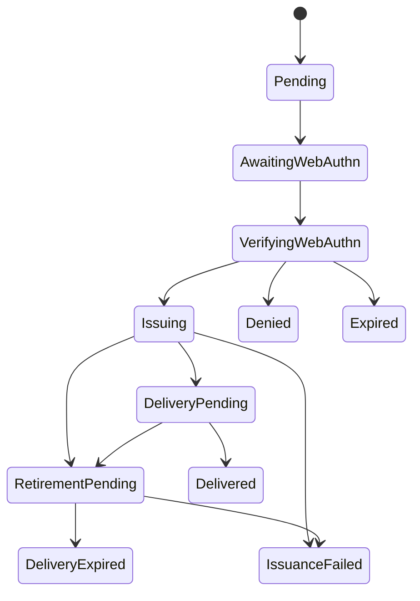

# Device Approval State v1

Status: **State-machine and port contract; production enrollment is blocked**

Scope: Server-side WebAuthn approval, idempotent certificate issuance, bounded
certificate delivery, acknowledgement, and retirement recovery in
`cy-workspace-fabric`.

Non-goals: A production Directory identity authority, WebAuthn verifier or
credential store, CA signer, certificate registry/activation service, or
retirement backend. The in-memory implementations and test ports are not
production implementations.

状态：**状态机与端口契约；生产设备注册仍受阻**。

范围：`cy-workspace-fabric` 中的服务端 WebAuthn 审批、幂等证书签发、有限时证书交付、确认和撤销恢复。

非目标：生产 Directory 身份权威、WebAuthn verifier 或 credential store、CA signer、证书 registry/activation 服务及 retirement 后端。内存实现和测试端口均不是生产实现。

## 1. Identity and trust boundaries / 身份与信任边界

The values below represent different authorities and lifetimes. They must not
be inferred from one another.

| Value | Meaning and source |
|---|---|
| `authorization_id` | One durable enrollment authorization and CA idempotency key. |
| `approval_id` | One server-created WebAuthn approval attempt. |
| `device_code` | Random 256-bit poll bearer; only its digest is persisted. |
| `user_code` | Short operator-entered code; stored as a versioned HMAC digest. |
| `device_id` | Stable WorkspaceDevice identity owned by Directory. It is not generated from `authorization_id` or present in this state-machine slice. |
| `registration_key` | High-entropy recovery credential for the Directory registration binding. Its exact-tuple replay and safe authorization recovery are not implemented by this state-machine slice. |

`device_id` must be bound by Directory using the registration key, exact scope,
CSR DER digest, and SPKI digest. Rotation must reuse the existing device ID
after authenticating the current WorkspaceDevice. If that binding is absent,
the HTTP/product projection must fail closed; it must not start signing or
return a response that implies a stable device identity.

`device_id` 由 Directory 持有，必须通过 registration key、精确 scope、CSR DER digest 和 SPKI digest 绑定。轮换时必须先认证当前 WorkspaceDevice，再复用现有 device ID。绑定不存在时，HTTP/Product 投影必须失败关闭；不得启动签名，也不得返回暗示稳定设备身份已建立的响应。

The manager stores a private `DeviceAuthorizationRegistrationBinding` snapshot
containing the opaque Directory binding ID, exact Workspace device key,
authorization generation, CSR digest, and SPKI digest. Its only production
conversion seam is crate-private and accepts a trusted Directory result; no
public constructor or request deserialization path exists. The start response,
WebAuthn context, signer request/attestation, delivery, and receipt carry the
same device ID and generation. The signer result must echo the binding ID, key,
generation, scope, and SPKI exactly or the certificate is quarantined and
retired.

The production Directory conversion is not wired in this state-machine slice.
Until that adapter exists, a request cannot construct the manager binding and
production start remains unavailable.

manager 持久化私有 `DeviceAuthorizationRegistrationBinding` snapshot，包含 opaque Directory binding ID、精确 Workspace device key、authorization generation、CSR digest 和 SPKI digest。唯一生产转换入口为 crate-private，只接收可信 Directory 结果；没有 public constructor 或 request 反序列化入口。Start response、WebAuthn context、signer request/attestation、delivery 和 receipt 均携带相同 device ID 与 generation。Signer result 必须精确回传 binding ID、key、generation、scope 和 SPKI，否则证书会进入 quarantine 并退休。

本状态机 slice 尚未接入生产 Directory conversion。该 adapter 完成前，request 无法构造 manager binding，生产 start 保持 unavailable。

## 2. Persisted approval lifecycle / 持久化审批生命周期

Every transition uses a durable compare-and-swap revision. Production stores
must implement cross-process CAS, unique code digests, and the approval lookup
needed to recover interrupted external work. `InMemoryDeviceAuthorizationStore`
is only for tests and local development.

Each transition uses durable compare-and-swap revision. Production store 必须实现跨进程 CAS、code digest 唯一性，以及恢复外部调用所需的 approval 查询。`InMemoryDeviceAuthorizationStore` 仅供测试和本地开发使用。

### 2.1 WebAuthn start, finish, and cancellation / WebAuthn 开始、完成与取消

1. `start_authentication` receives trusted user identity, exact organization/workspace scope, the Directory binding ID/device key/generation, CSR/SPKI digests, authorization expiry, and a new `approval_id`.
2. It returns public credential request options and opaque server authentication state. The manager persists the opaque state with the approval record; it is never returned to the browser or logged.
3. Finish reserves one assertion digest in `VerifyingWebAuthn`, then calls the verifier with the same context and opaque state. The verifier must make the same approval/assertion retry idempotent while consuming the challenge and updating its credential counter atomically.
4. Poll updates can advance the record revision while verification is running. The manager reloads and retries only while the exact approval, challenge state, and assertion remain current.
5. Denial or TTL expiry may win while the record is `VerifyingWebAuthn`. The manager reads trusted current time after verifier completion and rechecks expiry on each CAS attempt.
6. `VerifyingWebAuthn -> Issuing` is the linearization point. Once `Issuing` wins, denial/expiry cannot overwrite it; before then, a cancelled or expired record must never call the CA even if WebAuthn already consumed the assertion.

1. `start_authentication` 接收可信 user identity、精确 organization/workspace scope、Directory binding ID/device key/generation、CSR/SPKI digest、授权过期时间和新的 `approval_id`。
2. verifier 返回公开 credential request options 与不透明 server authentication state。manager 将 opaque state 持久化到审批记录，不返回给浏览器，也不写入日志。
3. Finish 在 `VerifyingWebAuthn` 中预留一个 assertion digest，再用原上下文和 opaque state 调 verifier。verifier 必须让同一 approval/assertion 重试幂等，并原子消费 challenge、更新 credential counter。
4. 验证运行期间 poll 可以推进记录 revision。manager 只能在 approval、challenge state 和 assertion 均未变化时重读并重试。
5. `VerifyingWebAuthn` 阶段仍允许 deny 或 TTL expiry 获胜。verifier 返回后，manager 读取可信当前时间，并在每次 CAS 尝试中重查过期。
6. `VerifyingWebAuthn -> Issuing` 是线性化点。`Issuing` 获胜后 deny/expiry 不得覆盖；此前若 deny/expiry 获胜，即使 WebAuthn 已消费 assertion，也绝不能调用 CA。

### 2.2 Issuance outcomes / 签发结果

The CA port is keyed by `authorization_id` and must replay the same certificate
for the exact same scope, CSR, SPKI digest, and persisted `issued_at` value.
The port distinguishes:

| Outcome | Durable state and action |
|---|---|
| `DefinitiveNoCommit` | The CA guarantees no concurrent or later commit for this exact key/request. Persist `IssuanceFailed`; do not retry as a new authorization. |
| `OutcomeUnknown` | Keep `Issuing`. Recovery retries the same ID and exact inputs so the signer can reconcile or return its original certificate. |
| Valid, correctly bound certificate | Persist the exact DER, chain, SHA-256 fingerprint, delivery ID, and deadline as `DeliveryPending`. The CA result must attest the same Directory binding ID, stable device key, generation, exact scope, and SPKI. |
| Misbound, malformed, or already expired certificate | Persist `RetirementPending` before calling retirement. A wrong device key or authorization generation is a binding failure. Never place the certificate in a delivery response. |

CA port 以 `authorization_id` 为幂等键，并必须对完全相同的 scope、CSR、SPKI digest 和已持久化 `issued_at` 重放同一证书。端口区分以下结果：

| 结果 | 持久状态与动作 |
|---|---|
| `DefinitiveNoCommit` | CA 保证该 key/request 不存在并发或后续提交。持久化 `IssuanceFailed`；不得改用新授权重试。 |
| `OutcomeUnknown` | 保持 `Issuing`。恢复时使用相同 ID 和完全相同输入重试，让 signer 对账或返回原证书。 |
| 有效且绑定正确的证书 | 将原始 DER、chain、SHA-256 fingerprint、delivery ID 和 deadline 持久化为 `DeliveryPending`。CA result 必须 attestation 同一 Directory binding ID、stable device key、generation、精确 scope 和 SPKI。 |
| 绑定错误、格式错误或已经过期的证书 | 先持久化 `RetirementPending`，再调用 retirement。device key 或 authorization generation 错误也属于 binding failure。绝不把该证书放入交付响应。 |

### 2.3 Delivery and acknowledgement / 交付与确认

- `DeliveryPending` stores the exact certificate bytes and chain. Every poll before the acknowledgement deadline returns the byte-identical certificate and the same `delivery_id`.
- The deadline is the earlier of five minutes after delivery becomes ready and certificate `not_after`.
- ACK requires the device-code holder plus the exact authorization ID, delivery ID, certificate SHA-256, CSR SHA-256, and CSR SPKI SHA-256.
- The ACK CAS commits `Delivered` only while trusted current time is strictly before the deadline. An exact replay of a receipt already committed before the deadline returns the same receipt, including after the deadline.
- The registered ACK CAS also verifies the current Directory authorization generation. A new ACK from a stale generation is rejected; replay of that authorization's exact already-committed receipt remains idempotent after a later generation is created.
- This manager does not activate a registry sequence. A certificate in `DeliveryPending` or `Delivered` must not be treated as an active WorkspaceDevice certificate. Production activation must happen only after durable ACK and an explicit registry transition.
- At deadline, the manager persists `RetirementPending` and calls the idempotent retirement port. It marks `DeliveryExpired` only after retirement is confirmed. An unresolved result remains `RevocationPending` or `RecoveryBlocked` and must be retried or explicitly reconciled.

- `DeliveryPending` 保存完全相同的证书字节和 chain。确认 deadline 前的每次 poll 都返回字节完全一致的证书和相同 `delivery_id`。
- deadline 是“交付就绪后五分钟”和证书 `not_after` 两者中较早者。
- ACK 必须由 device-code 持有者提交，并精确匹配 authorization ID、delivery ID、证书 SHA-256、CSR SHA-256 和 CSR SPKI SHA-256。
- 只有可信当前时间严格早于 deadline 时，ACK CAS 才能提交 `Delivered`。deadline 前已提交 receipt 的精确重放会返回同一 receipt，即使重放发生在 deadline 之后。
- Registered ACK CAS 还会核对当前 Directory authorization generation。旧 generation 的新 ACK 会被拒绝；更高 generation 建立后，旧 authorization 已提交 receipt 的精确重放仍保持幂等。
- 当前 manager 不激活 registry 序列。`DeliveryPending` 或 `Delivered` 证书均不得被视为 Active WorkspaceDevice 证书。生产激活必须发生在 ACK 持久提交之后，并通过显式 registry 状态迁移完成。
- 到达 deadline 时，manager 先持久化 `RetirementPending`，再调用幂等 retirement port。只有确认 retirement 后才能标记 `DeliveryExpired`。未解决的结果保持 `RevocationPending` 或 `RecoveryBlocked`，必须重试或显式对账。

## 3. User-code digest keys / User code digest 密钥

The manager requires an injected `UserCodeKeyRing`; there is no default key.
New codes use the active version. Lookup derives candidates across configured
versions and verifies the selected HMAC in constant time. Manager startup
checks that every version still referenced by stored records is present.
Removing a historical key before its records expire makes those records
unreadable and fails startup closed. Legacy unversioned SHA-256 user-code rows
cannot be converted without the raw code; migration must expire/purge and
reissue them rather than inventing a digest.

manager 必须注入 `UserCodeKeyRing`，没有默认密钥。新 code 使用 active version；查找会生成配置版本的候选值，并以常时比较校验选中 HMAC。manager 启动时会检查存储记录引用的所有密钥版本。记录过期前删除历史密钥，会使记录不可读并导致启动失败关闭。旧的无版本 SHA-256 user-code 行无法在没有原始 code 的情况下转换；迁移必须过期/清除并重新签发，不能伪造 digest。

## 4. Production prerequisites / 生产前置条件

Do not enable the HTTP/Product device-enrollment flow until all of these are
implemented and integrated:

1. Directory registration binding from the 256-bit recovery credential and exact scope/CSR/SPKI tuple to one stable `device_id`; same-tuple retries recover the same binding, and rotations authenticate the current device and reuse its ID.
2. A composite PostgreSQL authorization store whose registered insert, every state CAS, and new ACK CAS lock/validate the Directory binding generation in the same transaction as the authorization row. Legacy stores inherit `Unavailable` defaults for these operations and cannot fall back to plain insert/CAS. The in-memory store is a test fixture only. The production store must also provide registration-key recovery semantics, attempt limits, and safe pre-`Issuing` supersession. Code-digest rotation and generation fencing must be atomic; stale device codes must not poll or ACK.
3. Production WebAuthn verifier and durable credential store with atomic challenge consumption/counter updates and same-assertion retry semantics.
4. Idempotent CA signer/reconciler that binds the stable Directory `device_id`, exact workspace scope, and CSR SPKI; it must distinguish definitive no-commit from unknown outcome.
5. Idempotent revocation/retirement backend and reconciliation for misbound, expired, and unacknowledged certificates.
6. Certificate registry/activation backend that does not mark a serial Active until the ACK receipt is durable, and can recover/retire a signed but unactivated certificate.
7. Wire mapping and TCK that expose the required Directory `device_id`, delivery deadline, exact ACK tuple, and retirement recovery status. Missing Directory identity must return unavailable rather than inventing an ID.

以上能力全部实现并集成之前，不得启用 HTTP/Product 设备注册流程：

1. Directory 必须将 256-bit recovery credential 与精确 scope/CSR/SPKI tuple 绑定到一个稳定 `device_id`；同 tuple 重试查回相同绑定，轮换须认证当前设备并复用其 ID。
2. Composite PostgreSQL authorization store 必须在与 authorization row 相同的事务中锁定/校验 Directory binding generation，并实现 registered insert、每次 state CAS 和新 ACK CAS。旧 store 继承的这些操作默认返回 `Unavailable`，不能回退到普通 insert/CAS。内存 store 仅供测试。生产 store 还必须实现 registration-key 恢复语义、尝试次数限制和 `Issuing` 之前的安全 supersede。code digest 轮换与 generation fencing 必须原子执行；旧 device code 不得 poll 或 ACK。
3. 生产 WebAuthn verifier 与 durable credential store 必须原子消费 challenge/更新 counter，并支持同 assertion 的安全重试。
4. 幂等 CA signer/reconciler 必须绑定稳定 Directory `device_id`、精确 workspace scope 和 CSR SPKI，并区分确定未提交与结果未知。
5. 幂等 revocation/retirement 后端必须可对账绑定错误、过期和未确认的证书。
6. Certificate registry/activation 后端不得在 ACK receipt 持久化之前将 serial 标记为 Active，并能恢复/retire 已签发但未激活的证书。
7. Wire mapping 与 TCK 必须暴露 Directory 必需的 `device_id`、delivery deadline、精确 ACK tuple 和 retirement recovery status。Directory identity 缺失时必须返回 unavailable，不得临时生成 ID。

## 5. Local evidence boundary / 本地证据边界

The Rust tests exercise fake ports and the in-memory store. They verify state
transitions, retry behavior, digest binding, and CAS races; they do not prove a
production Directory, WebAuthn credential database, CA, revocation service,
or certificate registry exists or is reachable.

Rust 测试使用 fake ports 和内存 store，验证状态迁移、重试行为、digest 绑定与 CAS 竞态；这些测试不证明生产 Directory、WebAuthn credential database、CA、revocation service 或 certificate registry 已实现或可访问。
