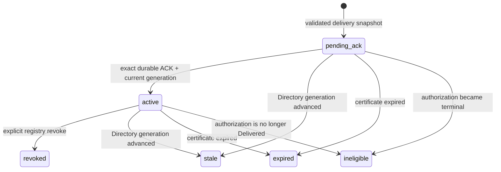

# Workspace Device Registry PostgreSQL Activation v1

This note records the fail-closed boundary implemented by the Platform PostgreSQL device registry. The registry stores certificate metadata and exposes a device as approved only after it can prove a durable certificate-delivery ACK for the exact authorization, certificate, and current Directory generation.

这份说明记录 Platform PostgreSQL 设备注册表的失败关闭边界。注册表持久化证书元数据；只有确认精确授权、证书和当前 Directory 代次的 ACK 已持久提交后，才会把设备返回为已批准。

## State and transaction boundary

`stage_pending_delivery(authorization_id)` locks the Directory identity and authorization rows, and re-reads the immutable registration binding. It accepts only a V2 `delivery_pending` payload whose certificate metadata, DER SHA-256, CSR/SPKI digests, delivery ID, approval ID, and acknowledgement deadline agree with the row columns and binding. The insert is immutable and starts in `pending_ack`; the database trigger independently rejects any insert in an active state.

`activate_acknowledged_delivery(authorization_id)` is idempotent. In one transaction it locks Directory identity, authorization, then registry row; checks the exact current generation and immutable binding; requires `state_kind = delivered`; compares the persisted receipt to the staged authorization ID, delivery ID, certificate SHA-256, CSR and SPKI digests, device ID, generation, ACK deadline, and certificate expiry; then changes `pending_ack` to `active`. A database trigger repeats the ACK and generation checks before accepting the transition.

If the process stops after the authorization ACK commits but before registry activation commits, the row remains `pending_ack`. A bounded reconciler retries the same activation. An unknown database result is an error; no in-memory success is inferred. Stale generations, expired certificates, and terminal authorization states are moved to inactive terminal registry states. Registry inactivity does not claim that the external CA has revoked the certificate.

The mTLS fingerprint lookup accepts `active` only when one MVCC join sees the active registry row, exact Delivered authorization and receipt, immutable Directory binding, and matching current generation in the same statement snapshot. It also checks certificate expiry against database time. A rotation that advances the current generation therefore fences the old certificate on subsequent lookups, even if cleanup has not run. Missing, malformed, or mismatched V2 evidence returns Unavailable or no approved record.

mTLS 指纹查询只有在同一 MVCC join 快照中看到 active 注册记录、精确 Delivered 授权与回执、不可变 Directory binding 和匹配的当前代次才会接受 `active`，并按数据库时间检查证书有效期。即使清理尚未运行，推进当前代次的轮换也会在后续查询中隔离旧证书。缺失、格式错误或不匹配的 V2 证据会返回 Unavailable 或不返回已批准设备。

## Deployment and integration gates

- Apply migrations in this order: Directory base (`0001_workspace_directory`), Directory binding (`0002_device_registration_binding`), device authorization V2 (binding columns, V2 state payload, and delivery ACK states), then Registry (`device_registry/0001_device_certificate_registry`). The registry migration intentionally fails if its required tables or columns are absent.
- The runtime login must be a member of the runtime app role, which receives `SELECT` and the required-column `INSERT` on registry records, column-scoped reads of authorization and Directory evidence, and `EXECUTE` only on activation and revoke functions. It receives no registry `UPDATE`, no helper-function execute, and no membership in the dedicated `NOLOGIN` function-owner role. That role owns the fixed-search-path `SECURITY DEFINER` functions and receives only the column-scoped reads, row-lock privileges, and registry state-update privileges those functions need. The migration principal temporarily grants itself membership to transfer function ownership, then revokes it. Use a separate migration credential. TLS certificate and hostname validation are required by the adapter.
- The ordinary `import_approved_device_certificate` port is rejected by the PostgreSQL adapter. The delivery handler must stage before returning certificate bytes, and its ACK path must call activation only after the authorization store commits Delivered.
- The handler, authorization store, Directory authority, and registry must use the same PostgreSQL database for row locks and durable evidence. The registry adapter does not itself make Directory binding allocation and authorization insertion one composite transaction. Production enrollment must remain unavailable until that composite transaction is integrated.
- No production CA, certificate retirement, Directory orchestration, HTTP handler wiring, or live PostgreSQL acceptance test is supplied by this slice. Reconciliation and mTLS lookup code are local implementation evidence only until those integrations are exercised.

## 部署与集成门槛

- 适配器要求 TLS 证书与主机名校验。
- PostgreSQL 适配器拒绝普通 `import_approved_device_certificate`。HTTP 交付处理必须先 stage 再返回证书字节；ACK 路径必须等授权 store 提交 Delivered 后才调用 activation。
- HTTP handler、授权 store、Directory authority 与注册表必须使用同一 PostgreSQL 数据库，才能共享行锁和持久证据。此适配器本身没有把 Directory binding 分配与授权插入合并为一个复合事务。该复合事务接入前，生产设备注册必须保持不可用。
- 本提交不提供生产 CA、证书退休、Directory 编排、HTTP handler 接线或真实 PostgreSQL 验收测试。reconciliation 与 mTLS 查询目前只是本地实现证据，仍需在集成后实测。
- 迁移顺序为：Directory 基础 migration（`0001_workspace_directory`）、Directory binding（`0002_device_registration_binding`）、设备授权 V2（binding 列、V2 状态负载和 ACK 状态），最后是 Registry（`device_registry/0001_device_certificate_registry`）。缺少依赖表或列时 Registry migration 会失败。
- 运行时登录身份必须是 app role 的成员；app role 仅有注册表 `SELECT` 和限定列的 `INSERT`、授权与 Directory 证据的列级读取权限，以及对 activation/revoke 两个函数的 `EXECUTE`。它没有注册表 `UPDATE`、helper 函数权限，也不属于专用 `NOLOGIN` function-owner role。该 owner role 持有固定 `search_path` 的 `SECURITY DEFINER` 函数，只取得这些函数所需的列级读取、行锁和注册表状态更新权限。迁移身份为转移函数 owner 临时授予自身 role membership，随后立即撤销。migration 使用独立凭据。
