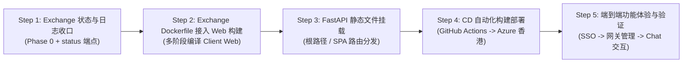

# Exchange Web Pilot & Vertical Slice Plan
# Exchange Web 试点与垂直切片计划

Status: **PROPOSED** — experimental vertical slice execution plan.
Upstream reference: [`no-port-connectivity-plan.md`](no-port-connectivity-plan.md) (Phases 0 & 3).

状态：**PROPOSED（提案中）** — 试验性垂直切片执行计划。
上游引用：[`no-port-connectivity-plan.md`](no-port-connectivity-plan.md)（Phase 0 与 Phase 3）。

---

## 1. Context and Motivation | 背景与动机

The master plan [`no-port-connectivity-plan.md`](no-port-connectivity-plan.md) designs a comprehensive, zero-inbound-port architecture across all 6 Cyrene microservices, the Rust Workspace Fabric, gRPC relay streaming, biometric device approval, and cross-NAT artifact distribution.

Executing that entire blueprint in a single step introduces high coordination complexity across 10 repositories. To validate the feasibility, usability, and developer experience with the smallest possible workload, this document defines the **first minimal vertical slice (Pilot POC)**:

> **Wire the existing Web console from [`Cyrene-Client`](https://github.com/DoHorizon-AI/Cyrene-Client) directly to the newly deployed Hong Kong Azure [`Cyrene-Exchange`](https://github.com/DoHorizon-AI/Cyrene-Exchange) gateway.**

This pilot proves the core principles of the No-Port plan in a real cloud environment without touching unfinished service surfaces.

主计划 [`no-port-connectivity-plan.md`](no-port-connectivity-plan.md) 规划了一套覆盖 Cyrene 全部 6 个微服务、Rust Workspace Fabric、gRPC 中继流控、生物识别设备审批和跨 NAT 大文件传输的完整无端口体系。

一次性全量落地该蓝图跨越 10 个仓库，协同复杂度较高。为了以**最小的工作量**验证架构可行性、实际可用性与端到端体验，本文档制定了**首个最小垂直切片（试验性 POC）**：

> **将 [`Cyrene-Client`](https://github.com/DoHorizon-AI/Cyrene-Client) 中现有的 Web 控制台直接打通至最新部署在 Azure 香港数据中心的 [`Cyrene-Exchange`](https://github.com/DoHorizon-AI/Cyrene-Exchange) 网关。**

该试点在真实云环境中验证无端口计划的核心理念，同时无需提前变动尚未准备好的其他服务。

---

## 2. Scope Boundary | 范围边界

### In Scope (This Pilot) | 本试点范围内

1. **Client Web Console Reuse**: Build and leverage `Cyrene-Client/apps/web/services/navigator` (which already contains `GatewayPage`, `ChatPage`, and `OverviewPage`).
2. **Fused Container Delivery**: Package the compiled Web UI directly into `Cyrene-Exchange`'s multi-stage Docker container, mounted at root `/`.
3. **Same-Origin & SSO Convergence**:
   - Access via the existing Hong Kong FQDN (`https://cyrene-exchange.whitefield-8c4d4393.eastasia.azurecontainerapps.io/`).
   - Outer layer guarded by Azure Envoy + Microsoft Entra ID (Easy Auth).
   - Zero CORS issues; requests to `/v1/*` and `/api/v1/*` use relative same-origin paths.
4. **Phase 0 Logging Close-Out**: Resolve silent error paths in `Cyrene-Exchange/src/cyrene_exchange/gateway.py` as specified in upstream Phase 0.
5. **Minimal Control Plane Projection**: Ensure `Cyrene-Exchange` exposes a lightweight `/api/v1/system/status` projection so the Web Client can detect host health immediately.

### Non-Goals (Deferred to Subsequent Slices) | 非目标（延后至后续切片）

- No modification to `Cyrene-Catalyst`, `Cyrene-Yield`, `Cyrene-Echo`, or `Cyrene-Reactor`.
- No deployment of the Rust gRPC Relay or outbound mTLS tunnel (the Azure Container App ingress serves as the outer HTTPS gateway for this slice).
- No cross-NAT model weights synchronization (Phase 2 object storage fallback).

---

## 3. Architecture and Data Flow | 架构与数据流

```mermaid
flowchart TD
    User(["用户浏览器 / Web Client"]) -->|HTTPS 443 (无裸业务端口)| Envoy["Azure ACA Envoy 反向代理 (香港 East Asia)"]

    subgraph AzureEdge ["Azure 边缘身份守卫"]
        Envoy -->|未登录| EasyAuth["Microsoft Entra ID SSO 拦截重定向"]
        Envoy -->|已登录 (携带 AppServiceAuthSession Cookie)| Container["容器: cyrene-exchange (私有端口 8000)"]
    end

    subgraph ContainerApp ["Cyrene-Exchange 统一融合容器"]
        Container -->|/ 与 /assets/*| StaticUI["Cyrene-Client Navigator Web UI (SPA 静态资源)"]
        Container -->|/v1/chat/completions 与 /v1/models| DataPlane["Exchange 数据面 (OpenAI 协议 / SSE 流式推理)"]
        Container -->|/api/v1/gateway-* 与 /api/v1/api-keys| ControlPlane["Exchange 控制面 (路由管理 / API Key 颁发)"]
        Container -->|/api/v1/system/status| HealthStatus["Exchange 状态投影 (供 Web 控制台探活)"]
    end

    DataPlane -->|上游提供方绑定| ModelProvider["模型提供方 (Ollama / vLLM / Cloud Provider)"]
```

### Key Architectural Benefits | 关键架构收益

1. **Zero External Ports**: Only HTTPS 443 is exposed externally. Internal FastAPI port 8000 stays private within the ACA network boundary.
2. **Zero Configuration for Users**: No need to manually configure backend IPs, ports, or API endpoints in the browser; everything resolves via same-origin relative URLs.
3. **SSO Identity as Gateway Key**: Authentication is terminated at the edge by Microsoft Entra ID before waking up backend serverless compute.
4. **Immediate Testability**: The user can open the browser, authenticate with their corporate Microsoft account, inspect active Exchange routes on `GatewayPage`, generate API keys, and test live chat on `ChatPage`.

---

## 4. Work Breakdown and Execution Steps | 工作拆解与实施步骤



### Step 1: Exchange Status Projection & Phase 0 Logging Close-out
- **Phase 0 Audit**: In `Cyrene-Exchange/src/cyrene_exchange/gateway.py:602`, ensure auth resolution failures log structured cause details with `trace_id` rather than silently discarding credentials. Ensure `self._lifecycle_observer` fails closed if missing.
- **Status Endpoint**: Add a minimal `/api/v1/system/status` response in `cyrene_exchange_product.api` returning service health, version, and proxy prefixes, allowing Navigator Web UI to recognize Exchange as an active host.

### Step 2: Client Web Build in Exchange Dockerfile
- In `Cyrene-Services/Cyrene-Exchange/Dockerfile`, add a Node.js builder stage (`node:22-alpine`):
  ```dockerfile
  FROM node:22-alpine AS web-builder
  WORKDIR /app/client
  COPY Cyrene-Client/package*.json ./
  COPY Cyrene-Client/packages ./packages
  COPY Cyrene-Client/apps/web/services/navigator ./apps/web/services/navigator
  RUN npm --prefix apps/web/services/navigator install && \
      npm --prefix apps/web/services/navigator run build
  ```
- Copy the resulting `dist/` directory into `/app/exchange/web_dist/` in the runtime container.

### Step 3: FastAPI Static File & SPA Fallback Mount
- In `cyrene_exchange_product.server` or `cyrene_exchange.http`:
  - Mount `/assets` to `StaticFiles(directory="web_dist/assets")`.
  - Serve `web_dist/index.html` on `/` and any unrecognized non-API routes (SPA HTML5 history routing).
  - Preserve all existing API endpoints (`/v1/*`, `/api/v1/*`, `/healthz`, `/docs`).

### Step 4: Automated Deployment Verification
- Push commit to `develop` on `Cyrene-Exchange`.
- GitHub Actions triggers workflow `.github/workflows/deploy-containerapp.yml`.
- Verify automated build, image push to GHCR, and deployment revision switch in Hong Kong ACA.

### Step 5: End-to-End Pilot Acceptance
- Open `https://cyrene-exchange.whitefield-8c4d4393.eastasia.azurecontainerapps.io/` in browser.
- Verify Entra ID login succeeds and lands on Navigator Console.
- Verify `GatewayPage` loads existing active endpoints.
- Generate an API Key and execute a test prompt in `ChatPage`.

---

## 5. Acceptance Criteria | 验收准则

| Checkpoint | Requirement | Verification Method |
| --- | --- | --- |
| **AC-1: Zero Port Exposure** | No public raw IP/port exposed; only port 443 with HTTPS. | Azure Container App Ingress config audit |
| **AC-2: Edge SSO Gate** | Unauthenticated requests are intercepted by Microsoft login; logged-in sessions pass through transparently. | Incognito browser verification |
| **AC-3: Web Console Delivery** | Root `/` serves Cyrene Navigator Web UI rather than 404. | Browser navigation to FQDN |
| **AC-4: No CORS Friction** | All `/api/v1/*` and `/v1/*` requests succeed with `200 OK` without CORS errors. | Browser DevTools Network tab |
| **AC-5: Gateway & Chat E2E** | User can inspect gateway routes, create/revoke an API key, and send a chat completion. | Live UI walkthrough |

---

## 6. Summary | 总结

This pilot plan takes the **most tangible slice** of `no-port-connectivity-plan.md` and realizes it with minimal code overhead. It serves as an experimental milestone: once proven successful, the exact same pattern can be progressively extended to the remaining services.

本试点计划选取了 `no-port-connectivity-plan.md` 中**最直观、用户价值最高的一个切片**，以极小的代码增量将其落地。它是一个试验性里程碑：一旦验证可行，后续可将完全相同的模式平滑推广至其余微服务。
