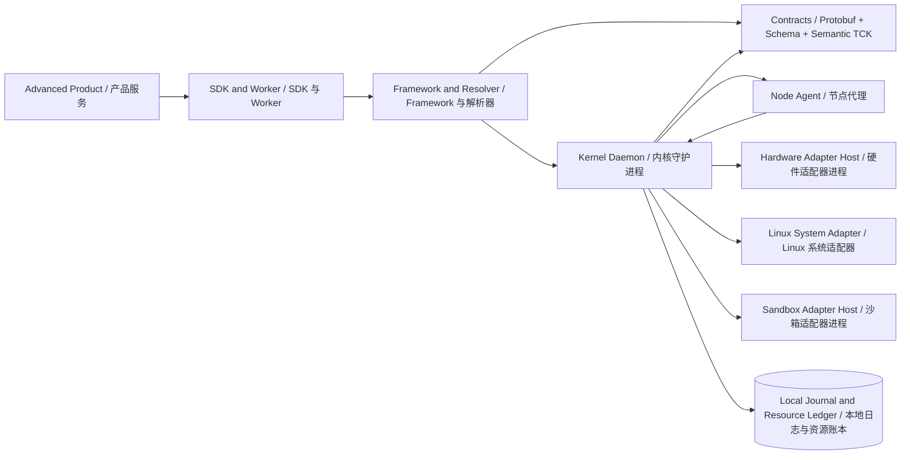

# CYRENE Platform Architecture Overview

This overview connects the language-neutral contracts to the Kernel, Framework,
SDK, node agent, and separately supervised local adapters.

本概览把语言无关的契约与 Kernel、Framework、SDK、Node Agent 及独立监管的本地
适配器连接起来。

## Request and evidence flow | 请求与证据流

1. A product expresses a product-neutral capability or workload intent.
2. The Framework resolves a compatible extension and compiles an execution
   request against the versioned contract.
3. The Kernel validates authority, revision, lease, and resource facts. It
   keeps the durable allocation ledger separate from fresh observations.
4. Hardware and sandbox operations cross authenticated local IPC boundaries;
   vendor libraries, cgroups, devices, and process primitives stay outside
   the Kernel address space.
5. Lifecycle events and exit evidence return through the contract projection,
   allowing products to reconcile without owning Kernel state.

1. 产品表达与具体产品无关的能力或工作负载意图。
2. Framework 解析兼容扩展，并依据版本化契约编译执行请求。
3. Kernel 校验权威身份、版本、租约和资源事实；持久分配账本与新鲜观测分离。
4. 硬件与沙箱操作通过认证的本地 IPC 边界完成；厂商库、cgroup、设备及进程
   原语不进入 Kernel 地址空间。
5. 生命周期事件与退出证据沿契约投影返回，使产品能够协调状态而不拥有 Kernel
   内部状态。

## Authority rules | 权威规则

Focused boundary pages: [`system-adapter.md`](system-adapter.md) and
[`sandbox-adapter.md`](sandbox-adapter.md). Their Chinese mirrors are
[`../zh-CN/architecture/system-adapter.md`](../zh-CN/architecture/system-adapter.md)
and [`../zh-CN/architecture/sandbox-adapter.md`](../zh-CN/architecture/sandbox-adapter.md).

重点边界页面：[`system-adapter.md`](system-adapter.md) 与
[`sandbox-adapter.md`](sandbox-adapter.md)。对应中文镜像是
[`../zh-CN/architecture/system-adapter.md`](../zh-CN/architecture/system-adapter.md)
和 [`../zh-CN/architecture/sandbox-adapter.md`](../zh-CN/architecture/sandbox-adapter.md)。

- Semantic contracts are authoritative for nouns, transitions, and denials.
- Protobuf and SDK types are projections; they must not introduce hidden
  semantics.
- The Framework owns discovery, policy routing, and plugin composition.
- The Kernel owns local admission, leases, fencing, lifecycle decisions, and
  generic transport—not product workflows or model execution.
- Adapters own privileged host facts and enforcement in separately supervised
  processes. The Linux build requires the Linux System Adapter for host facts;
  the sandbox remains a replaceable `SandboxBackend` with one lifecycle owner.

- 语义契约是名词、状态转换与拒绝条件的权威来源。
- Protobuf 与 SDK 类型是投影，不得引入隐藏语义。
- Framework 负责发现、策略路由和插件组合。
- Kernel 负责本地准入、租约、围栏、生命周期决策与通用传输，不负责产品流程或
  模型执行。
- 适配器在独立监管的进程中负责特权主机事实与强制执行。Linux 构建必须通过
  Linux System Adapter 获取主机事实；沙箱仍是可替换的 `SandboxBackend`，每个
  Worker 只允许一个生命周期 owner。
---

<!-- Chinese Translation / 中文翻译 -->

# CYRENE Platform 架构概览

本概览连接语言无关的契约与 Kernel、Framework、SDK、Node Agent 以及独立监管的本地适配器。

## 请求与证据流

1. Product 表达与具体产品无关的能力或工作负载意图。
2. Framework 解析兼容扩展，并依据版本化契约编译执行请求。
3. Kernel 校验权威身份、修订版本、租约和资源事实。它将持久分配账本与最新观测分开保存。
4. 硬件和沙箱操作跨越经过认证的本地 IPC 边界；厂商库、cgroup、设备及进程原语留在 Kernel 地址空间之外。
5. 生命周期事件与退出证据沿契约投影返回，使 Products 能够协调状态，而无需拥有 Kernel 状态。

## 权威规则

重点边界页面：[system-adapter.md](system-adapter.md) 与 [sandbox-adapter.md](sandbox-adapter.md)。对应中文镜像：[../zh-CN/architecture/system-adapter.md](../zh-CN/architecture/system-adapter.md) 和 [../zh-CN/architecture/sandbox-adapter.md](../zh-CN/architecture/sandbox-adapter.md)。

- 语义契约是名词、状态转换和拒绝条件的权威来源。
- Protobuf 和 SDK 类型是投影；不得引入隐藏语义。
- Framework 负责发现、策略路由和插件组合。
- Kernel 负责本地准入、租约、围栏、生命周期决策和通用传输；不负责 Product 工作流或模型执行。
- 适配器在独立监管的进程中拥有特权主机事实并负责强制执行。Linux 构建需要 Linux System Adapter 提供主机事实；沙箱仍是可替换的 SandboxBackend，且每个 Worker 只有一个生命周期 owner。
