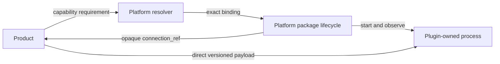

# Tool and Plugin system

The Plugin repository manifest owns capability names, interface versions,
method and payload schemas, language, protocol, and package launcher. Platform
uses opaque ids for compatibility and never maintains hardware/model/precision
business taxonomies.
---

<!-- Chinese Translation / 中文翻译 -->

# Tool 与 Plugin 系统

Plugin 仓库清单负责能力名称、接口版本、方法与负载架构、语言、协议和包启动器。Platform 使用不透明 ID 进行兼容性判断，不维护硬件、模型或精度等业务分类体系。
