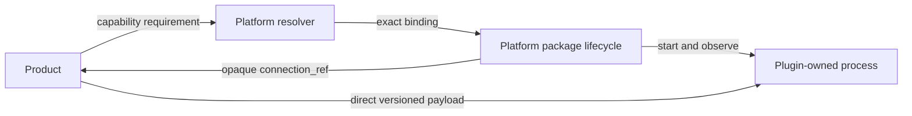

# Tool and Plugin system

The Plugin repository manifest owns capability names, interface versions,
method and payload schemas, language, protocol, and package launcher. Platform
uses opaque ids for compatibility and never maintains hardware/model/precision
business taxonomies.
