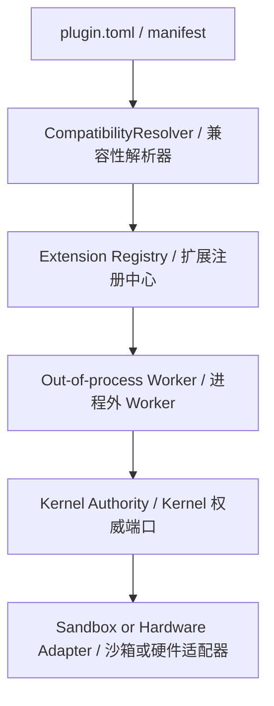

# Tool and Plugin System

The Framework presents a small, typed extension surface. Plugins implement
capabilities out of process; the Kernel remains a generic execution authority.

Framework 提供小而强类型的扩展面。插件在进程外实现具体能力；Kernel 仍然只是
通用执行权威。

## Composition rules | 组合规则

- A manifest declares identity, runtime, extension kind, and typed capability
  constraints.
- The resolver matches hardware, precision, quantization, and streaming needs;
  free-form feature labels are descriptive only.
- The registry keeps typed extension points separate while sharing common
  plugin identity and transport handling.
- Worker activation and cancellation are lifecycle operations, not product
  state transitions.
- A denied or unavailable plugin is represented explicitly; it must not be
  silently treated as a running or compatible implementation.

- Manifest 声明身份、运行时、扩展类型和强类型能力约束。
- 解析器匹配硬件、精度、量化和流式需求；自由格式 feature 标签只用于描述。
- 注册中心保持各扩展点类型隔离，同时复用插件身份与传输处理。
- Worker 激活与取消属于生命周期操作，不是产品状态转换。
- 被拒绝或不可用的插件必须显式表达，不能静默当作运行中或兼容实现。

