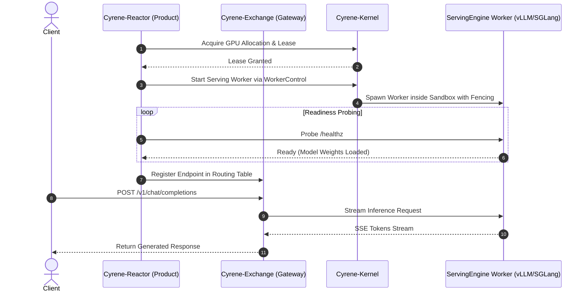
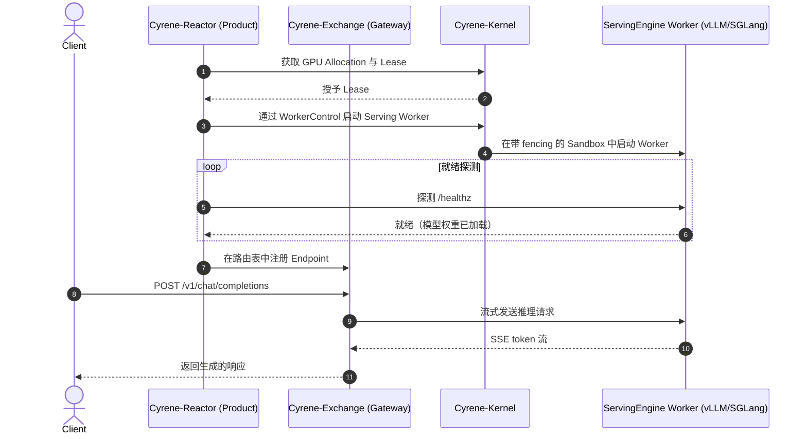

# End-to-End Flow: Model Serving & Inference

This document traces how model deployments are created, scaled, and served.

---

## Serving Architecture Flow

---

<!-- Chinese Translation / 中文翻译 -->

# 端到端流程：模型服务与推理

本文跟踪模型部署的创建、扩缩容和服务过程。

---

## 服务架构流程

