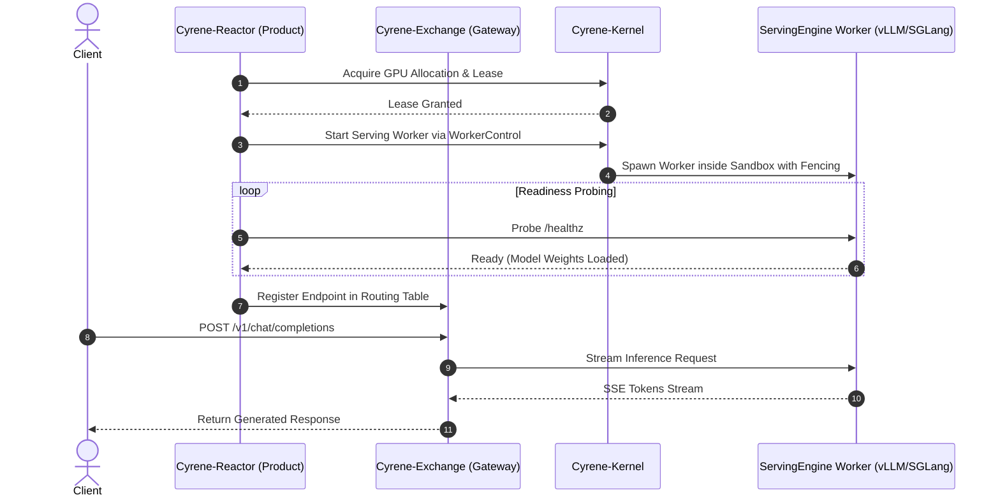

# End-to-End Flow: Model Serving & Inference

This document traces how model deployments are created, scaled, and served.

---

## Serving Architecture Flow

```mermaid
sequenceDiagram
    autonumber
    actor Client
    participant Reactor as Cyrene-Reactor (Product)
    participant Exchange as Cyrene-Exchange (Gateway)
    participant Kernel as Cyrene-Kernel
    participant Engine as ServingEngine Worker (vLLM/SGLang)

    Reactor->>Kernel: Acquire GPU Allocation & Lease
    Kernel-->>Reactor: Lease Granted
    Reactor->>Kernel: Start Serving Worker via WorkerControl
    Kernel->>Engine: Spawn Worker inside Sandbox with Fencing
    loop Readiness Probing
        Reactor->>Engine: Probe /healthz
        Engine-->>Reactor: Ready (Model Weights Loaded)
    end
    Reactor->>Exchange: Register Endpoint in Routing Table
    Client->>Exchange: POST /v1/chat/completions
    Exchange->>Engine: Stream Inference Request
    Engine-->>Exchange: SSE Tokens Stream
    Exchange-->>Client: Return Generated Response
```
