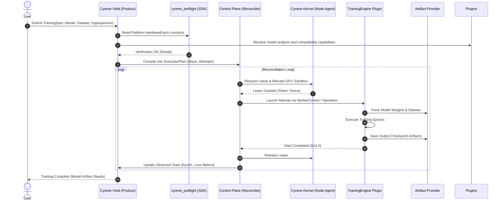

# End-to-End Flow: Model Training

This document traces the complete lifecycle of a model training job across Cyrene components.

---

## Complete Sequence Diagram

```mermaid
sequenceDiagram
    autonumber
    actor User
    participant Yield as Cyrene-Yield (Product)
    participant Preflight as cyrene_preflight (SDK)
    participant Control as Control Plane (Reconciler)
    participant Kernel as Cyrene-Kernel (Node Agent)
    participant Engine as TrainingEngine Plugin
    participant Artifacts as Artifact Provider

    User->>Yield: Submit TrainingSpec (Model, Dataset, Hyperparams)
    Yield->>Preflight: Read Platform HardwareFacts contracts
    Yield->>Plugins: Resolve model analysis and compatibility capabilities
    Preflight-->>Yield: Verification OK (Ready)
    Yield->>Control: Compile into ExecutionPlan (Steps, Attempts)
    loop Reconciliation Loop
        Control->>Kernel: Request Lease & Allocate GPU Sandbox
        Kernel-->>Control: Lease Granted (Token, Fence)
        Control->>Engine: Launch Attempt via WorkerControl / Operation
        Engine->>Artifacts: Fetch Model Weights & Dataset
        Engine->>Engine: Execute Training Epochs
        Engine->>Artifacts: Save Output Checkpoint Artifacts
        Engine-->>Control: Step Completed (Exit 0)
        Control->>Kernel: Release Lease
        Control->>Yield: Update Observed State (Epoch, Loss Metrics)
    end
    Yield-->>User: Training Complete (Model Artifact Ready)
```
