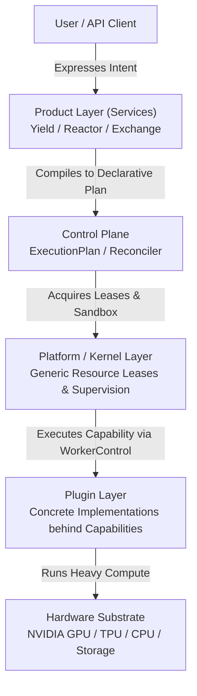

# What is Cyrene?

Cyrene is **not** a single monolithic application, nor is it merely a training script or a model server.

Cyrene is a **modular, enterprise-grade AI execution platform** designed to orchestrate the complete lifecycle of artificial intelligence workloads—from model training and fine-tuning to high-throughput inference serving, intelligent gateway routing, multi-agent execution, and data management.

---

## The Core Design Philosophy

The fundamental principle governing Cyrene is **separation of concerns across distinct architectural layers**:

1. **Users express Product Intent**: High-level business desires (e.g. *"Fine-tune Qwen-2.5-7B on dataset X with LoRA"*, or *"Serve DeepSeek-R1 with 4-way tensor parallelism"*).
2. **Product / Control Plane compiles Intent into Declarative Plans**: Services like **Cyrene-Yield** (Training) and **Cyrene-Reactor** (Serving) translate high-level intent into deterministic `ExecutionPlan`, `PlanStep`, and `Attempt` state machines.
3. **Platform / Kernel provides Generic Execution Mechanisms**: The **Cyrene-Platform** Kernel allocates node resources (GPU/CPU), manages time-bounded `Lease` tokens, isolates processes in sandboxes, and supervises worker lifecycles. **The Kernel contains zero product-specific or AI-specific semantics.**
4. **Plugins provide Concrete Replaceable Capabilities**: Specialized engines (e.g. HuggingFace analyzers, FAISS vector workers, Docker uv image builders, FastMCP tool providers) implement capability interfaces without polluting the platform foundation.

---

## Architectural Matrix Overview

| Layer | Primary Responsibility | Example Components | What It Must NEVER Own |
|---|---|---|---|
| **Product Layer** | Owns user-facing AI semantics, desired/observed state, orchestration intent | `Cyrene-Yield`, `Cyrene-Reactor`, `Cyrene-Exchange` | Generic resource leasing, cgroup sandboxing |
| **Product lifecycle** | Product-owned run state, plans, idempotency, and retry | Each Product repository | Kernel execution authority, plugin implementation |
| **Platform / Kernel** | Generic process supervisor, lease manager, node telemetry, hardware abstraction | `cyrene-kernel`, `cy-node-agent`, `WorkerControl` | Training loss curves, prompt templates, billing |
| **Plugin Layer** | Pluggable, interchangeable implementations behind standard Capability APIs | `cyrene.models.hf-analyzer`, `cyrene.data.memory` | Cluster orchestration, lease enforcement |

---

## Where to Go Next

- To understand how the layers connect: [01-system-map.md](01-system-map.md)
- To view every repository and what it owns: [02-repository-map.md](02-repository-map.md)
- To figure out where your new code belongs: [03-where-does-my-code-go.md](03-where-does-my-code-go.md)
