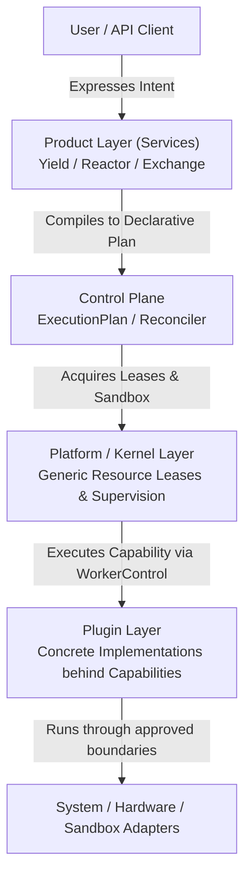

# What is Cyrene?

Cyrene is a family of repositories with a reusable Platform foundation. This
repository is not a monolithic AI product, training script, or model server;
it provides the generic contracts, Kernel authority, execution control,
adapters, SDKs, and host-runtime mechanisms consumed by Products and Plugins.

Product repositories own training, serving, gateway, agent, data, and business
workflows. Platform provides the generic execution substrate and must remain
usable without importing Product-specific semantics.

---

## The Core Design Philosophy

The fundamental principle governing Cyrene is **separation of concerns across distinct architectural layers**:

1. **Users express Product Intent**: Product-owned services accept high-level business desires and compile them to neutral execution plans.
2. **Product / Control Plane compiles Intent into Declarative Plans**: Services like **Cyrene-Yield** (Training) and **Cyrene-Reactor** (Serving) translate high-level intent into deterministic `ExecutionPlan`, `PlanStep`, and `Attempt` state machines.
3. **Platform / Kernel provides Generic Execution Mechanisms**: The **Cyrene-Platform** Kernel validates generic normalized resources, manages time-bounded `Lease` tokens, and supervises worker lifecycles. `SystemAdapter` and Hardware Adapters provide host and vendor facts; Sandbox Adapters enforce process boundaries. **The Kernel contains zero product-specific or AI-specific semantics.**
4. **Plugins provide Concrete Replaceable Capabilities**: Specialized engines (e.g. HuggingFace analyzers, FAISS vector workers, Docker uv image builders, FastMCP tool providers) implement capability interfaces without polluting the platform foundation.

---

## Architectural Matrix Overview

| Layer | Primary Responsibility | Example Components | What It Must NEVER Own |
|---|---|---|---|
| **Product Layer** | Owns user-facing AI semantics, desired/observed state, orchestration intent | `Cyrene-Yield`, `Cyrene-Reactor`, `Cyrene-Exchange` | Generic resource leasing, cgroup sandboxing |
| **Product lifecycle** | Product-owned run state, plans, idempotency, and retry | Each Product repository | Kernel execution authority, plugin implementation |
| **Platform / Kernel** | Generic process supervisor, lease manager, normalized host facts, adapter clients | `cyrene-kernel`, `cy-node-agent`, `WorkerControl` | Training loss curves, prompt templates, billing |
| **Plugin Layer** | Pluggable, interchangeable implementations behind standard Capability APIs | `cyrene.models.hf-analyzer`, `cyrene.data.memory` | Cluster orchestration, lease enforcement |

---

## Where to Go Next

- To understand how the layers connect: [01-system-map.md](01-system-map.md)
- To view every repository and what it owns: [02-repository-map.md](02-repository-map.md)
- To figure out where your new code belongs: [03-where-does-my-code-go.md](03-where-does-my-code-go.md)
