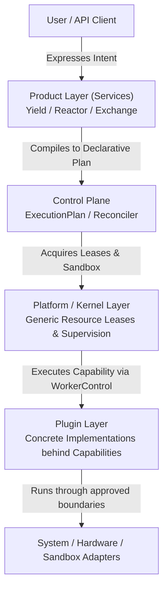
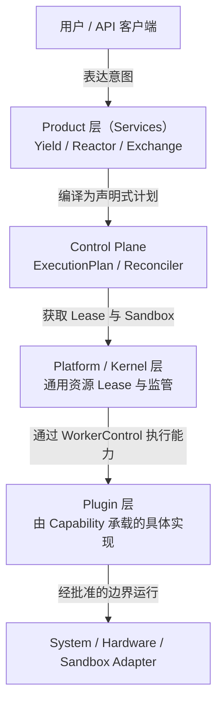

# What is Cyrene?

Cyrene is a family of repositories with a reusable Platform foundation. This
repository is not a monolithic AI product, training script, or model server;
it provides the generic contracts, Kernel authority, execution control,
adapters, SDKs, and host-runtime mechanisms consumed by Products and Plugins.

Product repositories own training, serving, gateway, agent, data, and business
workflows. Platform provides the generic execution substrate and must remain
usable without importing Product-specific semantics.

---

## The Core Design Philosophy

The fundamental principle governing Cyrene is **separation of concerns across distinct architectural layers**:

1. **Users express Product Intent**: Product-owned services accept high-level business desires and compile them to neutral execution plans.
2. **Product / Control Plane compiles Intent into Declarative Plans**: Services like **Cyrene-Yield** (Training) and **Cyrene-Reactor** (Serving) translate high-level intent into deterministic `ExecutionPlan`, `PlanStep`, and `Attempt` state machines.
3. **Platform / Kernel provides Generic Execution Mechanisms**: The **Cyrene-Platform** Kernel validates generic normalized resources, manages time-bounded `Lease` tokens, and supervises worker lifecycles. `SystemAdapter` and Hardware Adapters provide host and vendor facts; Sandbox Adapters enforce process boundaries. **The Kernel contains zero product-specific or AI-specific semantics.**
4. **Plugins provide Concrete Replaceable Capabilities**: Specialized engines (e.g. HuggingFace analyzers, FAISS vector workers, Docker uv image builders, FastMCP tool providers) implement capability interfaces without polluting the platform foundation.

---

## Architectural Matrix Overview

| Layer | Primary Responsibility | Example Components | What It Must NEVER Own |
|---|---|---|---|
| **Product Layer** | Owns user-facing AI semantics, desired/observed state, orchestration intent | `Cyrene-Yield`, `Cyrene-Reactor`, `Cyrene-Exchange` | Generic resource leasing, cgroup sandboxing |
| **Product lifecycle** | Product-owned run state, plans, idempotency, and retry | Each Product repository | Kernel execution authority, plugin implementation |
| **Platform / Kernel** | Generic process supervisor, lease manager, normalized host facts, adapter clients | `cyrene-kernel`, `cy-node-agent`, `WorkerControl` | Training loss curves, prompt templates, billing |
| **Plugin Layer** | Pluggable, interchangeable implementations behind standard Capability APIs | `cyrene.models.hf-analyzer`, `cyrene.data.memory` | Cluster orchestration, lease enforcement |

---

## Where to Go Next

- To understand how the layers connect: [01-system-map.md](01-system-map.md)
- To view every repository and what it owns: [02-repository-map.md](02-repository-map.md)
- To figure out where your new code belongs: [03-where-does-my-code-go.md](03-where-does-my-code-go.md)
---

<!-- Chinese Translation / 中文翻译 -->

# 什么是 Cyrene？

Cyrene 是一组共享可复用 Platform 基础设施的仓库。本仓库不是单体 AI 产品、训练脚本或模型服务器，而是为 Products 和 Plugins 提供通用契约、Kernel authority、执行控制、适配器、SDK 和主机运行时机制。

Product 仓库拥有训练、服务、网关、agent、数据和业务工作流。Platform 提供通用执行基础设施，并且不应导入特定 Product 语义也能正常使用。

---

## 核心设计理念

Cyrene 的基本原则是在不同架构层之间**分离关注点**：

1. **用户表达 Product 意图**：由 Product 所有的服务接收高层业务需求，并将其编译为中立执行计划。
2. **Product / Control Plane 将意图编译为声明式计划**：`Cyrene-Yield`（Training）和 `Cyrene-Reactor`（Serving）等服务将高层意图转换为确定性的 `ExecutionPlan`、`PlanStep` 和 `Attempt` 状态机。
3. **Platform / Kernel 提供通用执行机制**：`Cyrene-Platform` Kernel 校验规范化的通用资源、管理有时间限制的 `Lease` token，并监管 worker 生命周期。`SystemAdapter` 和 Hardware Adapter 提供主机与厂商事实；Sandbox Adapter 实施进程边界。**Kernel 不包含任何 Product 或 AI 专属语义。**
4. **Plugins 提供可替换的具体能力**：专用引擎（例如 HuggingFace analyzer、FAISS vector worker、Docker uv image builder、FastMCP tool provider）实现 capability interface，而不会污染平台基础代码。

---

## 架构层概览

| 层 | 主要职责 | 示例组件 | 绝不能拥有的内容 |
|---|---|---|---|
| **Product Layer** | 拥有面向用户的 AI 语义、期望/观测状态和编排意图 | `Cyrene-Yield`、`Cyrene-Reactor`、`Cyrene-Exchange` | 通用资源租赁、cgroup 沙箱 |
| **Product lifecycle** | Product 所有的运行状态、计划、幂等性和重试 | 各 Product 仓库 | Kernel 执行权威、Plugin 实现 |
| **Platform / Kernel** | 通用进程监管器、Lease manager、规范化主机事实、adapter client | `cyrene-kernel`、`cy-node-agent`、`WorkerControl` | 训练 loss 曲线、prompt 模板、计费 |
| **Plugin Layer** | 标准 Capability API 背后可插拔、可互换的实现 | `cyrene.models.hf-analyzer`、`cyrene.data.memory` | 集群编排、Lease 强制执行 |

---

## 下一步阅读

- 了解各层如何连接：[01-system-map.md](01-system-map.md)
- 查看所有仓库及其职责：[02-repository-map.md](02-repository-map.md)
- 确定新代码应放在哪里：[03-where-does-my-code-go.md](03-where-does-my-code-go.md)
