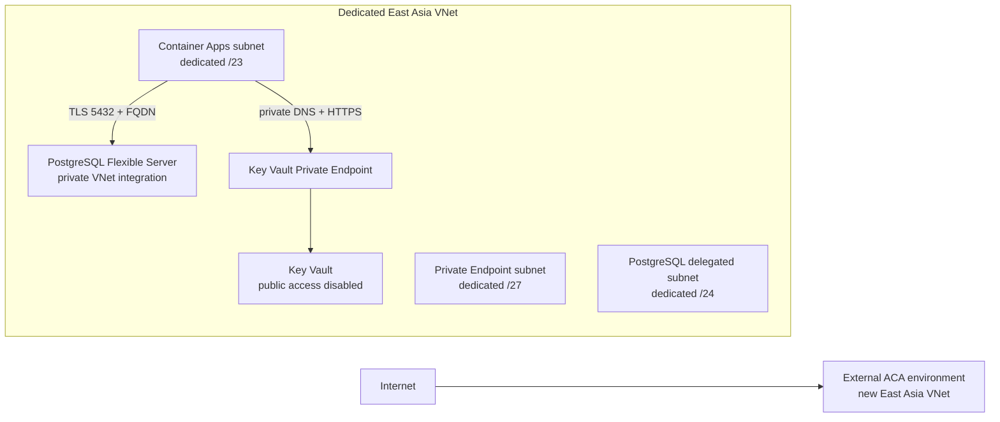

# Workspace data plane on Azure

This directory contains a parameterized, review-only Bicep template and the deployment plan for the Workspace Directory and Workspace Device Authorization PostgreSQL data plane. The template creates infrastructure only. It does not deploy application containers, create database login roles, run migrations, populate Key Vault, or change the live Product route.

本目录提供 Workspace Directory 与 Device Authorization 的 Azure 数据层审阅模板和部署方案。模板只定义基础设施，不部署应用、不创建数据库登录角色、不运行迁移、不写入 Key Vault 密钥，也不修改线上 Product 流量。

## Current Azure state checked on 2026-09-26

The active subscription has two Azure Container Apps environments and no Azure Database for PostgreSQL Flexible Server or Key Vault:

| Environment | Region | Network / ingress | Current use |
| --- | --- | --- | --- |
| `cae-dh-eastasia` | East Asia | Consumption profile, default Azure network, no VNet | `cyrene-web` has external ingress; Exchange, Catalyst, Echo, Yield, and Reactor use internal ingress |
| `cae-dh-westus2` | West US 2 | VNet-integrated at `vnet-dh-westus2/subnet-containerapps` | `astrbot-classic` |

The East Asia `cyrene-web` app currently has the custom domain `cyrene.dohorizon-llc.net`. The West US 2 VNet cannot be used as a direct same-region private network for an East Asia PostgreSQL server. Address ranges for every existing, peered, VPN, ExpressRoute, and on-premises network must be checked before choosing CIDRs.

**Implication:** the East Asia Container Apps environment cannot be attached to a VNet in place. Azure Container Apps fixes its network type when the environment is created. The private database plan therefore needs a new East Asia VNet-integrated environment, followed by a staged app migration. Microsoft documents the environment network-type limit and the dedicated subnet requirement in [Container Apps networking](https://learn.microsoft.com/en-us/azure/container-apps/networking).

## Proposed network and resource shape



`main.bicep` creates the VNet, three dedicated subnets, linked private DNS zones, a new external workload-profile Container Apps environment, a VNet-integrated PostgreSQL Flexible Server, a private-only Key Vault, and separate user-assigned identities for reader, operator, registrar, authorization runtime, and migration jobs.

The database subnet is delegated to `Microsoft.DBforPostgreSQL/flexibleServers`; the ACA subnet is delegated to `Microsoft.App/environments`. The server uses PostgreSQL 17, a General Purpose SKU, 64 GB Premium storage with auto-grow, 14-day backups, and Same-Zone HA by default. Directory and Device Authorization share one `cyrene_workspace` database with separate schemas so the planned binding/generation fence can run in one PostgreSQL transaction. ACA zone redundancy is an explicit parameter defaulting off until East Asia support and quota are confirmed. CIDRs and the globally unique Key Vault name are required parameters; no sample IP ranges are supplied because the active network ranges need an overlap review first.

Required parameters are `resourcePrefix`, `keyVaultName`, `virtualNetworkAddressPrefix`, `containerAppsSubnetPrefix`, `postgresSubnetPrefix`, `privateEndpointSubnetPrefix`, and secure `postgresAdministratorPassword`. The remaining sizing and HA settings are configurable; production defaults to Same-Zone PostgreSQL HA.

The PostgreSQL private DNS zone is `private.postgres.database.azure.com`, linked to the VNet. The Key Vault private endpoint uses `privatelink.vaultcore.azure.net`, also linked to the VNet. PostgreSQL clients must use the server FQDN (`<server>.postgres.database.azure.com`), not its private IP, so TLS hostname verification remains meaningful. Microsoft requires a `.postgres.database.azure.com` private zone for VNet-injected servers and recommends FQDNs for connections ([private networking guidance](https://learn.microsoft.com/en-us/azure/postgresql/network/concepts-networking-private)).

The Container Apps subnet is deliberately `/23` in the design, although a modern workload-profile environment can use `/27` or larger. This preserves headroom and also avoids accidentally undersizing a legacy Consumption-only subnet during review. PostgreSQL receives a separate `/24` delegated subnet for headroom; Azure's minimum is `/28`, which leaves 11 usable IPs, and one HA server uses four addresses. The Key Vault private endpoint receives a separate `/27` subnet. All CIDRs remain caller-supplied and must be non-overlapping ([PostgreSQL subnet requirements](https://learn.microsoft.com/en-us/azure/postgresql/network/concepts-networking-private)).

The VNet is a dedicated workspace network. Do not place unrelated applications into the new ACA environment. This first template does not add subnet NSGs or custom routes: PostgreSQL HA requires service traffic within its delegated subnet and access to Azure Storage for WAL archival. Add and verify network filtering with those service requirements before broadening the VNet or adding unrelated workloads ([PostgreSQL private networking requirements](https://learn.microsoft.com/en-us/azure/postgresql/network/concepts-networking-private)). Container Apps application logs are set to `none` in this review template; production must choose and configure a monitored log destination before traffic cutover.

## TLS and database authentication

The template explicitly sets PostgreSQL `require_secure_transport=ON` and `ssl_min_protocol_version=TLSv1.3`. The application connection strings must use SQLx `PgSslMode::VerifyFull` (equivalent to PostgreSQL `sslmode=verify-full`), point to the server FQDN, and trust the complete current Azure root CA set. Do not trust intermediate/server certificates or pin certificates. Microsoft’s current TLS guidance recommends TLS 1.3 and full certificate plus hostname validation (`verify-all` in its current libpq guidance); validate the exact `VerifyFull` behavior against the deployed SQLx/TLS runtime and private DNS before enabling production traffic ([TLS guidance](https://learn.microsoft.com/en-us/azure/postgresql/security/security-tls)). Azure Database for PostgreSQL does not support client-certificate mTLS; database access is controlled with PostgreSQL roles and TLS server verification.

The current Rust PostgreSQL adapters use PostgreSQL login credentials in DSNs. This Bicep template does not enable Microsoft Entra database authentication or claim that ACA managed identity authenticates directly to PostgreSQL. Managed identities here are for Key Vault access. Store each role-specific DSN and the application HMAC key ring in Key Vault after infrastructure review; never put their values in parameter files, Bicep outputs, shell history, or deployment logs.

## Identity, Key Vault, and database role boundaries

The Key Vault uses RBAC, soft delete, 90-day retention, purge protection, `publicNetworkAccess: Disabled`, and a private endpoint. Each role gets a distinct user-assigned managed identity. Assign `Key Vault Secrets User` at the individual secret resource scope after the secrets are provisioned; do not grant all application identities access to every secret in a shared vault. Container Apps requires a managed identity and that role for Key Vault references ([Container Apps Key Vault references](https://learn.microsoft.com/en-us/azure/container-apps/manage-secrets)). A versionless reference follows new secret versions within about 30 minutes and can restart active revisions that use the value as an environment variable, so rotate database credentials and HMAC key rings as a coordinated rollout.

The migrations define these database `NOLOGIN` permission groups:

| Identity purpose | PostgreSQL group role / secret | Runtime boundary |
| --- | --- | --- |
| Workspace Directory reader | `cyrene_workspace_directory_reader` / `CYRENE_WORKSPACE_DIRECTORY_DATABASE_URL` | Relay, Direct, and identity lookup reads only |
| Directory operator | `cyrene_workspace_directory_operator` / `CYRENE_WORKSPACE_DIRECTORY_OPERATOR_DATABASE_URL` | Separate controlled provisioning process only; never mounted in request-serving apps |
| Device registrar | `cyrene_workspace_device_registrar` / `CYRENE_WORKSPACE_DEVICE_REGISTRATION_DATABASE_URL` | Registration authority only after the atomic authorization transaction is implemented |
| Device authorization runtime | `cyrene_workspace_device_authorization_app` / `CYRENE_WORKSPACE_DEVICE_AUTHORIZATION_DATABASE_URL` | Authorization store only; add the required narrow Directory binding grants before enabling registration |
| Migration runner | Separate temporary login with `CYRENE_WORKSPACE_DIRECTORY_MIGRATION_DATABASE_URL` and `CYRENE_WORKSPACE_DEVICE_AUTHORIZATION_MIGRATION_DATABASE_URL` | Controlled one-off migration job; not an application identity |

The Bicep-created identities do not themselves grant any database or Key Vault permissions. A separate operator-managed bootstrap must create dedicated LOGIN roles as members of the migration-defined NOLOGIN groups, grant only the necessary schema/table rights, create the exact-secret Key Vault role assignments, and set DSNs through a secure secret workflow. The initial role-creating migration needs temporary `CREATEROLE` authority; remove it from the migration principal after bootstrap and never grant it to any runtime login. The Directory operator applies membership/role changes and appends audit rows in a transaction; the audit table's SQL trigger rejects UPDATE and DELETE. The PostgreSQL server administrator credential is a secure Bicep parameter for initial bootstrap only and is not returned as an output; schema migrations use separate credentials.

### Application gaps that block production activation

* `cyrene_workspace_device_authorization_app` currently has privileges only in the Device Authorization schema. A future composite transaction must lock and check `workspace_device_identities` and `device_registration_bindings` in the same PostgreSQL transaction as the authorization generation/state update. The required narrow cross-schema grant and store API are not in this base; leave device registration/approval unavailable until that work is deployed and tested.
* The current baseline has no PostgreSQL WebAuthn credential-store adapter or credential/counter migration. The authorization payload can persist ceremony state, but that does not persist the enrolled credential authority. Do not use ACA local storage for production WebAuthn credentials. A PostgreSQL adapter/schema and migration are still required.
* OIDC token validation and the production identity-provider configuration remain application responsibilities. A database membership row is authorization data, not proof that an `(issuer, subject)` token is authentic.

## Migration and rollback plan

Run migrations only from an isolated, one-off migration job with its separate credentials. The initial order is:

1. [Workspace Directory `0001_workspace_directory.up.sql`](../../../framework/crates/cy-workspace-fabric/migrations/0001_workspace_directory.up.sql).
2. [Device registration binding `0002_device_registration_binding.up.sql`](../../../framework/crates/cy-workspace-fabric/migrations/0002_device_registration_binding.up.sql).
3. [Device Authorization `0001_authorizations.up.sql`](../../../framework/crates/cy-workspace-fabric/migrations/device_authorization/0001_authorizations.up.sql).
4. [Delivery acknowledgement `0002_delivery_ack.up.sql`](../../../framework/crates/cy-workspace-fabric/migrations/device_authorization/0002_delivery_ack.up.sql).
5. The separately reviewed composite transaction/role-grant migration, before enabling device enrollment.

The app login roles remain separate from the migration login. Check the migration ledger and schema before every run, and take/verify a point-in-time restore point before a production migration. For authorization state, prefer forward-only migrations. Some down migrations can remove state or intentionally refuse after rows reach newer states; never treat `down.sql` as an automatic deployment rollback. A data-bearing schema rollback requires a reviewed restore/PITR decision, a verified backup, a quiesced writer, and an explicit state/data compatibility check. PostgreSQL supports automated backups and point-in-time restore over its configured retention window ([Flexible Server overview](https://learn.microsoft.com/en-us/azure/postgresql/overview)).

The new infrastructure remains parallel to the existing East Asia environment. Deploy and test new app revisions in the VNet-integrated environment, confirm private DNS, TLS, role grants, migrations, readiness probes, and internal service calls, then bind/validate `cyrene.dohorizon-llc.net` on the new environment and change its DNS CNAME with a planned TTL. The app FQDNs will change. Update internal service targets, callback URLs, CORS allowlists, and any external clients that use generated ACA FQDNs. Retain the old environment through the DNS drain and rollback window. If the new PostgreSQL instance accepts writes, a traffic rollback also needs a data-write reconciliation plan; DNS alone cannot reverse database writes.

## Region support and price snapshot

This template defaults to East Asia because the current Product web environment is there. The live Microsoft region matrix lists stable Intel v3/v4/v5 Flexible Server compute and Same-Zone HA in East Asia. East Asia’s Zone-Redundant HA entry carries both `$` and `**` caveats in the current matrix; confirm current subscription capacity and region support before selecting it. The V6 compute family is preview and currently does not support VNet integration, so it is not used here ([region matrix and limitations](https://learn.microsoft.com/en-us/azure/postgresql/overview)).

Using the Microsoft Retail Prices API for East Asia on 2026-09-26, the indicative on-demand prices were about `$0.269` per hour for `Standard_D2ds_v5` and `$0.15` per GB-month for Flexible Server Premium storage. For 730 hours and 64 GB:

| Configuration | Approximate monthly compute + storage |
| --- | ---: |
| 2-vCore GP, no HA | `$196.37 + $9.60 = $205.97` |
| Same-Zone HA (primary + standby) | about `$411.94` |

These are retail list-price estimates, not a quote. They exclude backup storage beyond included allowances, Key Vault operations, Private Endpoint processing/data, logs/monitoring, network egress, taxes, reservations, discounts, and regional capacity constraints. HA bills for the standby compute and storage as well ([PostgreSQL pricing](https://azure.microsoft.com/en-us/pricing/details/postgresql/flexible-server/)). Recheck current prices with the [Azure Retail Prices API](https://learn.microsoft.com/en-us/rest/api/cost-management/retail-prices/azure-retail-prices) and the target subscription before approval.

The template pins stable resource API versions and avoids preview APIs: [PostgreSQL Flexible Server `2025-08-01`](https://learn.microsoft.com/en-us/azure/templates/microsoft.dbforpostgresql/flexibleservers), [Container Apps managed environments `2024-03-01`](https://learn.microsoft.com/en-us/azure/templates/microsoft.app/managedenvironments), [Key Vault `2025-05-01`](https://learn.microsoft.com/en-us/azure/templates/microsoft.keyvault/vaults), [Private Endpoints `2025-07-01`](https://learn.microsoft.com/en-us/azure/templates/microsoft.network/privateendpoints), and [Private DNS Zones `2024-06-01`](https://learn.microsoft.com/en-us/azure/templates/microsoft.network/2024-06-01/privatednszones). The `ssl_min_protocol_version` setting follows [Flexible Server TLS parameter guidance](https://learn.microsoft.com/en-us/azure/postgresql/parameters/concepts-parameters).

The template disables geo-redundant backups and does not configure PostgreSQL or Key Vault Azure Monitor diagnostic settings. Choose the cross-region recovery objective and configure monitored retention before production; the 14-day PITR window is the only backup policy represented here.

## Review and local validation

`main.bicep` is parameterized and contains no real CIDRs, credentials, or secret values. This change does not call an Azure deployment, validation, or `what-if` command. After architecture review, an authorized operator must verify subscription region/SKU quota, resource-provider registration, subnet non-overlap, custom-domain ownership/certificate binding, app compatibility, migration permissions, secure secret provisioning, backup/PITR policy, and expected cost before any deployment.

Local static checks:

```bash
bicep build infrastructure/azure/workspace-data/main.bicep --stdout >/dev/null
bicep lint infrastructure/azure/workspace-data/main.bicep
git diff --check
```

These checks establish local template compilation and whitespace hygiene only. They do not prove that deployment will succeed in the target Azure subscription or that runtime database connectivity, TLS, DNS, role permissions, migration behavior, or WebAuthn persistence work.
